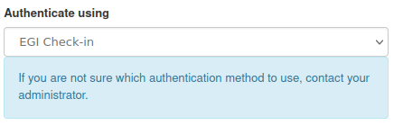
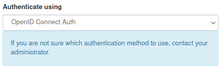
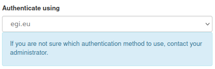
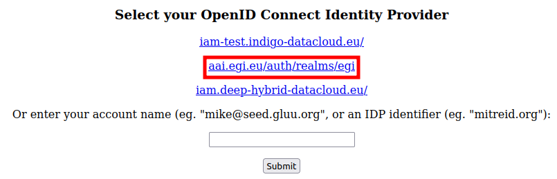

[OpenStack](https://openstack.org) providers of the EGI Cloud Compute service
offer native OpenStack features via native APIs integrated with EGI Check-in
accounts.

The extensive [OpenStack user documentation](https://docs.openstack.org/user/)
includes details on every OpenStack project most providers offer access to:

- [Keystone](https://docs.openstack.org/keystone/latest/), for identity
- [Nova](https://docs.openstack.org/nova/latest/), for VM management
- [Glance](https://docs.openstack.org/glance/latest/), for VM image management
- [Cinder](https://docs.openstack.org/cinder/latest/), for block storage
- [Swift](https://docs.openstack.org/swift/latest/), for object storage
- [Neutron](https://docs.openstack.org/neutron/latest/), for network management
- [Horizon](https://docs.openstack.org/horizon/latest/), as a web dashboard


## Access through web dashboard

The Horizon Web-dashboard of the OpenStack providers can be accessed using your
EGI Check-in credentials directly.

Select _EGI Check-In_:



Or _OpenID Connect_:



Or _egi.eu_:



In the **Authenticate using** drop-down menu of the login screen.

Additionally you may need to select _aai.egi.eu/auth/realms/egi_ as well:



{}

You can also find links to all the providers dashboards
at [the EGI Cloud Compute dashboard](https://dashboard.cloud.egi.eu/).

You can quickly find the dashboards of
all providers in the EGI infrastructure that are accessible to you (use the
correct VO) with the [FedCloud Client](#the-fedcloud-client):

```shell
$ fedcloud endpoint list --service-type org.openstack.horizon --site ALL_SITES
```

The same way you can also discover other types of resources, just use the
correct resource type:

- `org.openstack.horizon` for dashboards
- `org.openstack.nova` for virtual machines
- `org.openstack.swift` for object storage

{}


## The FedCloud client

The [FedCloud client](https://fedcloudclient.fedcloud.eu/index.html) is a
high-level Python package for a command-line client designed for interaction
with the OpenStack providers in the EGI infrastructure.

{} The FedCloud client is the recommended
command-line interface to use with OpenStack in EGI, as it provides an easy to
use wrapper around the default OpenStack client. {}

FedCloud client has the following modules (features):

- [**Check-in**](https://fedcloudclient.fedcloud.eu/fedcloudclient.html#module-fedcloudclient.checkin)
  allows checking validity of access tokens and listing
  [Virtual Organisations](../../../aai/check-in/vos) (VOs) of a token
- [**Endpoint**](https://fedcloudclient.fedcloud.eu/fedcloudclient.html#module-fedcloudclient.endpoint)
  can search endpoints in the
  [Configuration Database](../../../../internal/configuration-database) and extract
  site-specific information from unscoped/scoped tokens
- [**Sites**](https://fedcloudclient.fedcloud.eu/fedcloudclient.html#module-fedcloudclient.sites)
  allows management of site configurations
- [**OpenStack**](https://fedcloudclient.fedcloud.eu/fedcloudclient.html#module-fedcloudclient.openstack)
  can perform commands on [OpenStack services](../openstack) deployed to sites
- **EC3** allows deploying
  [elastic cloud compute clusters](../../orchestration/im/ec3)

### Installation

The FedCloud client can be installed with the `pip3` Python package manager
(without root or administrator privileges).

 

To install the FedCloud client:

```shell
$ pip3 install fedcloudclient
```

This installs the latest version of the FedCloud client, together with its
required packages (like _openstackclient_). It will also create executables
**fedcloud** and **openstack**, adding them to the `bin` folder corresponding to
your current Python execution environment (`$VIRTUAL_ENV/bin` for executing pip3
in a Python virtual environment, `~/.local/bin` for executing pip3 as user (with
`--user` option), and `/usr/local/bin` when executing pip3 as root).

 

As there are non-pure Python packages needed for installation, the
[Microsoft C++ Build Tools](https://visualstudio.microsoft.com/visual-cpp-build-tools/)
is a prerequisite, make sure it's installed with the following options selected:

- C++ CMake tools for Windows
- C++ ATL for latest v142 build tools (x86 & x64)
- Testing tools core features - Build Tools
- Windows 10 SDK (`<latest`>)

In case you prefer to use non-Microsoft alternatives for building non-pure
packages, please see
[Python Windows Compilers](https://wiki.python.org/moin/WindowsCompilers).

To install the FedCloud client:

```shell
> pip3 install fedcloudclient
```

This installs the latest version of the FedCloud client, together with its
required packages (like _openstackclient_). It will also create executables
**fedcloud** and **openstack**, adding them to the `bin` folder corresponding to
your current Python execution environment.

 

Check if the installation is correct by executing the client:

```shell
$ fedcloud --version
```

#### Installing EGI Core Trust Anchor certificates

Some sites in the EGI infrastructure use certificates issued by Certificate
Authorities (CAs) that are not included in the default OS distribution. If you
receive error message "_SSL exception connecting to..._", install the EGI Core
Trust Anchor Certificates by running the following commands:

```shell
$ wget https://raw.githubusercontent.com/tdviet/python-requests-bundle-certs/main/scripts/install_certs.sh
$ bash install_certs.sh
```

{} The above script does not work on all
Linux distributions. Change _python_ to _python3_ in the script if needed, see
the [README](https://github.com/tdviet/python-requests-bundle-certs#usage) for
more details, or follow the
[official instructions](https://github.com/tdviet/python-requests-bundle-certs/blob/main/docs/Install_certificates.md)
for installing EGI Core Trust Anchor certificates in production environments.
{}

### Using via Docker container

The FedCloud client can also be used without installation, by running it in a
Docker container. In this case, the EGI Core Trust Anchor certificates are
pre-installed.

 

To run the FedCloud client in a container, make sure
[Docker is installed](https://docs.docker.com/engine/install/#server), then run
the following commands:

```shell
$ docker pull tdviet/fedcloudclient
$ docker run -it tdviet/fedcloudclient bash
```

 

To run the FedCloud client in a container, make sure
[Docker is installed](https://docs.docker.com/desktop/mac/install/), then run
the following commands:

```shell
$ docker pull tdviet/fedcloudclient
$ docker run -it tdviet/fedcloudclient bash
```

 

To run the FedCloud client in a container, make sure
[Docker is installed](https://docs.docker.com/desktop/windows/install/), then
run the following commands:

```shell
> docker pull tdviet/fedcloudclient
> docker run -it tdviet/fedcloudclient bash
```

 

Once you have a shell running in the container with the FedCloud client, usage
is the same as from [the command-line](#using-from-the-command-line).

### Using from EGI Notebooks

[EGI Notebooks](../../../dev-env/notebooks) are integrated with access tokens so it
simplifies using the FedCloud client. First make sure that you follow the
[installation](#installation) steps above. Then, below are the commands that you
need to run inside a terminal in JupyterLab:

```shell
export OIDC_ACCESS_TOKEN=`cat /var/run/secrets/egi.eu/access_token`
fedcloud token check
```

Please follow instructions [below](#using-from-the-command-line) to learn how to
use the `fedcloud` command.

### Using from the command-line

The FedCloud client has these subcommands:

- **fedcloud token** for checking access tokens (see token
  [subcommands](https://fedcloudclient.fedcloud.eu/usage.html#fedcloud-token-commands))
- **fedcloud endpoint** for querying the Configuration Database (see endpoint
  [subcommands](https://fedcloudclient.fedcloud.eu/usage.html#fedcloud-endpoint-commands))
- **fedcloud site** for manipulating site configurations (see site
  [subcommands](https://fedcloudclient.fedcloud.eu/usage.html#fedcloud-site-commands))
- **fedcloud openstack** or **fedcloud openstack-int** for performing OpenStack
  commands on sites (see openstack
  [subcommands](https://fedcloudclient.fedcloud.eu/usage.html#fedcloud-openstack-commands))
- **fedcloud ec3** for provisioning elastic cloud compute clusters (see cluster
  [subcommands](https://fedcloudclient.fedcloud.eu/usage.html#fedcloud-ec3-commands))

{} See also the
[complete documentation](https://fedcloudclient.fedcloud.eu/index.html) or read
and contribute to the [source code](https://github.com/tdviet/fedcloudclient).
{}

Performing any OpenStack command on any site requires only three options: the
site, the VO and the command. For example, to list virtual machine (VM) images
available to members of VO _fedcloud.egi.eu_ on the site _CYFRONET-CLOUD_, run
the following command:

```shell
$ fedcloud openstack image list --vo fedcloud.egi.eu --site CYFRONET-CLOUD
```

#### Authentication

Many of the FedCloud client commands need access tokens for authentication.
Users can choose whether to provide access tokens directly (via option
`--oidc-access-token`), or generate them on the fly with **oidc-agent** (via
option `--oidc-agent-account`) or from refresh tokens (via option
`--oidc-refresh-token`, which must be provided together with option
`--oidc-client-id` and option `--oidc-client-secret`).

{} Users of EGI Check-in can get a Check-in
client ID and refresh token, as well as all the information needed to obtain
access tokens for their FedCloud client, by visiting
[EGI Check-in Token Portal](https://aai.egi.eu/token/). {}

{} To provide access tokens automatically
via **oidc-agent**, follow
[these instructions](https://indigo-dc.gitbook.io/oidc-agent/user/oidc-gen/provider/egi/)
to register a client, then pass the client name (account name used during client
registration) to the FedCloud client via option `--oidc-agent-account`.
{}

{} Refresh tokens have long
lifetime (one year in EGI Check-in), so they must be properly protected.
Exposing refresh tokens via environment variables or command-line options is
considered insecure and will be disabled in the near future in favour of using
**oidc-agent**. {}

If multiple methods of getting access tokens are given at the same time, the
FedCloud client will try to get an access token from the **oidc-agent** first,
then obtain one using the refresh token.

The default authentication protocol is `openid`. Users can change the default
protocol via the option `--openstack-auth-protocol`. However, sites may have the
protocol fixed in the site configuration (e.g. `oidc` for the site
_INFN-CLOUD-BARI_).

The default OIDC identity provider is EGI Check-in
(<https://aai.egi.eu/auth/realms/egi>). Users can set another OIDC identity
provider via option `--oidc-url`.

{} Remember to also set the identity
provider's name accordingly for OpenStack commands, by using the option
`--openstack-auth-provider`.{}

#### Environment variables

Most of the FedCloud client options can be set via environment variables:

{} To save a lot of time, set the frequently
used options like access token, VO, etc. using environment variables.
{}

{} When you want commands to work on all
sites in the EGI infrastructure, use `ALL_SITES` for the `--site` parameter.
{}

| Environment variable    | Command-line option         | Default value                        |
| ----------------------- | --------------------------- | ------------------------------------ |
| OIDC_AGENT_ACCOUNT      | `--oidc-agent-account`      |                                      |
| OIDC_ACCESS_TOKEN       | `--oidc-access-token`       |                                      |
| OIDC_REFRESH_TOKEN      | `--oidc-refresh-token`      |                                      |
| OIDC_CLIENT_ID          | `--oidc-client-id`          |                                      |
| OIDC_CLIENT_SECRET      | `--oidc-client-secret`      |                                      |
| OIDC_URL                | `--oidc-url`                | <https://aai.egi.eu/auth/realms/egi> |
| OPENSTACK_AUTH_PROTOCOL | `--openstack-auth-protocol` | openid                               |
| OPENSTACK_AUTH_PROVIDER | `--openstack-auth-provider` | egi.eu                               |
| OPENSTACK_AUTH_TYPE     | `--openstack-auth-type`     | v3oidcaccesstoken                    |
| EGI_VO                  | `--vo`                      |                                      |

#### Getting help

The FedCloud client can display help for the commands and subcommands it
supports. Try running the following command to see the commands supported by the
FedCloud client:

```shell
$ fedcloud --help
Usage: fedcloud [OPTIONS] COMMAND [ARGS]...

Options:
  --version  Show the version and exit.
  --help     Show this message and exit.

Commands:
  ec3            EC3 related commands
  endpoint       endpoint command group for interaction with GOCDB and...
  openstack      Executing OpenStack commands on site and VO
  openstack-int  Interactive OpenStack client on site and VO
  site           Site command group for manipulation with site...
  token          Token command group for manipulation with tokens
```

Similarly, you can see help for e.g. the `openstack` subcommand by running the
command below:

```shell
$ fedcloud openstack --help
Usage: fedcloud openstack [OPTIONS] OPENSTACK_COMMAND...

  Executing OpenStack commands on site and VO

Options:
  --oidc-client-id TEXT           OIDC client id
  --oidc-client-secret TEXT       OIDC client secret
  --oidc-refresh-token TEXT       OIDC refresh token
  --oidc-access-token TEXT        OIDC access token
  --oidc-url TEXT                 OIDC URL  [default: <https://aai.egi.eu/auth/realms/egi>]
  --oidc-agent-account TEXT       short account name in oidc-agent
  --openstack-auth-protocol TEXT  Check-in protocol  [default: openid]
  --openstack-auth-type TEXT      Check-in authentication type  [default:
                                  v3oidcaccesstoken]
  --openstack-auth-provider TEXT  Check-in identity provider  [default:
                                  egi.eu]
  --vo TEXT                       Name of the VO  [required]
  -i, --ignore-missing-vo         Ignore sites that do not support the VO
  -j, --json-output               Print output as a big JSON object
  --help                          Show this message and exit.
```

{} Most commands support multiple levels of
subcommands, you can get help for all of them using the same principle as above.
{}

### Using from Python

The FedCloud client can be used as a library for developing other services and
tools for EGI services. Most of the functionalities can be called directly from
Python code without side effects.

An usage example is available on
[GitHub](https://github.com/tdviet/fedcloudclient/blob/master/examples/demo.py).
Just copy/download the code, add your access token and execute `python demo.py`
to see how it works.

### Using in scripts

The FedCloud client can also be used in scripts for simple automation, either
for setting environment variables for other tools, or to process outputs from
OpenStack commands.

#### Setting environment variables for external tools

Some FedCloud commands generate output that contains shell commands to set
environment variables with the returned result, as exemplified below.

 

Run a command to get details of a project:

```shell
$ export EGI_SITE=IISAS-FedCloud
$ export EGI_VO=eosc-synergy.eu
$ fedcloud site show-project-id --site $EGI_SITE
export OS_AUTH_URL="https://cloud.ui.savba.sk:5000/v3/";
export OS_PROJECT_ID="51f736d36ce34b9ebdf196cfcabd24ee";
```

Run the same command but set environment variables with the returned values:

```shell
$ eval $(fedcloud site show-project-id)
```

The environment variables will have their values set to what the command
returned:

```shell
$ echo $OS_AUTH_URL
https://cloud.ui.savba.sk:5000/v3/

$ echo $OS_PROJECT_ID
51f736d36ce34b9ebdf196cfcabd24ee
```

 

Run a command to get details of a project:

```shell
> set EGI_SITE=IISAS-FedCloud
> set EGI_VO=eosc-synergy.eu
> fedcloud site show-project-id --site %EGI_SITE%
set OS_AUTH_URL=https://cloud.ui.savba.sk:5000/v3/
set OS_PROJECT_ID=51f736d36ce34b9ebdf196cfcabd24ee
```

If you copy the returned output and execute it as commands in a command prompt:

```shell
> set OS_AUTH_URL=https://cloud.ui.savba.sk:5000/v3/
> set OS_PROJECT_ID=51f736d36ce34b9ebdf196cfcabd24ee
```

The environment variables will have their values set to what the command
returned:

```shell
> set OS_AUTH_URL
OS_AUTH_URL=https://cloud.ui.savba.sk:5000/v3/

> set OS_PROJECT_ID
OS_PROJECT_ID=51f736d36ce34b9ebdf196cfcabd24ee
```

 

Run a command to get details of a project:

```powershell
> $Env:EGI_SITE="IISAS-FedCloud"
> $Env:EGI_VO="eosc-synergy.eu"
> fedcloud site show-project-id --site $Env:EGI_SITE
$Env:OS_AUTH_URL="https://cloud.ui.savba.sk:5000/v3/";
$Env:OS_PROJECT_ID="51f736d36ce34b9ebdf196cfcabd24ee";
```

Run the same command but set environment variables with the returned values:

```powershell
> fedcloud site show-project-id --site $Env:EGI_SITE `
                | Out-String | Invoke-Expression
```

The environment variables will have their values set to what the command
returned:

```powershell
> $Env:OS_AUTH_URL
https://cloud.ui.savba.sk:5000/v3/

> $Env:OS_PROJECT_ID
51f736d36ce34b9ebdf196cfcabd24ee
```

 

#### Processing output from OpenStack commands

The `fedcloud openstack` subcommand's output can be converted to
[JavaScript Object Notation](https://en.wikipedia.org/wiki/JSON) (JSON) format
by using the `--json-output` option. This is useful for further machine
processing of the command output.

{} JSON output can be processed with a tool
like [jq](https://stedolan.github.io/jq/), which can slice, filter, map, and
transform structured data. It acts as a filter: it takes an input and produces
an output. Check out the [tutorial](https://stedolan.github.io/jq/tutorial/) for
using it to extract data from JSON sources. {}

```shell
$ export EGI_SITE=IISAS-FedCloud
$ export EGI_VO=eosc-synergy.eu
$ fedcloud openstack flavor list --site $EGI_SITE --json-output
[
{
  "Site": "IISAS-FedCloud",
  "VO": "eosc-synergy.eu",
  "command": "flavor list",
  "Exception": null,
  "Error code": 0,
  "Result": [
    {
      "ID": "0",
      "Name": "m1.nano",
      "RAM": 64,
      "Disk": 1,
      "Ephemeral": 0,
      "VCPUs": 1,
      "Is Public": true
    },
    {
      "ID": "2e562a51-8861-40d5-8fc9-2638bab4662c",
      "Name": "m1.xlarge",
      "RAM": 16384,
      "Disk": 40,
      "Ephemeral": 0,
      "VCPUs": 8,
      "Is Public": true
    },
    ...
  ]
}
]

# The following jq command selects flavors with VCPUs=2 and prints their names
$ fedcloud openstack flavor list --site IISAS-FedCloud --json-output | \
    jq -r '.[].Result[] | select(.VCPUs == 2) | .Name'
m1.medium
```

{} Note that `--json-output` option can be
used only with those OpenStack commands that have outputs. Using this parameter
with commands with no output (e.g. setting properties) will generate an
unsupported parameter error.{}

<!--
// jscpd:ignore-end
-->

### Obtaining tokens for other clients

Most OpenStack clients allow authentication with tokens, so you can easily use
them with EGI Cloud providers just doing a first step for obtaining the token:

```shell
fedcloud openstack --site <NAME_OF_THE_SITE> --vo <NAME_OF_VO> token issue -c id -f value
```

### Useful OpenStack commands

Usage of the OpenStack client is described in detail
[here](https://docs.openstack.org/python-openstackclient/latest).

Please refer to the
[nova documentation](https://docs.openstack.org/nova/latest/user/) for a
complete guide on the VM management features of OpenStack. We list in the
sections below some useful commands for the EGI Cloud.

#### Registering an existing ssh key

It's possible to register an ssh key that can later be used as the default ssh
key for the default user of the VM (via the `--key-name` argument to
`openstack server create`):

```shell
fedcloud openstack keypair create --public-key ~/.ssh/id_rsa.pub mykey
```

#### Creating a VM

```shell
fedcloud openstack flavor list
FLAVOR=<FLAVOR_NAME>
fedcloud openstack image list
IMAGE_ID=<IMAGE_ID>
fedcloud openstack network list
# Pick FedCloud network
NETWORK_ID=<NETWORK_ID>
fedcloud openstack security group list
fedcloud openstack server create --flavor $FLAVOR --image $IMAGE_ID \
  --nic net-id=$NETWORK_ID --security-group default \
  --key-name mykey oneprovider
# Creating a floating IP
fedcloud openstack floating ip create <NETWORK_NAME>
# Assigning floating IP to server
fedcloud openstack server add floating ip <SERVER_ID> <IP>
# Removing floating IP from server
fedcloud openstack server show <SERVER_ID>
# Deleting server
fedcloud openstack server remove floating ip <SERVER_ID> <IP>
fedcloud openstack server delete <SERVER_ID>
# Deleting floating IP
fedcloud openstack floating ip delete <IP>
```

- [OpenStack: launch an instance on the provider network](https://docs.openstack.org/mitaka/install-guide-obs/launch-instance-provider.html)
- [OpenStack: Managing IP addresses](https://docs.openstack.org/ocata/user-guide/cli-manage-ip-addresses.html)

#### Using cloud-init

```shell
fedcloud openstack server create --flavor m3.medium \
  --image d0a89aa8-9644-408d-a023-4dcc1148ca01 \
  --user-data userdata.txt --key-name My_Key server01.example.com
```

- [OpenStack: providing user data (cloud-init)](https://docs.openstack.org/nova/latest/user/user-data.html)
- [`cloudinit` documentation](https://cloudinit.readthedocs.io/en/latest/index.html)

##### Shell script data as user data

```shell
#!/bin/sh
adduser --disabled-password --gecos "" clouduser
```

##### cloud-config data as user data

```yaml
#cloud-config
hostname: mynode
fqdn: mynode.example.com
manage_etc_hosts: true
```

- [Official cloud-config examples](https://cloudinit.readthedocs.io/en/latest/topics/examples.html#yaml-examples)
- [Cloud-init example](https://www.zetta.io/en/help/articles-tutorials/customizing-instance-deployment-cloud-init/)

#### Creating a snapshot image from running VM

You can create a new image from a snapshot of an existing VM that will allow you
to easily recover a previous version of your VM or to use it as a template to
clone a given VM.

```shell
fedcloud openstack server image create <your VM> --name <name of the snapshot>
```

Once the snapshot is ready `openstack image show <name of the snapshot>` will
give your the details you can use it as any other image at the provider:

```shell
fedcloud openstack server create --flavor <flavor> \
  --image <name of the snapshot> \
  <name of the new VM>
```

You can override files in the snapshot if needed, e.g. changing the SSH keys:

```shell
fedcloud openstack server create --flavor <flavor> \
  --image <name of the snapshot> \
  --file /home/ubuntu/.ssh/authorized_keys=my_new_keys \
  <name of the new VM>
```

## libcloud

[Apache libcloud](https://libcloud.apache.org/index.html) supports OpenStack and
EGI authentication mechanisms by setting the `ex_force_auth_version` to
`3.x_oidc_access_token`. Check the
[libcloud docs on connecting to OpenStack](https://libcloud.readthedocs.io/en/latest/compute/drivers/openstack.html#connecting-to-the-openstack-installation)
for details. See below sample code:

```python
import requests

from libcloud.compute.types import Provider
from libcloud.compute.providers import get_driver

refresh_data = {
    'client_id': '<your client_id>',
    'client_secret': '<your client_secret>',
    'grant_type': 'refresh_token',
    'refresh_token': '<your refresh_token>',
    'scope': 'openid email profile',
}

r = requests.post("https://aai.egi.eu/auth/realms/egi/protocol/openid-connect/token",
                  auth=(client_id, client_secret),
                  data=refresh_data)

access_token = r.json()['access_token']

OpenStack = get_driver(Provider.OPENSTACK)
# first parameter is the identity provider: "egi.eu"
# Second parameter is the access_token
# The protocol 'openid' is specified in ex_tenant_name
# and tenant/project cannot be selected :(
driver = OpenStack('egi.eu', access_token, ex_tenant_name='openid',
                   ex_force_auth_url='https://keystone_url:5000',
                   ex_force_auth_version='3.x_oidc_access_token')
```
