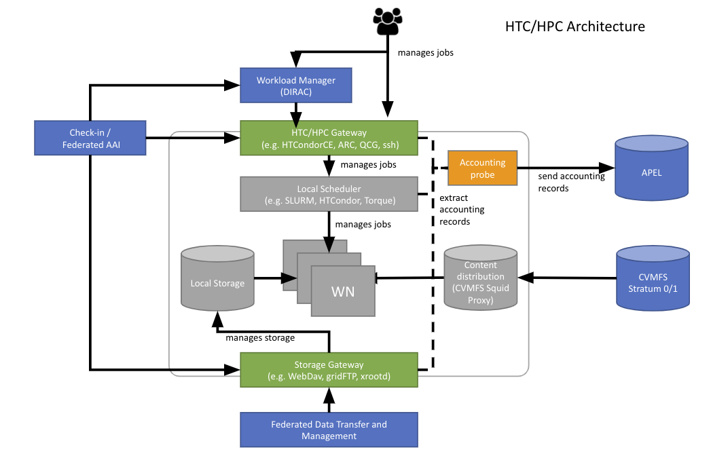

## What is it?

High Throughput Compute (HTC) is a computing paradigm that focuses on the
**efficient execution of a large number of loosely-coupled tasks** (e.g. data
analysis jobs). HTC systems execute independent tasks that can be individually
scheduled on many different computing resources, across multiple administrative
boundaries. Users submit these tasks to the infrastructure as jobs. After a job
have been scheduled and executed, the output can be collected from the
service(s) that executed the job.

## Target users

The target customers for EGI High Throughput Compute are research communities
that need to share, store, process, and produce large sets of data. Typically,
their research collaborations involve organizations across Europe and the
World.Some may already have local resources (e.g. universities, research
institutions) that can only be accessed by local users in accordance to the
respective organisation's access policies.

In case of local compute resources researchers can request access to the local
compute cluster from their IT department. However, when researchers join
collaborations that need to share their research activities, data collections,
and repositories, they need a homogeneous and coordinated operation of the
compute resources, which are not uniformly accessible. In addition, nowadays
many research collaborations generate large amounts of data, and managing such
data volumes is time consuming and error-prone.

The EGI High Throughput Compute service provides access to compute resources,
and offers a set of high-level tools that allow managing large amounts of data
in a collaborative way (e.g authorization and access control tools can be
regulated by the research collaboration in a central manner, data can be
uniformly distributed in the EGI Cloud, etc.).

## Features

EGI High Throughput Compute provides easy, uniform access to shared computing
and data services of EGI service providers. Most software deployed in the
distributed resource centres is based on
[open standards](https://en.wikipedia.org/wiki/Open_standard) and
[open source](https://en.wikipedia.org/wiki/Open_source) middleware services.

The main features of the EGI High Throughput Compute are:

- Access to high-quality computing resources
- Integrated monitoring and accounting tools provide information about the
  availability and resource consumption
- Workload and data management tools to manage all computational tasks
- Large amounts of processing capacity over long periods of time
- Faster results for your research
- Shared resources enable collaborative research

## The EGI HTC infrastructure

The EGI High Throughput Compute infrastructure is the federation of GRID
resources provided by EGI providers. Its aim is to share in a secure way the
distributed IT resources that are part of the EGI Cloud. It comprises of:

- **Compute Resources** -- execution environment for computing tasks, organized
  into clusters distributed across multiple resource centres in Europe and the
  World.
- **Data Infrastructure** -- storage servers from different resource centres
  where users can store their data/files in a distributed manner.
- **Federated Operations** -- global operational tasks (e.g., [AAI](../../aai),
  [Accounting](../../../internal/accounting),
  [Helpdesk](../../../internal/helpdesk)) needed to federate the heterogeneous
  resources of resource centres and their operational activities.
- **User Support** -- EGI provides the central user support and coordinates
  support activities of EGI providers, who offer user support for the
  services/resources they contribute to the EGI ecosystem.

### Architecture and service components

The key components of the EGI High Throughput Compute architecture are:

- [Data Transfer service](../../data/management/data-transfer) (FTS)
- [Online Storage services](../../data/storage)
- **Computing Elements** (CEs) are compute resources made available through GRID
  interfaces. The most common implementations of CEs in the EGI infrastructure
  are [HTCondor-CE](https://htcondor.com/htcondor-ce/) and
  [ARC-CE](http://www.nordugrid.org/arc/ce/).

### Access model

Access to HTC resources in the EGI infrastructure is based on X.509 certificates
and [Virtual Organisations](../../aai/check-in/vos) (VOs).

VOs are fully managed by research communities, allowing communities to manage
their users and grant access to their services and resources. This means
communities can either own their resources and use EGI services to share
(federate) them, or can use the resources available in the EGI infrastructure
for their scientific needs.

Before users can access EGI HTC services, they have to:

1. Obtain an X.509 certificate. The certificates are issued by Certification
   Authorities (CAs) part of the
   [European Policy Management Authority for Grid Authentication](https://www.eugridpma.org)
   (EUGridPMA), which is also part of the
   [International Global Trust Federation](https://www.igtf.net) (IGTF).
1. Enrol into a VO having access to HTC resources, as users are not individually
   granted access to resources.
1. Add the certificate to their internet browser of choice, or import it into
   the appropriate certificate store of their local machine (on Windows).
1. Proceed to [Workload Manager](../../compute/orchestration/workload-manager)
   to submit HTC jobs or retrieve job results, login using
   [EGI Check-in](../../aai/check-in) when prompted.

> If you are interested in using command-line and direct submission to Compute
> Elements, there is a
> [tutorial on HTC job submission](../../tutorials/htc-job-submission).
