The following guide is intended for researchers who want to use ECAS, a complete
environment enabling data analysis experiments, in the EGI cloud.

ECAS (ENES Climate Analytics Service) is part of the EOSC-hub service catalog
and aims to:

1. provide server-based computation,
1. avoid data transfer, and
1. improve reusability of data and workflows.

It relies on [Ophidia](http://ophidia.cmcc.it/), a data analytics framework for
eScience, which provides declarative, server-side, and parallel data analysis,
jointly with an internal storage model able to efficiently deal with
multidimensional data and a hierarchical data organization to manage large data
volumes ("datacubes"), and on JupyterHub, to give users access to ready-to-use
computational environments and resources.

Thanks to the Elastic Cloud Compute Cluster (EC3) platform, operated by the
[Polytechnic University of Valencia (UPV)](http://www.upv.es/index-en.html),
researchers will be able to rely on the EGI Cloud Compute service to scale up to
larger simulations without being worried about the complexity of the underlying
infrastructure.

This guide will show how to:

- deploy an ECAS elastic cluster of VMs in order to automatically install and
  configure the whole ECAS environment services, i.e. JupyterHub, PyOphidia,
  several Python libraries such as numpy, matplotlib and Basemap;
- perform data intensive analysis using the Ophidia HPDA framework;
- access the ECAS JupyterHub interface to create and share documents containing
  live code, equations, visualizations and explanatory text.

## Deploy an ECAS cluster with EC3

In the latest release of the EC3 platform a new Ansible receipt is available
for researchers interested to deploy ECAS cluster on the EGI Infrastructure.
The next sections provide details on how to configure and deploy an ECAS cluster
on EGI resources.

### Configure and deploy the cluster

To configure and deploy a Virtual Elastic Cluster using EC3, access the
[EC3 platform front page](https://servproject.i3m.upv.es/ec3-ltos/index.php) and
click on the **\"Deploy your cluster\"** link as shown in the figure below:

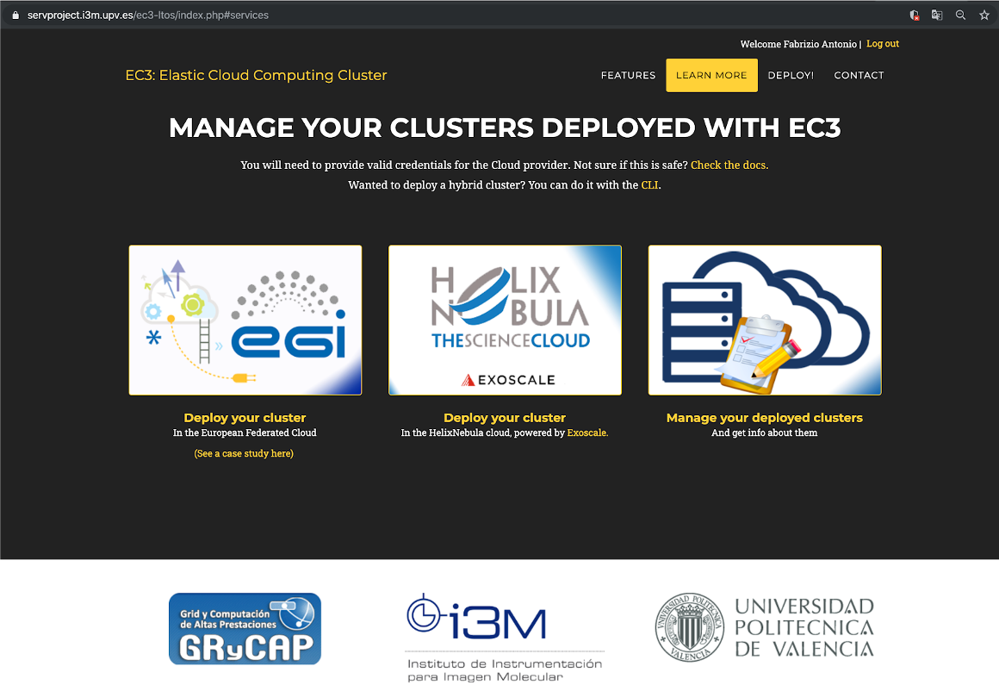

A wizard will guide you through the cluster configuration process. Specifically,
the general wizard steps include:

- **LRMS selection**: choose **ECAS** from the list of LRMSs (Local Resource
  Management System) that can be automatically installed and configured by EC3.

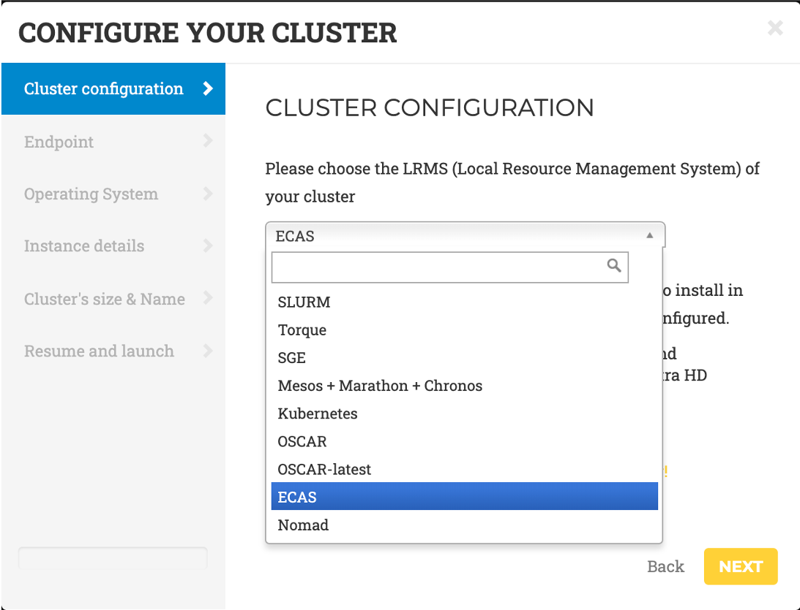

- **Endpoint**: the endpoints of the providers where to deploy the ECAS elastic
  cluster. The endpoints serving the `vo.access.egi.eu` VO are dynamically
  retrieved from the [EGI Application DataBase](https://appdb.egi.eu/) using
  REST APIs.

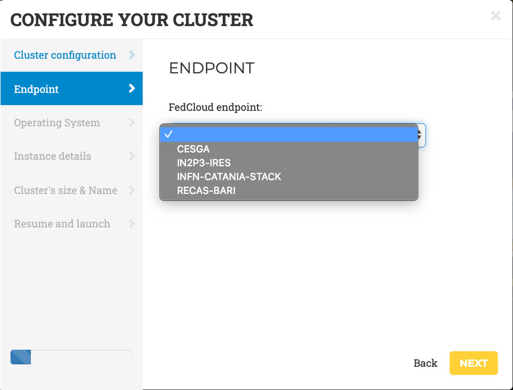

- **Operating System**: choose EGI CentOS7 as cluster OS.


- **Instance details**, in terms of CPU and RAM to allocate for the front-end
  and the working nodes.

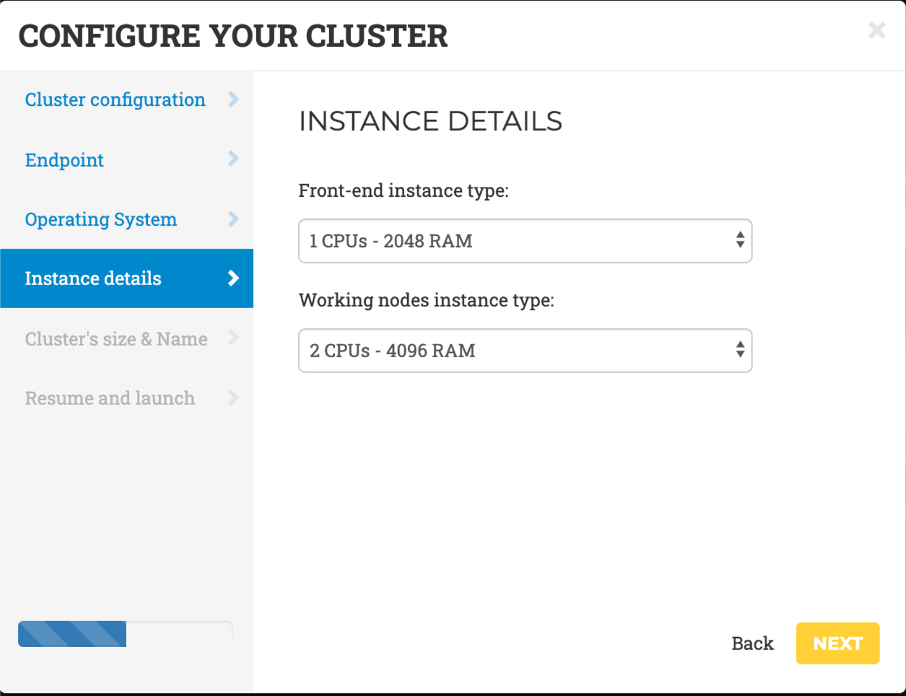

- **Cluster's size and name**: the name of the cluster and the maximum number of
  nodes of the cluster, without including the frontend. This value indicates the
  maximum number of working nodes that the cluster can scale to. Initially, the
  cluster is created with the frontend and only one working node: the other
  working nodes will be powered on on-demand.

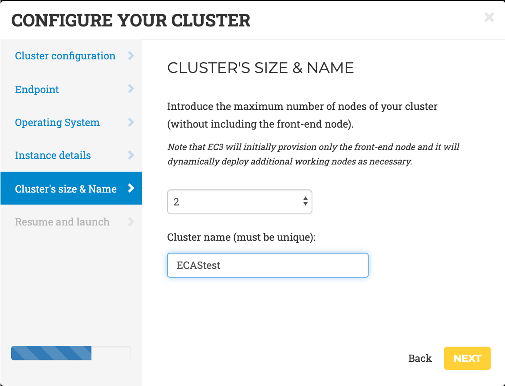

- **Resume and Launch**: a summary of the chosen cluster configuration. To start
  the deployment process, click the Submit button.

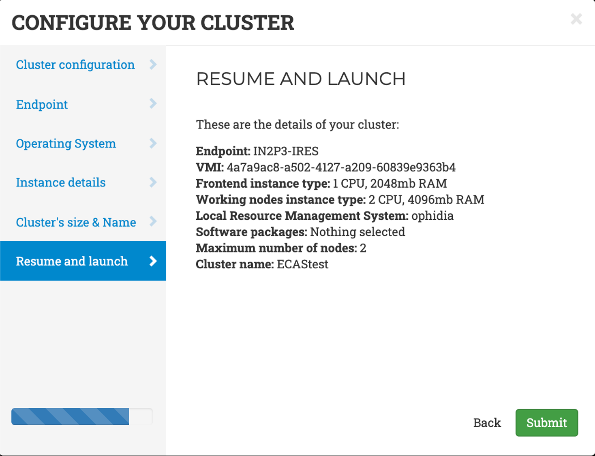

When the frontend node of the cluster has been successfully deployed, you
will be notified with the credentials to access via SSH.

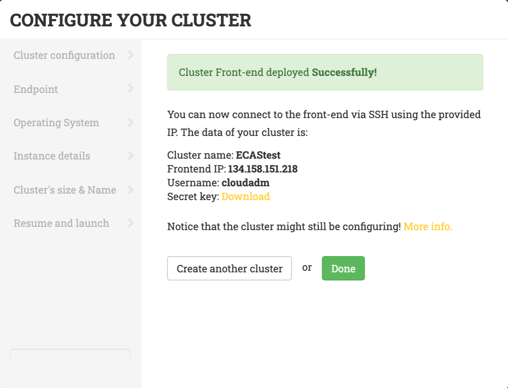

The cluster details are available by clicking on the \"Manage your deployed
clusters\" link on the front page:

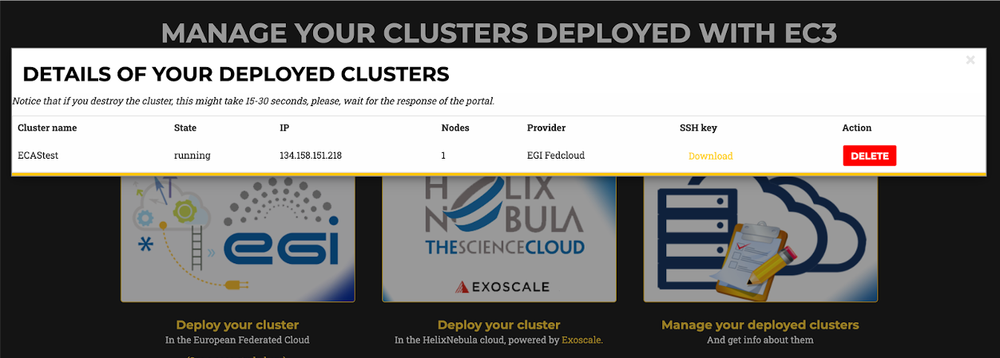

{} The configuration of the cluster may
take some time. Please wait for its completion before starting to use the
cluster. {}

### Accessing the cluster

To access the frontend of the cluster:

- download the SSH private key provided by the EC3 portal;
- change its permissions to `600`;
- access via SSH providing the key as identity file for public key
  authentication.

```shell
[user@localhost EC3]$ ssh -i key.pem cloudadm@<YOUR_CLUSTER_IP>
Last login: Mon Nov 18 11:37:29 2019 from torito.i3m.upv.es
[cloudadm@oph-server ~]$ sudo su -
[root@oph-server ~]#
```

Both the frontend and the working nodes are configured by Ansible. This
process usually takes some time. You can monitor the status of the cluster
configuration using the `is_cluster_ready` command-line tool:

```shell
[root@oph-server ~]# is_cluster_ready
Cluster is still configuring.
```

The cluster is successfully configured when the command returns the following
message:

```shell
[root@oph-server ~]# is_cluster_ready
Cluster configured!
```

As SLURM is used as workload manager, it is possible to check the status of the
working nodes by using the sinfo command, which provides information about Slurm
nodes and partitions.

```shell
[root@oph-server ~]# sinfo
PARTITION AVAIL  TIMELIMIT  NODES  STATE NODELIST
debug*       up   infinite   1  down* oph-io2
debug*       up   infinite   1   idle oph-io1
```

### Accessing the scientific eco-system

ECAS provides two different ways to get access to its scientific eco-system:
Ophidia client (`oph_term`) and JupyterHub.

#### Perform some basic operations with Ophidia

Run the Ophidia terminal as `ophuser` user.

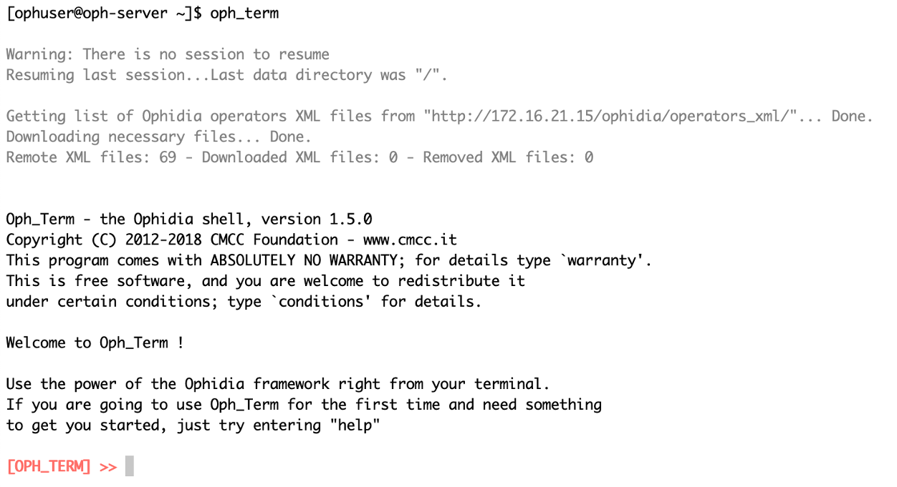

The default parameters are already defined as environmental variables inside the
`.bashrc` file:

```shell
export OPH_SERVER_HOST="127.0.0.1"
export OPH_SERVER_PORT="11732"
export OPH_PASSWD="abcd"
export OPH_USER="oph-test"
```

Create an empty container and a new datacube with random data and dimensions.

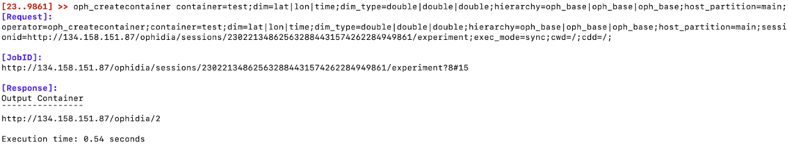

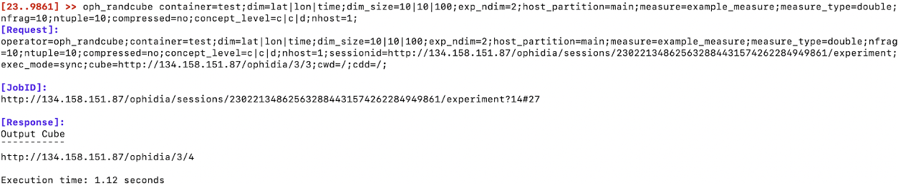

Now, you can submit your first operation of data transformation: let's reduce
the whole datacube in a single value for grid point using the average along the
time:

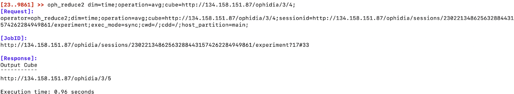

Let's have a look at the environment by listing the datacubes and containers in
the session:

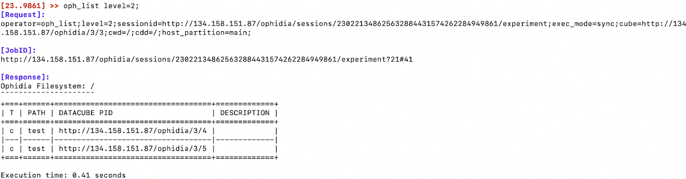

By default, the Ophidia terminal will use the last output datacube PID. So, you
can use the `oph_explorecube` operator to visualize the first 100 values.

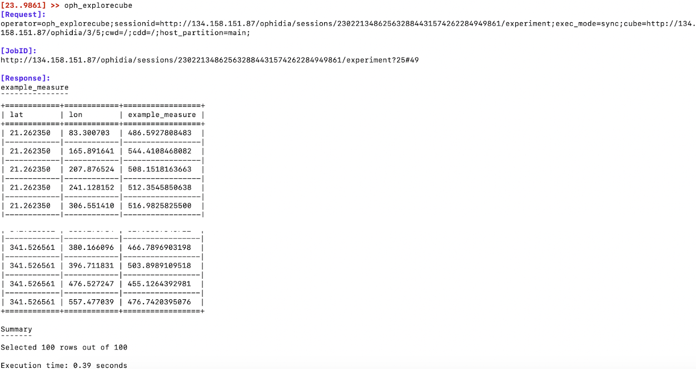

For further details about the Ophidia operators, please refer to the official
[documentation](http://ophidia.cmcc.it/).

#### Accessing the Jupyter interface

To access the Jupyter interface, open the browser at
`https://<YOUR_CLUSTER_IP>:443/jupyter` and log in to the system using the
username and password specified in the `jupyterhub_config.pyp` configuration
file (see the `c.Authenticator.whitelist` and `c.DummyAuthenticator.password`
lines) located under the `/root` folder.

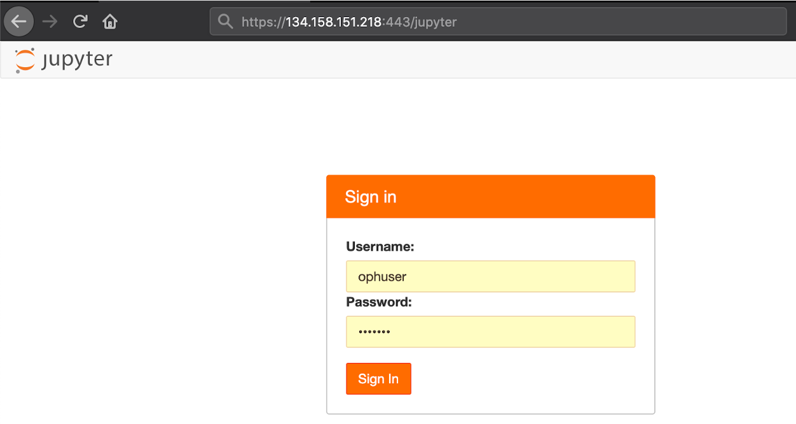

From JupyterHub in ECAS you can do several things such as:

- create and run a Jupyter Notebook exploiting PyOphidia and other Python
  libraries for data manipulation, analysis and visualization (e.g. NumPy,
  matplotlib, Cartopy);
- browse the directories, download and update files in the home folder;
- execute operators and workflows directly from the Ophidia Terminal;
- access to a read-only data repository hosted in a Onedata space and perform
  any analysis on this shared data.

The ECAS space shared in the ECAS environment through the Onedata services is
available at the `onedata/ecas_provider/ECAS_space` folder located under the
`/data` directory.

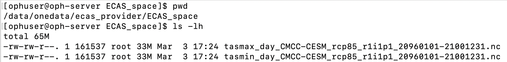

To get started with the ECAS environment capabilities, open the
`ECAS_Basics.ipynb` notebook available under the `notebooks/` folder in the home
directory.

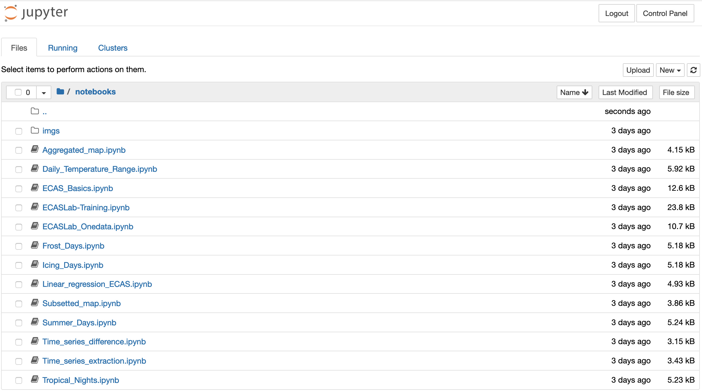

### Accessing the Grafana UI

This section will show how to monitor the ECAS environment and the resource
usage and get aggregated information over time.

To access the Grafana monitoring interface, open the browser at
`https://<YOUR_CLUSTER_IP>:3000` and log in to the system using the _admin_
username and the password specified in the `.grafana_pwd` file located under the
`/root` folder.

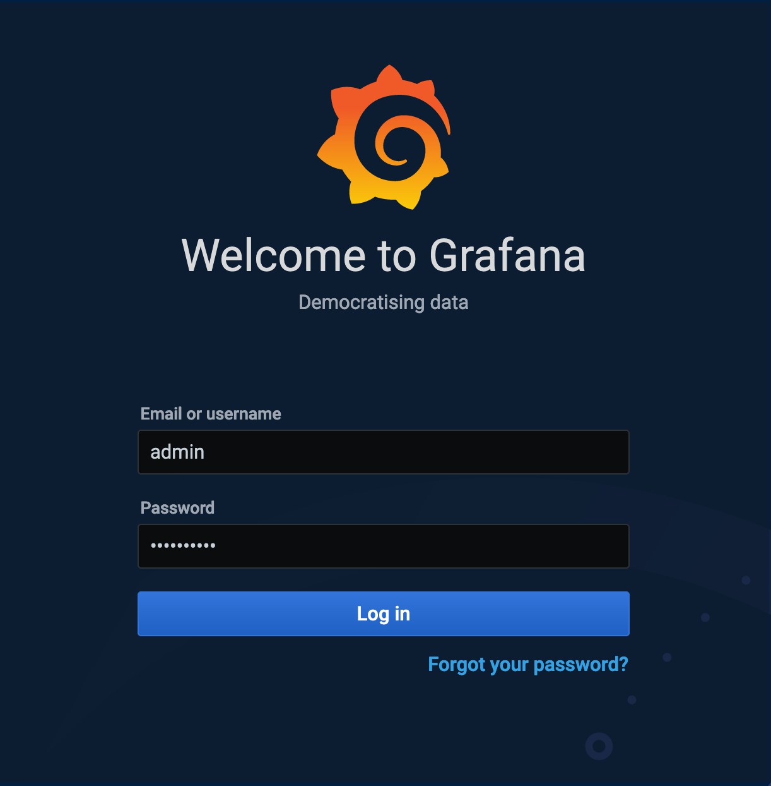

The Grafana-based monitoring system provides two dashboards in order to monitor
the ECAS cluster both at system and application level.

- The **infrastructure dashboard** provides information about the percentage of
  CPU, RAM, SWAP and disk used on each Node.js (the frontend and the working
  nodes).

|                 frontend node                     |            working node                |
| :-----------------------------------------------: | :------------------------------------: |
|  | 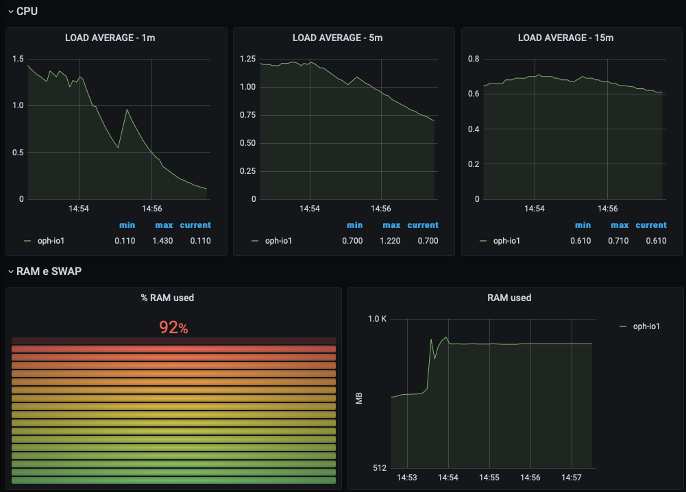 |

- The **application dashboard** shows information about which operator/workflow
  is being executed and its current execution status and provides aggregated
  information over time (e.g. number of total, completed and failed
  workflows/tasks, hourly weighted average of running cores).


### Destroy the cluster

To destroy the running cluster use the `delete` action from the cluster
management page.


## References

- [ECASLab CMCC](https://ecaslab.cmcc.it/web/home.html)
- [ECASLab DKRZ](https://ecaslab.dkrz.de/home.html)
- [Ophidia](http://ophidia.cmcc.it/)
- [GitHub: ECAS-Lab](https://github.com/ECAS-Lab)
- [GitHub: Ansible role Ophidia cluster](https://github.com/OphidiaBigData/ansible-role-ophidia-cluster)
- [EC3](http://www.grycap.upv.es/ec3)
- [GitHub EC3](http://www.github.com/grycap/ec3)
