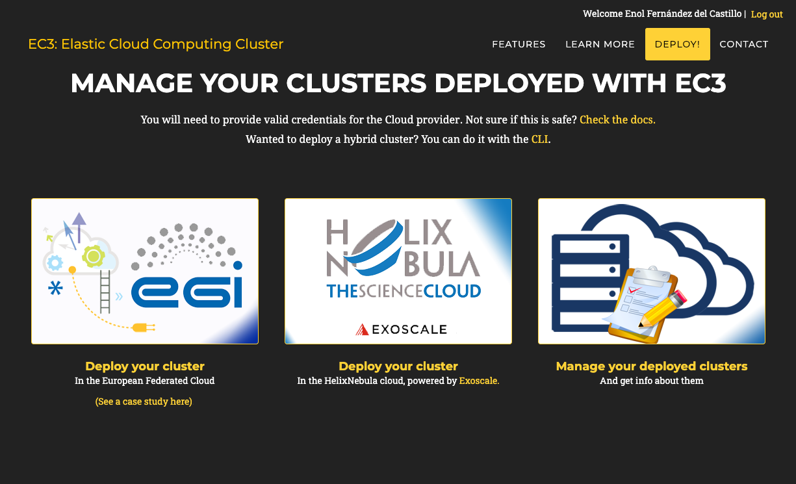
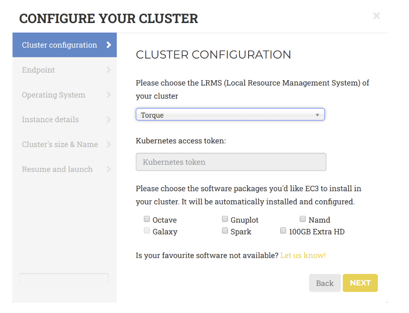
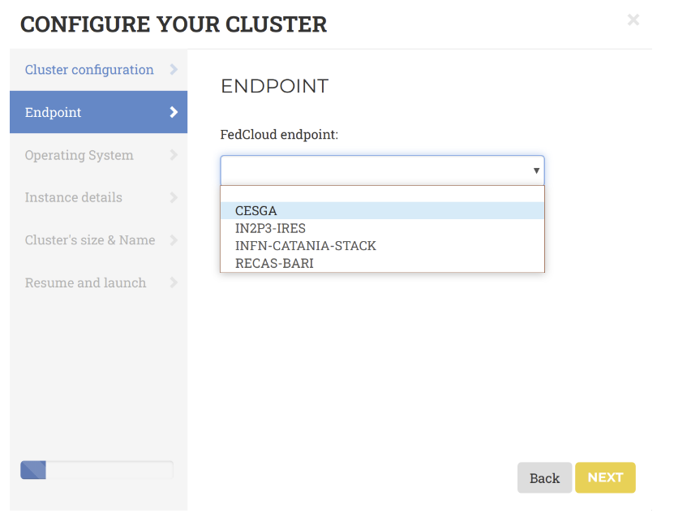
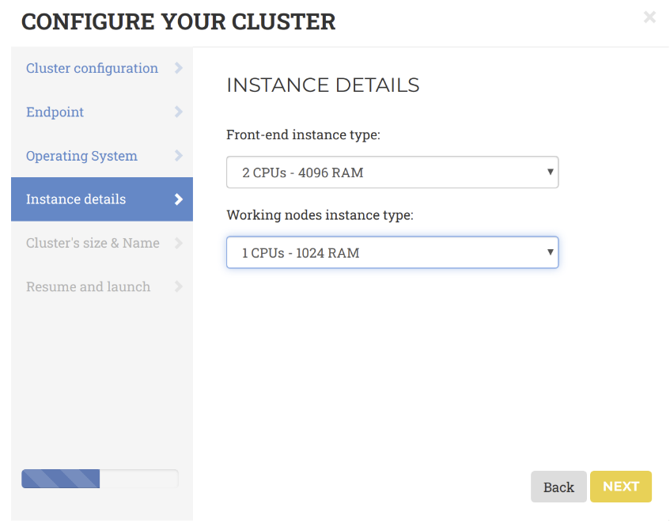
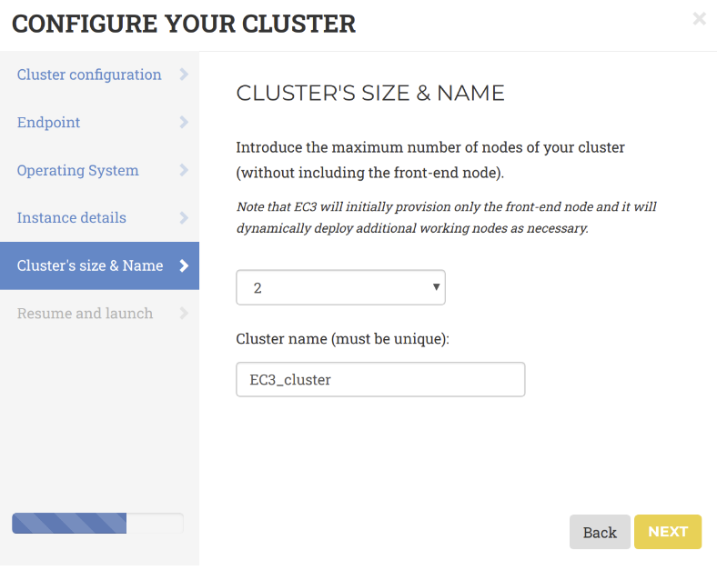

## Deploy cluster

Through a "job wizard" interface the user can login to the
[Elastic Cloud Compute Cluster (EC3) portal](https://servproject.i3m.upv.es/ec3-ltos/index.php)
and configure the virtual cluster with the related tools and applications to be
deployed in the EGI Cloud. Click on the “Deploy your cluster” button to create a
cluster in the EGI Cloud.



The cluster is composed of a front node, where a batch job scheduler is running,
and a number of compute nodes. These compute nodes will be dynamically deployed
and provisioned to fit increasing load, and un-deployed when they are in idle
status. The installation and configuration of the cluster is performed by means
of the execution of Ansible receipts.

A wizard will guide the user during the configuration process of the cluster,
allowing to configure details like the operating system, the characteristics of
the nodes, the maximum number of nodes of the cluster or the pre-installed
software packages. Specifically, the general wizard steps include:

1. **LRMS** selection: choose **Torque** from the list of LRMSs (Local Resource
   Management System) that can be automatically installed and configured by EC3.

   

1. **Endpoint**: the endpoints of the providers where to deploy the elastic
   cluster. The endpoints serving the
   [vo.access.egi.eu VO](https://operations-portal.egi.eu/vo/view/voname/vo.access.egi.eu)
   are dynamically retrieved from the
   [EGI Application DataBase](https://appdb.egi.eu/) using REST APIs.

   

1. **Operating System**: choose one of the available EGI base OS images
   available to create the cluster (e.g. CentOS7, or EGI Ubuntu 18.04 LTS).

1. **Instance details**: in terms of CPU and RAM to allocate for the front-end
   and the working nodes.

   

1. **Cluster’s size and name**: the name of the cluster and the maximum number
   of nodes of the cluster, without including the frontend. This value
   indicates the maximum number of working nodes that the cluster can scale.
   Initially, the cluster is created with the frontend and only one working
   node: the other working nodes are powered on on-demand.

   

1. **Resume and Launch**: a summary of the chosen cluster configuration. To
   start the deployment process, click the Submit button.

{}The configuration of the cluster may
take some time. Please wait for its completion before starting to use the
cluster! {}

When the frontend node of the cluster has been successfully deployed, the user
will be notified with the credentials to access via SSH.

The cluster details are available by clicking on the **"Manage your deployed
clusters"** link on the front page.

## Accessing the EC3 cluster

To access the frontend of the elastic cluster:

1. Download the SSH private key provided by the EC3 portal;
1. Change its permissions to 600;
1. Access via SSH providing the key as identity file for public key
   authentication.

```shell
]$ ssh -i key.pem cloudadm@<CLUSTER_PUBLIC_IP>
Last login: Mon Nov 18 11:37:29 2019 from torito.i3m.upv.es
[cloudadm@server ~]$
```

Both the frontend and the working node are configured by Ansible. This process
usually takes some time. User can monitor the status of the cluster
configuration using the `is_cluster_ready` command-line tool:

```shell
]# is_cluster_ready
Cluster is still configuring.
```

The cluster is successfully configured when the command returns the following
message:

```shell
]# is_cluster_ready
Cluster configured!

node state enabled time stable (cpu,mem) used (cpu,mem) total
]$ clues status
node   state   enabled   time stable   (cpu,mem) used   (cpu,mem) total
-----------------------------------------------------------------------
wn1     off    enabled    00h04'20"     0,0              1,-1
wn2     off    enabled    00h04'20"     0,0              1,-1
```

## Operate the EC3 cluster

To force CLUES to spawn a new node of the cluster, please use the command:

```shell
]$ clues poweron wn1
node wn1 powered on
```

The configuration triggers the execution of several ansible processes to
configure the node and may take some time. To monitor the configuration of the
node, you can use the `is_cluster_ready` command.

To avoid that clues powers off the node in case of inactivities, once the node
is configured, you can disable the node as it follows:

```shell
]$ clues disable wn1
node wn1 successfully disabled
```

## Log files

- Cluster logs files are available in `/var/tmp/.im/<cluster_id>`
- IM log files are in `/var/log/im/im.log`
- CLUES log files are in `/var/log/clues2/clues2.log`
