The IM Dashboard is a graphical interface for the IM Server specially developed
for EOSC users to access EGI Cloud Compute resources.

Functionalities:

- OIDC authentication
- Display user's infrastructures
- Display infrastructure details, template and log
- Delete infrastructure
- Create new infrastructure
- Add nodes to an infrastructure
- Resize VMs

{} More details about installing and
configuring the dashboard are available in the
[IM Dashboard documentation](https://imdocs.readthedocs.io/en/latest/dashboard.html).
{}

## Usage

The dashboard of the IM enables non advanced users to manage their
infrastructures by launching a set of predefined TOSCA templates on top of EGI
Cloud Compute resources. The dashboard does not provide all the features
provided by the IM service. In case you need more advanced features use the
[IM Web interface](https://imdocs.readthedocs.io/en/latest/web.html) or the
[IM-CLI](../cli).

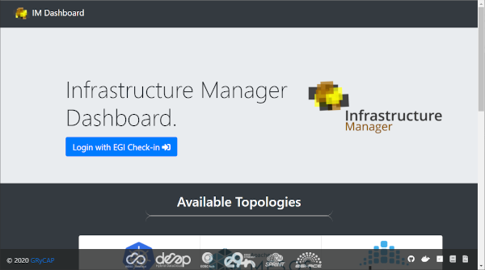

### Login

Users must use [EGI Check-in](../../../../aai/check-in) to log into the
dashboard. Once authenticated, they will be redirected to the portfolio of
available TOSCA templates.

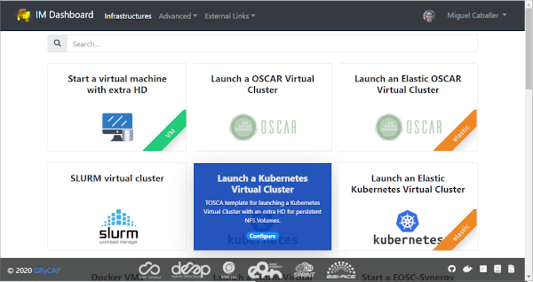

### Main menu bar

The main menu bar is located at the top of the pages:

- The first button `IM Dashboard` enables the user to go to the portfolio of
  available TOSCA templates.
- Second item `Infrastructures` redirects to the list of current user deployed
  infrastructures.
- In the `Advanced` item the `Settings` sub-item displays some configuration
  settings as the URL of the IM service or the OIDC issuer.
- `External Links` show a set of configurable information links (documentation,
  video tutorials, etc.)
- Finally, on the right top corner, appears the `User` menu item. This item
  shows the full name of the logged user, and an avatar obtained from
  [Gravatar](https://www.gravatar.com/). In this menu the user can access their
  `Cloud Credentials` with the cloud providers or log out from the application.

### Cloud Credentials

To be able to access any Cloud site the user must specify the credentials to
access them. This page allows the user to specify the credentials for accessing
any cloud provider. In the list the user can edit, delete and enable or disable
the selected cloud credentials.

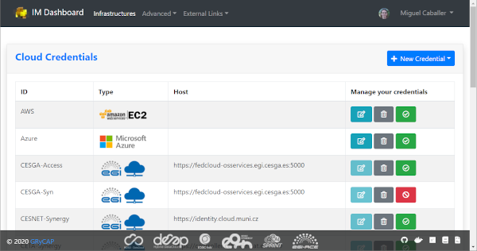

Editing or adding the credentials will show a modal form where the user has the
ability to specify all the parameters needed to access the supported cloud
providers. In particular, for [Cloud Compute](../../../cloud-compute) sites the
user only has to select one of the VOs he is member of and one of sites that
supports that VO. These drop-down fields are generated using the information
available from the sites and the list of VOs the user is member of.

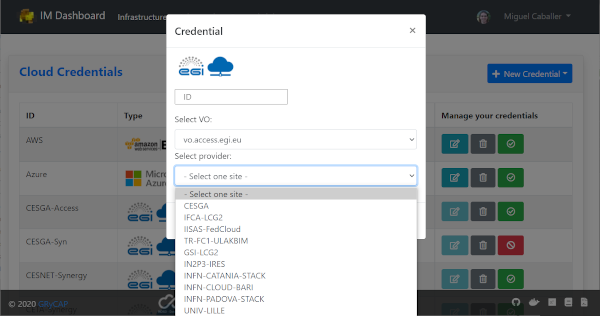

### TOSCA Templates

The list of available TOSCA templates enables the user to select the required
topology to deploy. Each TOSCA template can be labelled by the TOSCA developer
with any tag that will show a ribbon displayed on the right bottom corner. The
special `elastic` tag is used to mark templates that are configured to
automatically manage the elasticity of the deployed cluster.

The user must click on the `Configure` button to set the input values of the
TOSCA template and select the VO, Site and Image to use for deploying the
infrastructure.

Initially the user can set a name to describe the infrastructure to be deployed.
It will simplify identifying infrastructures. In the firsts tabs, the user can
introduce the set of input values of the topology. By default there is only one
tab called `Input Values`, but the TOSCA developer can add or rename them to
simplify the selection of input values.

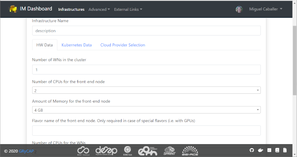

The final tab will be the `Cloud Provider Selection`. In this tab the user first
has to select one of the Cloud providers that has been previously added (and not
disabled) in the `Cloud Credentials` page, then has to select the base image
used to deploy the VMs. In case of EGI Cloud Compute sites, the user has two
options: he can select an image from the list of images provided by the
[EGI AppDB information system](https://appdb.egi.eu/) or from the list provided
directly by the Cloud site.

Other providers will only show a drop-down list with the available images. Only
in the case of AWS Cloud provider the user has to specify manually the AMI ID of
the image.

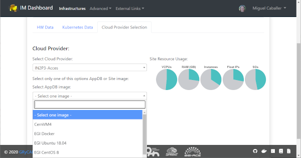

### Infrastructures

This page lists the infrastructures deployed by the user. The first column shows
the name set by the user on infrastructure creation, then shows the ID assigned
by the IM service, the third column shows the current status of the
infrastructure, the fourth show the list of VMs with their IDs and finally a
button with a set of actions appears.

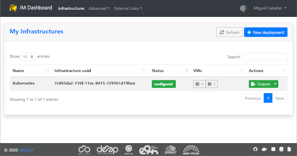

#### List of Actions

The following figure shows the list of actions available to manage the existing
infrastructures:

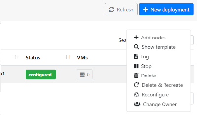

- Add nodes: The Add nodes action enables to add new VMs to the users'
  deployment. It will show the list of the different types of nodes currently
  deployed in the infrastructure and the user must set the number of nodes of
  each type he wants to deploy. It will also show a dropdown list with the
  available base images. It will enable changing the base image used to
  deploy the new nodes. In some cases it will be necessary because the original
  one has been removed.

  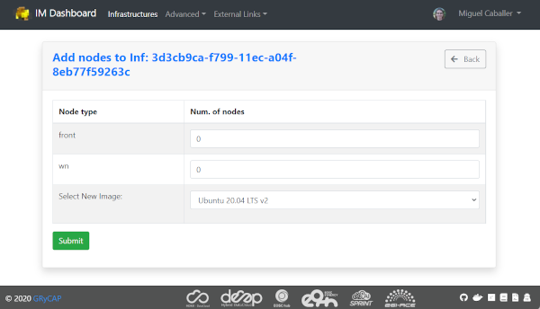

- Show template: This action shows the original TOSCA template submitted to
  create the infrastructure.

- Log: Shows the error/contextualization log of the infrastructure.

- Stop: Stops/Suspends all the VMs of the infrastructure.

- Start: Starts/Resumes a previously stopped infrastructure.

- Outputs: Shows the outputs of the TOSCA template. Private key of credentials
  can be downloaded as a file or copied to the clipboard.

  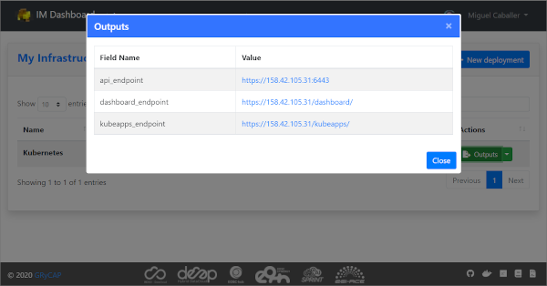

- Delete: Delete this infrastructure and all the associated resources. It also
  has the option to force the deletion. In this case the infrastructure will be
  removed from the IM service even if some cloud resources cannot be deleted.
  **Only use this option if you know what you are doing**.

- Delete & Recreate: Delete this infrastructure as the previous option, but once
  it is deleted it will redirect to the infrastructure creation form, with all
  the input fields filled with the same set of values used to create the deleted
  infrastructure.

- Reconfigure: Starts the reconfiguration of the infrastructure.

- Change User: Add or change the ownership of the infrastructure at IM level.
  Providing a valid `Access Token` of another user, the infrastructure can be
  shared or transferred to them. If `Overwrite` is checked, the new user will be
  the unique owner of the infrastructure (transferring), otherwise it will be
  added to the list of current users (sharing). **The new user must be member of
  the VO used to create the resources**, otherwise he will not be able to manage
  them. The list of current owners of the infrastructure will also be displayed.

  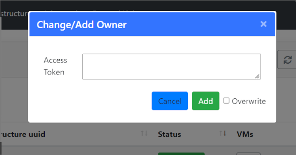

### VM Info page

The VM Info page shows all the information about the selected VM and enables to
manage the lifecycle of it. On the top right corner the `Manage VM` drop-down
menu allows to Stop/Start, Reboot, Resize, Reconfigure and Terminate the VM.
Furthermore the user can check the error or contextualisation log of this
particular VM.

The VM information is split in two different tables, the first one with the main
information: State, IPs, HW features and the SSH credentials needed to access
it. The second table shows additional fields.

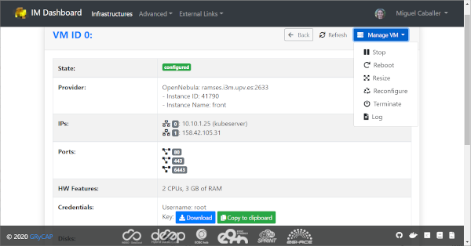

When resizing the VM the user must provide the new size of the VM in terms of
number of CPUs and amount of memory as shown in the figure below:

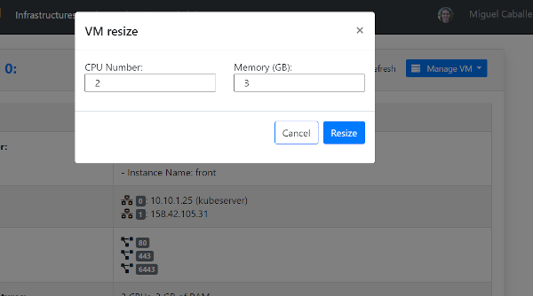
