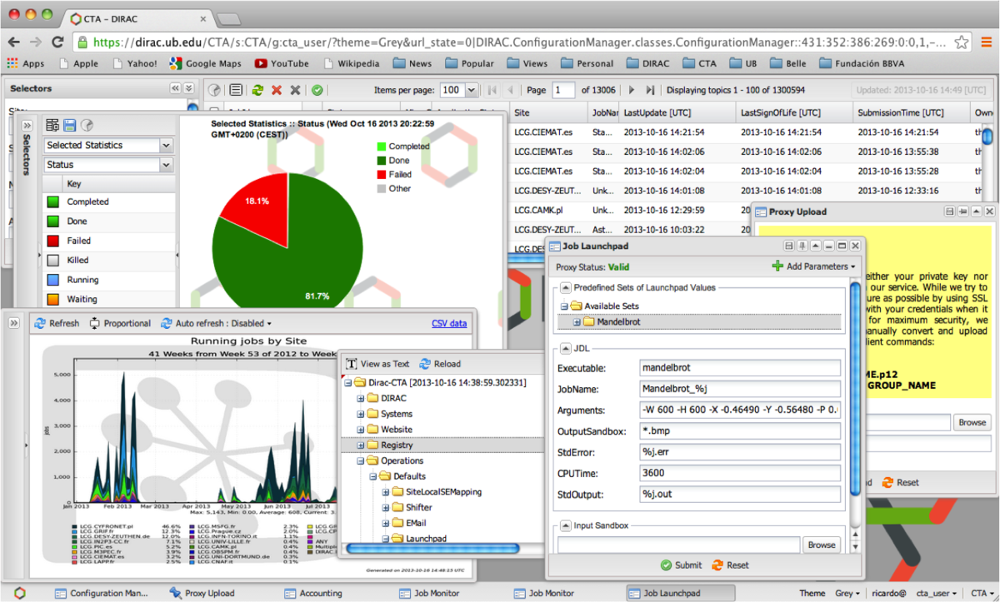
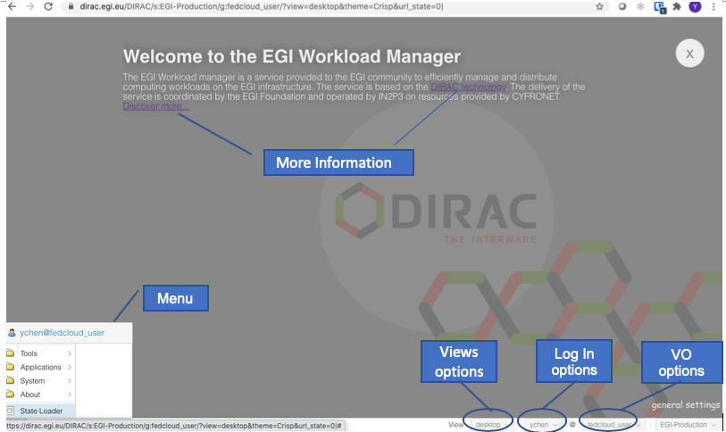
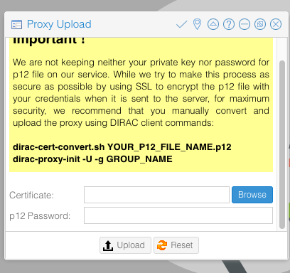
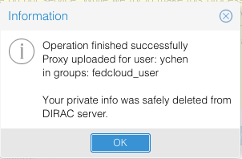
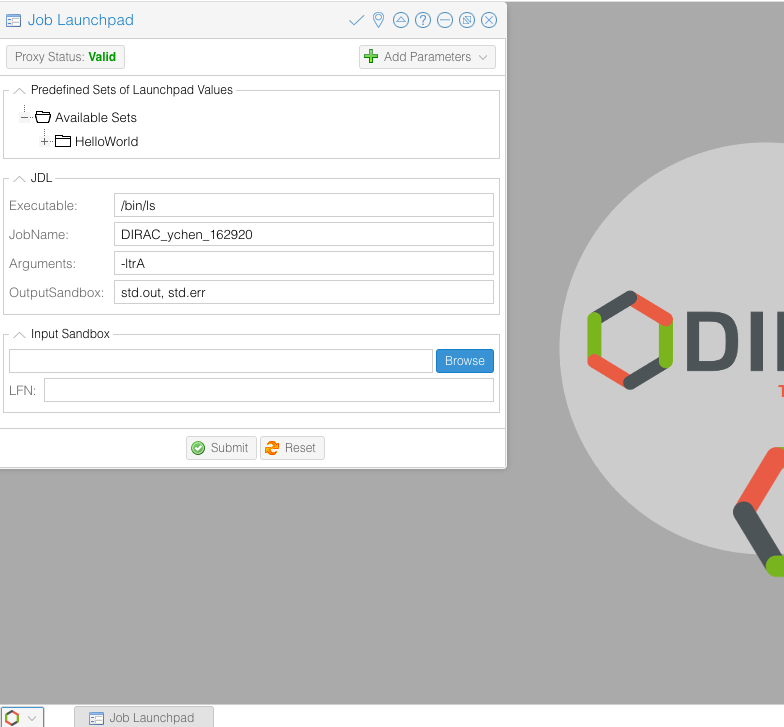
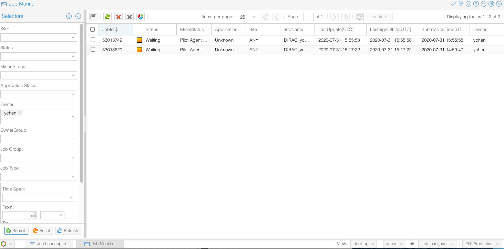

## What is it?

[EGI Workload Manager](https://www.egi.eu/services/workload-manager/) is a
service provided to the EGI community to efficiently **manage and distribute
computing workloads on the EGI infrastructure**.

Workload Manager is configured to support a number of
HTC and cloud resource pools from the EGI Federation. This pool of computing
resources can be easily extended and customized to support the needs of new
scientific communities.

<!-- markdownlint-disable no-inline-html -->

{} Workload Manager is based on
[DIRAC technology](http://diracgrid.org/).<br/>
The delivery of the service is coordinated
by the EGI Foundation and [IN2P3](https://in2p3.cnrs.fr/) provides the resources and
operates the service.
{}

<!-- markdownlint-enable no-inline-html -->

## Main Features

The EGI Workload Manager:

- Maximizes usage efficiency by choosing appropriately computing and storage
  resources on real-time.

- Provides a large-scale distributed environment to manage and handle data
  storage, data movement, accessing and processing.

- Handles job submission and workload distribution in a transparent way.

- Improves the general job throughput compared with native management of EGI
  Grid or Cloud computing resources.

- Offers pilot-based task scheduling method, that submits pilot jobs to
  resources to check the execution environment before to start the user's jobs.
  From a technical standpoint, the user's job description is delivered to the
  pilot, which prepares its execution environment and executes the user
  application. The pilot-based scheduling feature solves many problems of using
  heterogeneity and unstable distributed computing resources.

- Includes easy extensions to customize the environment checks to address the
  needs of a particular community. Users can choose appropriately computing and
  storage resources maximising their usage efficiency for particular user
  requirements.

- Handles different storage supporting both cloud and grid capacity.

- Provides a user-friendly interface that allows users to choose among different
  DIRAC services.

## Target User Groups

The service suits for the established Virtual Organization communities, long
tail of users, SMEs and Industry

- EGI and EGI Federation participants
- Research communities

## Architecture

The EGI Workload Manager service is a cluster of DIRAC services running on EGI
resources (HTC, Cloud, HPC) supporting multi-VO. All the DIRAC services are at
or above TRL8. The main service components include:

- Workload Management System (WMS) architecture is composed of multiple loosely
  coupled components working together in a collaborative manner with the help of
  a common Configuration Services ensuring reliable service discovery
  functionality. The modular architecture allows to easily incorporate new types
  of computing resources as well as new task scheduling algorithms in response
  to evolving user requirements. DIRAC services can run on multiple
  geographically distributed servers which increases the overall reliability and
  excellent scalability properties.

- REST server providing language neutral interface to DIRAC service.

- Web portal provides simple and intuitive access to most of the DIRAC
  functionalities including management of computing tasks and distributed data.
  It also has a modular architecture designed specifically to allow easy
  extension for the needs of particular applications.



The DIRAC Web portal

## How to access the EGI Workload Manager service

There are several options to access the service:

1. Members of a scientific community whose resources pool is already configured
   in the EGI Workload Manager instance can use the
   [EGI Workload Manager web portal](https://dirac.egi.eu/DIRAC/) to access the
   service, or use [DIRAC Client](#the-dirac-client-tool).
1. Individual researchers who want to do some number crunching for a limited
   period of time, with a reasonable (not too high) number of CPUs can use the
   catch-all VO resource pool (`vo.access.egi.eu`). Submit a request through the
   [EOSC Marketplace](https://marketplace.eosc-portal.eu/services/egi-workload-manager).
1. Representatives of a community who want to try DIRAC and EGI > Same as #2.
1. Representative of a community who wants to request DIRAC for the community's
   own resource pool > Submit a request through the
   [EOSC Marketplace](https://marketplace.eosc-portal.eu/services/egi-workload-manager).

## Getting Started

### Submit a service order via the Marketplace

User can request access to the service submitting a service-order to use the EGI
HTC service directly from the EOSC Marketplace:

- [EOSC Marketplace: Workload Manager](https://marketplace.eosc-portal.eu/services/egi-workload-manager)

Service orders are usually handled within 5 working days by the EGI User Support
Team on shift.

### Before starting

#### Apply for your user credentials

DIRAC uses [X.509 certificates](../../../aai/check-in/vos/voms) to identify and
authenticate users. These certificates are delivered to each individual by
trusted certification authorities. If you have a personal certificate issued by
a [EUGridPMA-certified](http://www.eugridpma.org/) authority you can use it for
this tutorial. Otherwise refer to the information available in this
[section](../../../aai/check-in/vos/voms/#get-a-certificate), to obtain a certificate.
Your certificate may take a few days to be delivered, so please ask for your
certificate well in advance and in any case, before the tutorial starts.

#### Install your credentials

Your personal certificate is usually delivered to you via a site and is
automatically loaded in your browser. You need to export it from the browser and
put it in the appropriate format for DIRAC to use. This is a one-time operation.
Please follow the instructions in detailed in
[VOMS documentation page](../../../aai/check-in/vos/voms) to export and in install your
certificate.

#### Send your certificate's subject to the DIRAC team

In order to configure the DIRAC server so that you gets registered as a user,
the team needs to know your certificate's subject.

Please use the command below on any Unix machine and send its output to\
`dirac-support` `<AT>` `mailman.egi.eu`

```shell
$ openssl x509 -in $HOME/.globus/usercert.pem -subject -noout
```

### The EGI Workload Manager Web Portal

To access the EGI Workload Manager open a web browser to:
[https://dirac.egi.eu/DIRAC/](https://dirac.egi.eu/DIRAC/)



The EGI Workload Manager service Web portal

- If you are a new user, you can see the welcome page where you can find links
  to user documentations.

- _VO options_: you can switch to different VOs that you have membership.

- _Log In options_: the service supports both X.509, Certificate and Check-in
  log-in.

- _View options_: allow to choose either desktop or tabs layout.

- _Menu_: a list of tools that enable the selected VO.

#### Upload Proxy

Before submitting your job, you need to upload your Proxy. Login to the portal.
Go to:\
`Menu` > `Tools` > `Proxy Upload`, enter your certificates .p12 file and the passphrase,
click `Upload`.




The wizard to upload the .p12 proxy certificate

#### Job Submission

Go to:\
`Menu` > `Tools` > `Job Launchpad`. First check the `Proxy Status`, click it until
it shows `Valid` in green color.

In the Job Launchpad, you can select your jobs from the list; add parameters,
indicating the output Sandbox location.

Now, select `Helloworld` from the job list, and click `Submit`, you just launch
your very first job to the EGI HTC cluster.



Submit a job with the Job Launchpad

#### Monitor Job status

Go to:\
`Menu` > `Applications` > `Job Monitor`.\
The left panel gives all kinds of search options for your jobs. Set your search
criteria, and click `Submit`, the jobs will list on the right panel.\
Try the various options to view different information about the jobs.



Monitor the job execution with the Job Monitor panel

#### Get Results from Sandbox

Once the job has been successfully processed, the `Status` of the job will
change to green. Right click the job, select:\
`Sandbox` > `Get Output file(s)`, you can get the result file(s).

#### Full User Guide for DIRAC Web Portal

For further instructions, please refer to
[DIRAC Web Portal Guide](https://dirac.readthedocs.io/en/latest/UserGuide/WebAppUserGuide/index.html)

### The DIRAC client tool

The easiest way to install the client is via
[Docker Container](https://www.docker.com/). If you have a Docker client
installed in your machine, install the DIRAC CLI as follows:

```shell
$ docker run -it -v $HOME:$HOME -e HOME=$HOME diracgrid/client:egi
```

Once the client software is installed, it should be configured in order to
access the EGI Workload Manager service:

```shell
$ source /opt/dirac/bashrc
```

To proceed further a temporary proxy of the user certificate should be created.
This is necessary to get information from the central Configuration Service:

```shell
$ dirac-proxy-init -x
Generating proxy...
Enter Certificate password:
...
```

Now the client can be configured to work in conjunction with the EGI Workload
Manager service:

```shell
$ dirac-configure defaults-egi.cfg Executing:
/home/jdoe/DIRAC/DIRAC/Core/scripts/dirac-configure.py defaults-egi.cfg


Checking DIRAC installation at "/home/jdoe/DIRAC" Created vomsdir file
/home/jdoe/DIRAC/etc/grid-security/vomsdir/vo.formation.idgrilles.fr/cclcgvomsli01.in2p3.fr.lsc
[..]
Created vomsdir file
/home/jdoe/DIRAC/etc/grid-security/vomsdir/fedcloud.egi.eu/voms2.grid.cesnet.cz.lsc
Created vomses file `/home/jdoe/DIRAC/etc/grid-security/vomses/fedcloud.egi.eu`
```

Generate the proxy containing the credentials of your VO. Specify the VO in the
`--group` option:

In this example, we are going to use the resources allocated for the WeNMR
project.

```shell
$ dirac-proxy-init --debug --group wenmr_user -U --rfc
$ dirac-proxy-init --debug --group wenmr_user -U --rfc
Generating proxy...
Enter Certificate password:
Contacting CS...
Checking DN /DC=org/DC=terena/DC=tcs/C=NL/O=Stichting EGI/CN=Jane Doe
jdoe@egi.eu
Username is jdoe
Creating proxy for jdoe@wenmr_user
(/DC=org/DC=terena/DC=tcs/C=NL/O=Stichting EGI/CN=Jane Doe
jdoe@egi.eu)
Requested adding a VOMS extension but no VOMS attribute defined for group wenmr_user
Uploading proxy for wenmr_user...
Uploading wenmr_user proxy to ProxyManager...
Loading user proxy Uploading proxy on-the-fly
Cert file /home/jdoe/.globus/usercert.pem Key file
/home/jdoe/.globus/userkey.pem
Loading cert and key User credentials loaded
Uploading...  Proxy uploaded Proxy generated:
subject      : /DC=org/DC=terena/DC=tcs/C=NL/O=Stichting EGI/CN=Jane Doe jdoe@egi.eu/CN=0123456789
issuer       : /DC=org/DC=terena/DC=tcs/C=NL/O=Stichting EGI/CN=Jane Doe jdoe@egi.eu
identity     : /DC=org/DC=terena/DC=tcs/C=NL/O=Stichting EGI/CN=Jane Doe jdoe@egi.eu
timeleft     : 23:59:58
DIRAC group  : wenmr_user
rfc          : True
path         : /tmp/x509up_u0
username     : jdoe
properties   : LimitedDelegation, GenericPilot, Pilot, NormalUser

Proxies uploaded: DN
| Group               | Until (GMT) /DC=org/DC=terena/DC=tcs/C=NL/O=Stichting
EGI/CN=Jane Doe jdoe@egi.eu | access.egi.eu_user  | 2021/09/14 23:54
/DC=org/DC=terena/DC=tcs/C=NL/O=Stichting EGI/CN=Jane Doe
jdoe@egi.eu | fedcloud_user       | 2021/09/14 23:54
/DC=org/DC=terena/DC=tcs/C=NL/O=Stichting EGI/CN=Jane Doe
jdoe@egi.eu | access.egi.eu_admin | 2021/09/14 23:54
/DC=org/DC=terena/DC=tcs/C=NL/O=Stichting EGI/CN=Jane Doe
jdoe@egi.eu | wenmr_user          | 2021/09/14 23:54
```

As a result of this command a user proxy with the same validity period of the
certificate is uploaded to the DIRAC ProxyManager service.

For checking the details of you proxy, run the following command:

```shell
$ dirac-proxy-info
subject      : /DC=org/DC=terena/DC=tcs/C=NL/O=Stichting EGI/CN=Jane Doe jdoe@egi.eu/CN=0123456789
issuer       : /DC=org/DC=terena/DC=tcs/C=NL/O=Stichting EGI/CN=Jane Doe jdoe@egi.eu
identity     : /DC=org/DC=terena/DC=tcs/C=NL/O=Stichting EGI/CN=Jane Doe jdoe@egi.eu
timeleft     : 23:59:26
DIRAC group  : wenmr_user
rfc          : True
path         : /tmp/x509up_u0
username     : jdoe
properties   : LimitedDelegation, GenericPilot, Pilot, NormalUser
```

#### Access the client via CVMFS

The DIRAC client may be accessed via CVMFS with the following two command lines:

```shell
$ source /cvmfs/dirac.egi.eu/dirac/bashrc_egi_dev
$ dirac-login --issuer=https://dirac.egi.eu/auth
```

#### Managing simple jobs

<!-- markdownlint-disable line-length -->

| DIRAC commands             | Note                                               |
| -------------------------- | -------------------------------------------------- |
| dirac-wms-job-status       | To check the status of a job                       |
| dirac-wms-job-delete       | To delete a job                                    |
| dirac-wms-job-logging-info | To retrieve history of transitions for a DIRAC job |
| dirac-wms-job-get-output   | To retrieve the job output                         |
| dirac-wms-job-submit       | To submit a job                                    |

<!-- markdownlint-enable line-length -->

DIRAC commands

Have a look at the official
[command reference documentation](http://dirac.readthedocs.io/en/latest/UserGuide/CommandReference/WorkloadManagement/index.html)
for the complete list of the Workload Management commands.

In general, you can submit jobs, check their status, and retrieve the output.
For example:

Create a simple JDL file (test.jdl) to submit the job:

```shell
[ JobName = "Simple_Job"; Executable = "/bin/ls"; Arguments = "-ltr";
StdOutput = "StdOut"; StdError = "StdErr"; OutputSandbox = {"StdOut","StdErr"};
]
```

Submit the job:

```shell
$ dirac-wms-job-submit test.jdl JobID = 53755998
```

Check the job status:

```shell
$ dirac-wms-job-status 53755998 JobID=23844073 Status=Waiting;
MinorStatus=Pilot Agent Submission; Site=ANY;
```

```shell
$ dirac-wms-job-status 53755998 JobID=53755998 Status=Done;
MinorStatus=Execution Completed; Site=EGI.NIKHEF.nl; Site=EGI.HG-08-Okeanos.gr;
```

Retrieve the outputs of the job (when the status is Done):

```shell
$ dirac-wms-job-get-output --Dir joboutput/ 53755998 Job output sandbox
retrieved in joboutput/53755998/
```

#### Jobs with Input Sandbox and Output Sandbox

In most cases the job input data or executable files are available locally and
should be transferred to the grid to run the job. In this case the
`InputSandbox` attribute can be used to move the files together with the job.

Create the `InputAndOuputSandbox.jdl`

```shell
JobName    = "InputAndOuputSandbox";
Executable = "testJob.sh";
StdOutput = "StdOut";
StdError = "StdErr";
InputSandbox = {"testJob.sh"};
OutputSandbox = {"StdOut","StdErr"};
```

Create a simple shell script (`testJob.sh`)

```shell
#!/bin/bash
/bin/hostname
/bin/date
/bin/ls -la
```

After creation of JDL file the next step is to submit the job, using the
command:

```shell
$ dirac-wms-job-submit InputAndOuputSandbox.jdl JobID = XXXXXXXX
```

#### List of supported VOs

- acc-comp.egi.eu, beapps, compchem, eiscat.se, eli-laser.eu,
- eli-beams.eu, eng.vo.ibergrid.eu, enmr.eu, fedcloud.egi.eu,
- hungrid, km3net.org, lofar, opencoast.eosc-hub.eu, see,
- training.egi.eu, virgo, vlemed, vo.formation.idgrilles.fr,
- vo.plgrid.pl, vo.access.egi.eu, auger, biomed, bitp,
- eng_cloud and breakseq_cloud

#### More details

- JDL language and simple jobs submission:
  [JDLs and Job Management](https://dirac.readthedocs.io/en/latest/UserGuide/Tutorials/JDLsAndJobManagementBasic/index.html)
- Basic Submitting Parametric jobs, using DIRAC API:
  [Advanced Job Management](https://dirac.readthedocs.io/en/latest/UserGuide/Tutorials/JobManagementAdvanced/index.html)
- [Past tutorials](https://github.com/DIRACGrid/DIRAC/wiki/TutorialIHEP2013-11)

## Technical Support

- DIRAC User Guide:
  [https://dirac.readthedocs.io/en/latest/UserGuide/](https://dirac.readthedocs.io/en/latest/UserGuide/)

- For technical issues and bug reports, please submit a ticket in
  [GGUS](https://ggus.eu/?mode=ticket_submit), in `Assign to support unit`,
  indicate:\
  `EGI Services and Service Components` > `Workload Manager (DIRAC)`.
