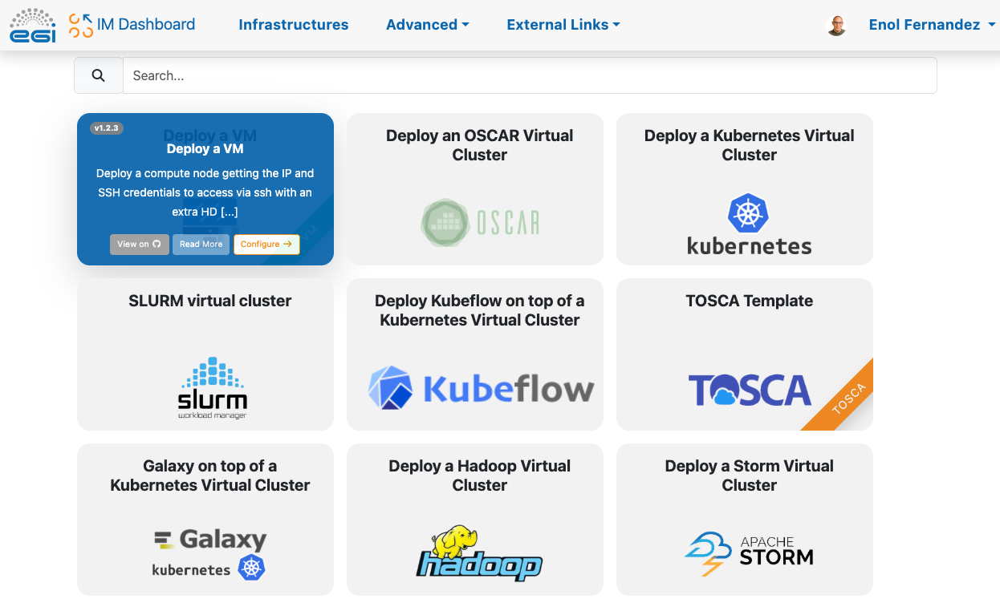
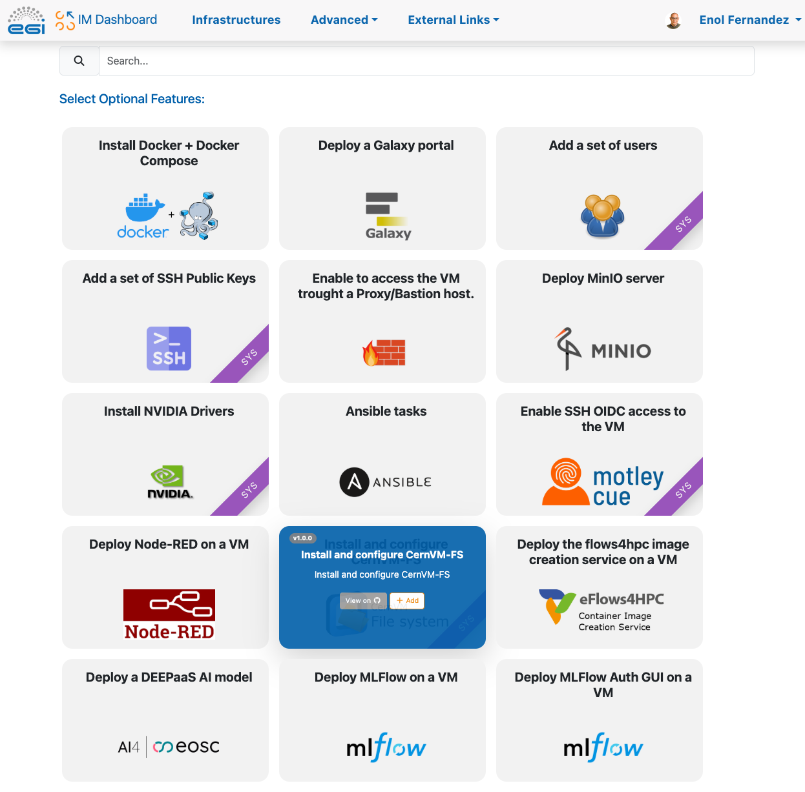
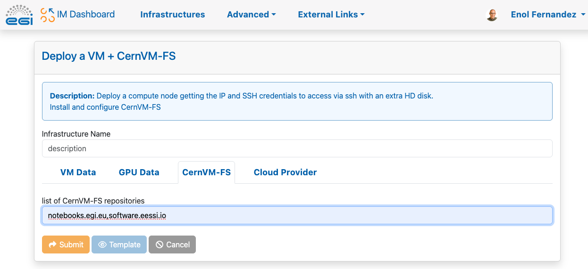
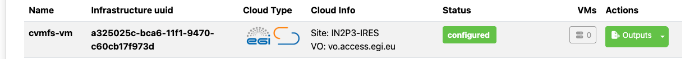
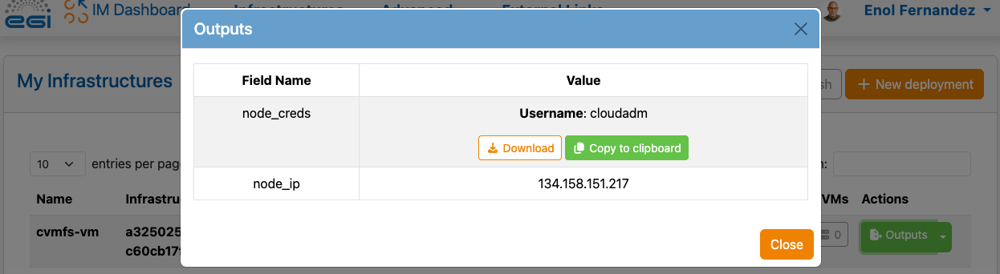

You can start a VM with CVMFS configured out of the box with
[Infrastructure Manager](../../orchestration/im/) relying on the available
templates.

## Create a new infrastructure

Once you have logged in the
[Infrastructure Manager Dashboard](https://im.egi.eu), select "Deploy a VM" from
the dashboard:



You will be shown with a set of optional features to add to the VM, Add "Install
and Configure CernVM-FS" and click on "Configure" button at the bottom of the
page:



In the configuration form, you will see a _CernVM-FS_ tab where you can list the
repositories to configure. In this example we will add `notebooks.egi.eu` and
`software.eesi.io`. EGI's Software Distribution service supports the
[repositories listed here](../#overview)



Check the [IM dashboard documentation](../../orchestration/im/dashboard) for
more details on how to configure your VM.

## Use your VM

Once the VM is configured:



click on "Outputs" and download the key:



From your terminal you can now login and access the cvmfs directories

```shell
$ chmod 400 key.pem
$ ssh -i key.pem cloudadm@<your VM IP>
$ ls /cvmfs/notebooks.egi.eu
fedcloud  isgc-2023  midicsv
$ cat /cvmfs/software.eessi.io/README.eessi
EESSI - the European Environment for Scientific Software Installations

Getting started
---------------

1) Set up your environment by sourcing the initialisation script for a particular version of EESSI:

    source /cvmfs/software.eessi.io/versions/2023.06/init/bash

2) Explore the software included in EESSI via the "module avail" command.

3) Load one or more modules, and start running the software!


Links
-----

website: https://eessi.io
documentation: https://eessi.io/docs
support: https://www.eessi.io/docs/support (contact support@eessi.io via e-mail)
```
