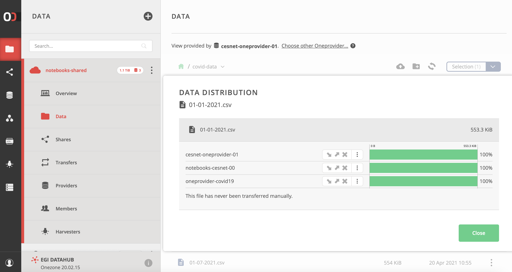
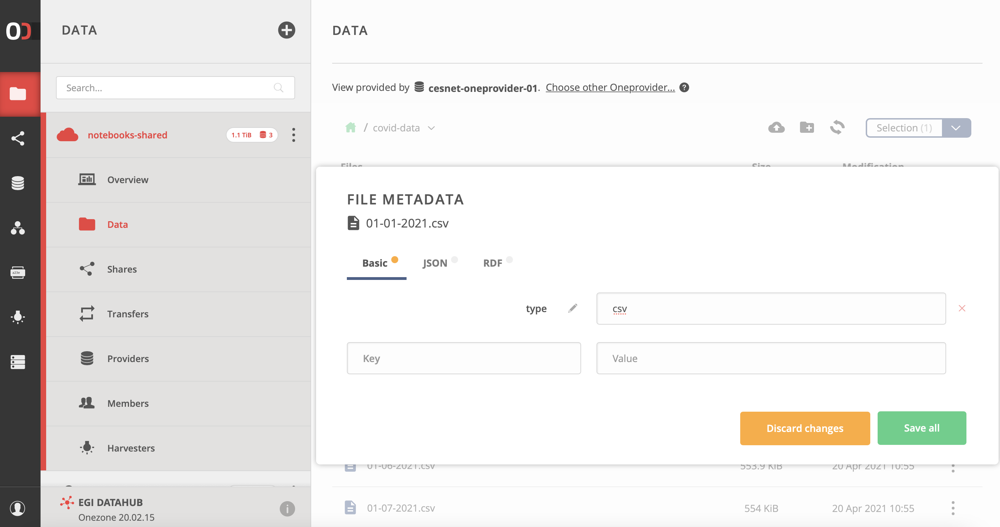

## What is it?

[EGI DataHub](https://datahub.egi.eu/) is a high-performance data management
solution that offers **unified data access across globally distributed
environments and multiple types of underlying storage**. It allows researchers
to share, collaborate and perform computations on the stored data easily.

Users can bring data close to their community or to the
[compute facilities](../../../compute) they use, in order to exploit it
efficiently. This is as simple as selecting which (subset of the) data should be
available at which supporting provider.

The main features of DataHub are:

- Discovery of data spaces via a central portal
- Policy based data access
- Replication of data across providers for resiliency and availability purposes
- Integration with [EGI Check-in](../../../aai/check-in) allows access using
  community credentials, including from other EGI services and components
- File catalog to track replication of data and manage logical and physical
  files

EGI DataHub supports multiple access policies:

- Unauthenticated, open access
- Access after user registration or
- Access restricted to members of a
  [Virtual Organization](../../../aai/check-in//vos) (VO)

Data replication in EGI DataHub may take place either on-­demand or
automatically. Replication uses a file catalogue to enable tracking of logical
and physical copies of data.

{} EGI DataHub is based on the
[Onedata technology](https://onedata.org/). {}

## Motivations

- Putting up a (scalable) distributed data infrastructure needs specific
  expertise, resources and knowledge
- No easy way to discover and transfer data
- No easy way of making data (publicly) accessible without transferring it with
  a sharing service
- No easy way of combining multiple datasets from different data providers
- Users need to access data locally and from compute resources

## Components and concepts

The following concepts (components) will help you understand how EGI DataHub
works.

### Space

Virtual volume where users will organize their data. A space is supported by one
or more Oneproviders that provide the actual storage resources.

### Oneprovider

Data management component deployed in the data centres, provisioning data and
managing transfers. A Oneprovider is typically deployed at a site near the local
storage resources, and can access local storage resources over multiple
connectors (e.g. CEPH, POSIX). A default one is operated for EGI by CYFRONET.

### Onezone

Central component for federating providers. It takes care of Authentication and
Authorization and other management tasks (like space creation). EGI DataHub is a
Onezone instance.

### EGI DataHub

The central Onezone instance of the EGI Federation. Single Sign On (SSO) with
all the connected storage providers (Oneprovider) is guaranteed through
[EGI Check-in](../../../aai/check-in)

### Oneclient

Client application providing access to the spaces through a Linux
[FUSE mount point](https://www.kernel.org/doc/html/latest/filesystems/fuse.html)
(local POSIX access), as if they were part of the local file system. Oneclient
can be used from VMs, containers, desktops, etc.

{} Web interfaces and APIs are also
available. {}

## Highlighted features

Using the EGI DataHub web interface it\'s possible to manage the space.

Using Oneclient it\'s possible to mount a space locally, and access it over a
POSIX interface, using files as they were stored locally. The file\'s blocks are
downloaded on demand.

In Onedata the file distribution is done on a block basis, blocks will be
replicated on the fly, and it\'s possible to instrument the replication between
Oneproviders.

Three different formats of metadata can be attached to files: basic (key-value),
JSON and RDF. The metadata can be managed using the Web interface and the APIs.
It\'s also possible to create indexes and query them.

It\'s possible to view the popularity of a file and manage smart caching.

