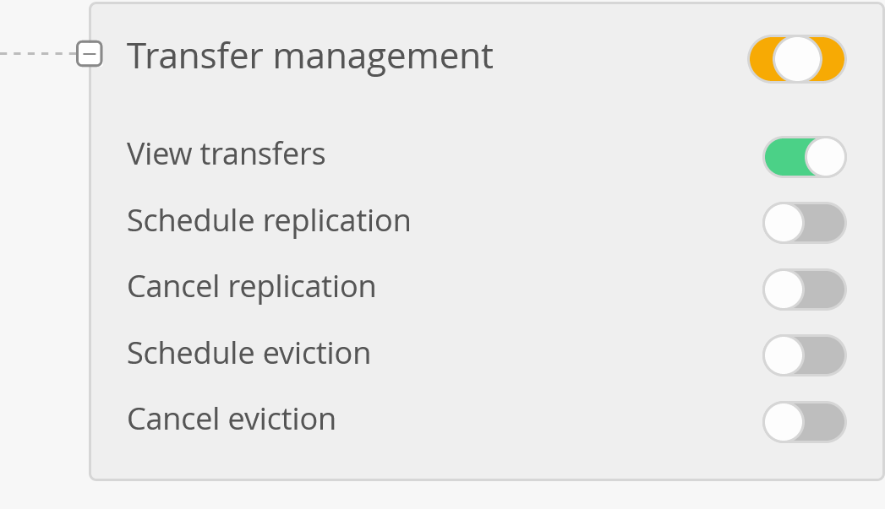

Most operations in EGI DataHub can be performed using one of the
[OneData Application Programming Interfaces](https://onedata.org/#/home/api)
(APIs).

{} In order to be able to access
the Onedata APIs, an access token is required. See below for instructions on how
to generate one. {}

## Getting an API access token

Tokens have to be generated from the **EGI DataHub** (Onezone) interface as
documented in
[Generating tokens for using Oneclient or APIs](../clients/#generating-tokens-for-using-oneclient-or-apis)
or using a command-line call as documented hereafter.

Bear in mind that a single API token can be used with both Onezone, Oneprovider
and other Onedata APIs.

It's possible to retrieve the `CLIENT_ID` and `REFRESH_TOKEN` using the
[EGI Check-in Token Portal](https://aai.egi.eu/token/). See
[Check-in documentation](../../../../aai/check-in) for more information.

```shell
$ CLIENT_ID=<CLIENT_ID>
$ REFRESH_TOKEN=<REFRESH_TOKEN>
# Retrieving an OIDC token from Check-in
$ curl -X POST \
    -d "client_id=$CLIENT_ID&grant_type=refresh_token&refresh_token=$REFRESH_TOKEN&scope=openid%20email%20profile%20eduperson_entitlement" \
    'https://aai.egi.eu/auth/realms/egi/protocol/openid-connect/token' | python -m json.tool;
# Token is in the access_token field of the response
```

The following variables should be set:

- `OIDC_TOKEN`: OpenID Connect Access token.
- `ONEZONE_HOST`: name or IP of the Onezone host (to use Onezone API).

```shell
$ ONEZONE_HOST=https://datahub.egi.eu
$ OIDC_TOKEN=<OIDC_ACCESS_TOKEN>
$ curl -H "X-Auth-Token: egi:$OIDC_TOKEN" -X POST \
    -H 'Content-type: application/json'  \
    "$ONEZONE_HOST/api/v3/onezone/user/tokens/named" \
    -d '{
      "name": "REST and CDMI access token",
      "type": {
        "accessToken": {}
      },
      "caveats": [
        {
          "type": "interface",
          "interface": "rest"
        }
      ]
    }'
```

## Data access via CDMI and REST API

Below are example commands to learn how to access DataHub files and folders via
[CDMI](https://en.wikipedia.org/wiki/Cloud_Data_Management_Interface) and
[REST](https://en.wikipedia.org/wiki/Representational_state_transfer) API using
the command-line interface.

For more information please check the Onedata
[CDMI documentation](https://onedata.org/#/home/documentation/stable/doc/advanced/cdmi.html)
and the Onedata
[Oneprovider REST API](https://onedata.org/#/home/api/stable/oneprovider?anchor=tag/Basic-File-Operations)

### Common configuration

Follow instructions [above](#getting-an-api-access-token) to get an API access
token, and configure environment variables:

```shell
$ export DATAHUB_TOKEN=<DATAHUB_ACCESS_TOKEN>
$ export ONEPROVIDER_HOST=plg-cyfronet-01.datahub.egi.eu
```

Having [jq](https://stedolan.github.io/jq/) installed is useful for better
formatting of the JSON output.

### CDMI

Configure a header to be passed in some operations.

```shell
$ export CDMI_VSN_HEADER='X-CDMI-Specification-Version: 1.1.1'
```

See examples on how to list a folder, and file download/upload using CDMI:

```shell
# List files in a folder
$ curl -H "X-Auth-Token: $DATAHUB_TOKEN" \
    -H "$CDMI_VSN_HEADER" \
    "https://$ONEPROVIDER_HOST/cdmi/PLAYGROUND/?children" | jq .

# Download "helloworld.txt" from DataHub to "downloadtest.txt" on your computer
$ curl -H "X-Auth-Token: $DATAHUB_TOKEN" \
    "https://$ONEPROVIDER_HOST/cdmi/PLAYGROUND/helloworld.txt" \
    -o downloadtest.txt

# Upload "helloworld.txt" from your computer to "uploadtest.txt" on DataHub
$ curl -H "X-Auth-Token: $DATAHUB_TOKEN" \
    -H "$CDMI_VSN_HEADER" \
    -X PUT "https://$ONEPROVIDER_HOST/cdmi/PLAYGROUND/uploadtest.txt" \
    -T helloworld.txt
```

### REST API

See examples on how to list a folder, and file download/upload using REST API:

```shell
# Get base folder ID
$ curl -H "X-Auth-Token: $DATAHUB_TOKEN" \
    -X POST "https://$ONEPROVIDER_HOST/api/v3/oneprovider/lookup-file-id/PLAYGROUND"

# Add the folder ID to an environment variable
$ export DIR_ID=<ID_FROM_PREVIOUS_COMMAND>

# List files inside the folder with DIR_ID
$ curl -H "X-Auth-Token: $DATAHUB_TOKEN" \
    -X GET "https://$ONEPROVIDER_HOST/api/v3/oneprovider/data/$DIR_ID/children" \
    | jq .

# Add the ID of the file that you want to download
$ export FILE_ID=<ID_FROM_PREVIOUS_COMMAND>

# Download file with FILE_ID from DataHub to "helloworld.txt" on your computer
$ curl -H "X-Auth-Token: $DATAHUB_TOKEN" \
    -X GET "https://$ONEPROVIDER_HOST/api/v3/oneprovider/data/$FILE_ID/content" \
    -o helloworld.txt

# Upload "helloworld.txt" on your local computer to "uploadtest.txt" on DataHub
$ curl -H "X-Auth-Token: $DATAHUB_TOKEN" \
    -X POST \
    "https://$ONEPROVIDER_HOST/api/v3/oneprovider/data/$DIR_ID/children?name=uploadtest.txt" \
    -H "Content-Type: application/octet-stream" -d "@helloworld.txt"
```

## Data access from Python

If your application is written in Python please check the documentation for the
[OnedataFS Python library](https://onedata.org/#/home/documentation/stable/doc/using_onedata/onedatafs.html)

## Testing the API with the REST client

A docker container with clients acting as wrappers around the API calls is
available: `onedata/rest-cli`. It\'s very convenient for discovering and testing
the **Onezone** and **Oneprovider** API.

```shell
$ docker run -it onedata/rest-cli
# Exporting env for Onezone API
$ export ONEZONE_HOST=https://datahub.egi.eu
$ export ONEZONE_API_KEY=<ACCESS_TOKEN>
# Checking current user
$ onezone-rest-cli getCurrentUSer | jq '.'
# Listing all accessible spaces
$ onezone-rest-cli listEffectiveUserSpaces | jq '.'
```

```shell
$ docker run -it onedata/rest-cli
# Exporting env for Oneprovider API
$ export ONEPROVIDER_HOST=https://plg-cyfronet-01.datahub.egi.eu
$ export ONEPROVIDER_API_KEY=<ACCESS_TOKEN>
# Listing all spaces supported by the Oneprovider
$ oneprovider-rest-cli getAllSpaces | jq '.'
# Listing content of a space
$ oneprovider-rest-cli listFiles path='EGI Foundation/'
$ oneprovider-rest-cli listFiles path='EGI Foundation/CS3_dataset'
```

## Printing the raw REST calls of a wrapped command

Raw REST calls (used with `curl`) can be printed using the `--dry-run` switch.

```shell
$ docker run -it onedata/rest-cli
$ export ONEZONE_HOST=https://datahub.egi.eu
$ export ONEZONE_API_KEY=<ACCESS_TOKEN>
# Listing all accessible spaces
$ onezone-rest-cli listEffectiveUserSpaces | jq '.'
# Printing the curl command without running it
$ onezone-rest-cli listEffectiveUserSpaces --dry-run
```

## Working with PID / Handle

It's possible to mint a Permanent Identifier (PID) for a space or a subdirectory
of a space using a handle service (like Handle.net) that is registered in the
Onezone (EGI DataHub).

Once done, accessing the PID using its URL will redirect to the Onedata share
allowing to retrieve the files.

Prerequisites: access to a Handle service registered in the Onezone. See the
[Handle Service API documentation](https://onedata.org/#/home/documentation/doc/using_onedata/handle_services.html)
for documentation on registering a new Handle service or ask a Onezone
administrator to authorize you to use an existing Handle service already
registered in the Onezone.

The following variables should be set:

- `API_ACCESS_TOKEN`:
  [Onedata API access token](https://onedata.org/docs/doc/using_onedata/using_onedata_from_cli.html#authentication)
- `ONEZONE_HOST`: name or IP of the Onezone host (to use Onezone API).
- `ONEPROVIDER_HOST`: name or IP of the Oneprovider host (to use Oneprovider
  API)

```shell
# Getting the IDs of the available Handle Services
$ curl -sS --tlsv1.2 -H "X-Auth-Token: $API_ACCESS_TOKEN" \
    "$ONEZONE_HOST/api/v3/onezone/user/handle_services"
HANDLE_SERVICE=<HANDLE_SERVICE_ID>

# Getting details about a specific Handle service
$ curl -sS --tlsv1.2 -H "X-Auth-Token: $API_ACCESS_TOKEN" \
    "$ONEZONE_HOST/api/v3/onezone/user/handle_services/$HANDLE_SERVICE"

# Listing all spaces
$ curl -sS --tlsv1.2 -H "X-Auth-Token: $API_ACCESS_TOKEN" \
    "$ONEZONE_HOST/api/v3/onezone/user/effective_spaces/" | jq '.'

# Displaying details of a space
$ curl -sS --tlsv1.2 -H "X-Auth-Token: $API_ACCESS_TOKEN" \
    "$ONEZONE_HOST/api/v3/onezone/spaces/$SPACE_ID" | jq '.'

# Listing content of a space
$ curl -sS --tlsv1.2 -H "X-Auth-Token: $API_ACCESS_TOKEN" \
    "$ONEPROVIDER_HOST/api/v3/oneprovider/files/EGI%20Foundation/" | jq '.'

# Creating a share of a subdirectory of a space
$ DIR_ID_TO_SHARE=<DIR_ID>
$ curl -sS --tlsv1.2 -H "X-Auth-Token: $API_ACCESS_TOKEN" \
    -X POST -H 'Content-Type: application/json' \
    -d '{"name": "input"}'
    "$ONEPROVIDER_HOST/api/v3/oneprovider/shares-id/$DIR_ID_TO_SHARE" | jq '.'

# Displaying the share
$ SHARE_ID=<SHARED_ID>
$ curl -sS --tlsv1.2 -H "X-Auth-Token: $API_ACCESS_TOKEN" \
    "$ONEZONE_HOST/api/v3/onezone/shares/$SHARE_ID" | jq '.'

# Registering a handle
# Proper Dublin Core metadata is required
# It can be created using https://nsteffel.github.io/dublin_core_generator/generator_nq.html
$ cat metadata.xml
# Escape double quotes and drop line return
$ METADATA=$(cat metadata.xml | sed 's/"/\\"/g' | tr '\n' ' ')
# On handle creation the created handles is provided in the Location header
$ curl -D - --tlsv1.2 -H "X-Auth-Token: $API_ACCESS_TOKEN" \
    -H "Content-type: application/json" -X POST \
    -d '{"handleServiceId": "'"$HANDLE_SERVICE_ID"'", "resourceType": "Share", "resourceId": "'"$SHARE_ID"'", "metadata": "'"$METADATA"'"}' \
    "$ONEZONE_HOST/api/v3/onezone/user/handles"

# Listing handles
$ curl --tlsv1.2 -H "X-Auth-Token: $API_ACCESS_TOKEN" \
    "$ONEZONE_HOST/api/v3/onezone/user/handles"

# Displaying a handle
$ HANDLE_ID=<HANDLE_ID>
$ curl --tlsv1.2 -H "X-Auth-Token: $API_ACCESS_TOKEN" \
    "$ONEZONE_HOST/api/v3/onezone/user/handles/$HANDLE_ID"
```

## Subscribe to file events

Following is an example of how to subscribe to DataHub to receive notification
on file events which is described in details in the official documentation
[Subscribe to file events](https://onedata.org/#/home/api/stable/oneprovider?anchor=operation/get_space_changes):

```shell
$ curl -N -H "X-Auth-Token: $TOKEN" \
    -X POST "https://$ONEPROVIDER_HOST/api/v3/oneprovider/changes/metadata/$SPACE_ID" \
    -H "Content-Type: application/json" -d "@./changes_req.json"
```

This requires the permission set as following:



For groups or single users. For single users, one way to add one is to select
Effective members" -> in the user list search for the required user and "Make an
owner". In this case the user will have admins privileges in addition to the one
required. As this might not be the desired configuration it will be enough to
remove all the unwanted permissions, e.g.: make it the same as the VO to which
the user belongs to, and leave only, as extra, the permission shown in the
screenshot.
