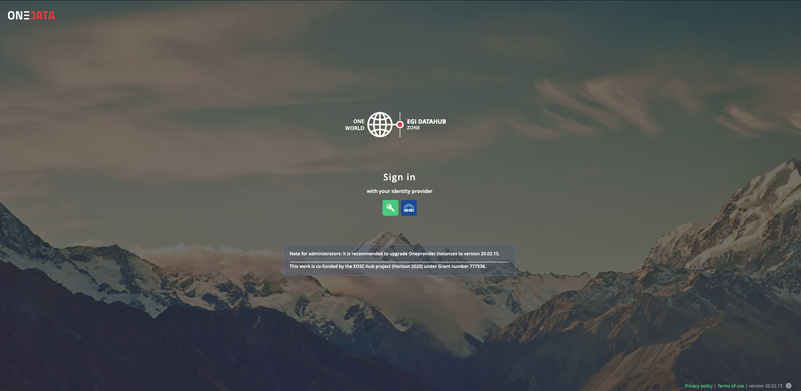
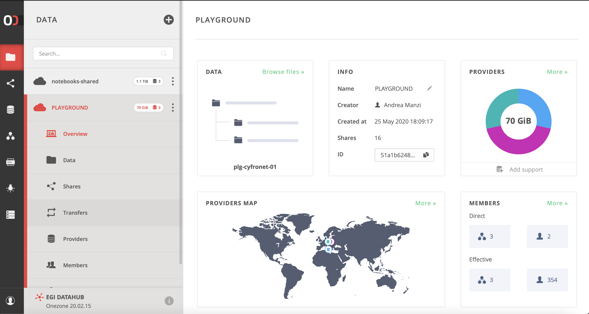
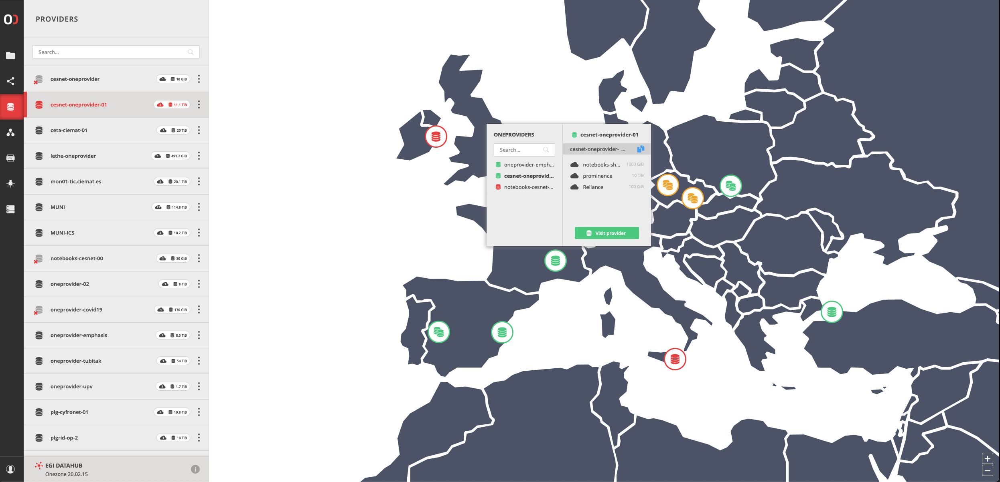
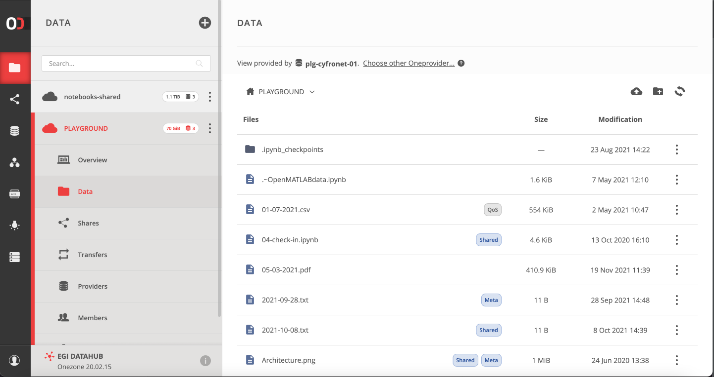
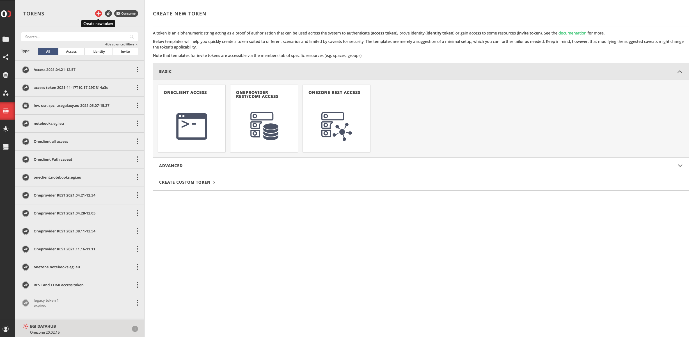

[EGI DataHub](https://datahub.egi.eu/) spaces can be accessed via web interface,
the `oneclient` component or the [API](../api).

The official documentation for `oneclient` is hosted on the
[Onedata homepage](https://onedata.org/#/home/documentation/doc/using_onedata/oneclient.html),
and a specific [tutorial](../../../../tutorials/vm-datahub) on how to install
and use it from a Virtual Machine is also available.

## Using the web interface

Using EGI Check-in allows you to connect with your institute's credentials.



On this page it's possible to have an overview of all the spaces and their
supporting providers.



On this capture, the information about the spaces supported by a specific
provider is displayed.



The data space can be managed (i.e. uploading/downloading/managing files and
metadata, managing space access) using the web browser.



## Generating tokens for using Oneclient or APIs

{} In order to be able to access
your spaces using `oneclient` or the [API](../api), it is required to generate
an access token. {}

Tokens have to be generated from the **EGI DataHub** (Onezone) interface.



The access tokens can be created and managed using the EGI DataHub web
interface.

### Environment variables

The sections below assume you have defined the following variables in your
environment:

- `ONECLIENT_ACCESS_TOKEN`: access token allowing to access **all** the spaces
- `ONECLIENT_PROVIDER_HOST`: name or IP of the Oneprovider the client should
  connect to.

## Installing and testing Oneclient in a docker container

{} In order to be able to use FUSE,
the container should run in **privileged** mode. {}

A quick and simple solution for testing is to install the client on demand in a
container for a supported Operating System flavor (mainly various CentOS and
Ubuntu releases).

```shell
$ docker run -it --privileged centos:7 /bin/bash
root@81dbd7e84438 /]# curl -sS  http://get.onedata.org/oneclient.sh | bash
# (...)
Complete!
Installation has been completed successfully.
Run 'oneclient --help' for usage info.
root@81dbd7e84438 /]# export ONECLIENT_ACCESS_TOKEN=<ACCESS_TOKEN_FROM_ONEZONE>
root@81dbd7e84438 /]# export ONECLIENT_PROVIDER_HOST=plg-cyfronet-01.datahub.egi.eu
root@81dbd7e84438 /]# mkdir /tmp/space
root@81dbd7e84438 /]# oneclient /tmp/space
root@81dbd7e84438 /]# ls /tmp/space
```

Here the data is mounted in `/tmp/space`, creating a file into it will push it
to the Oneprovider and it will be accessible in the web interface and from other
providers supporting the space.

For a real production usage it\'s preferable to use the Oneclient container as a
source for a volume mounted into another container.

## Testing Oneclient in a Oneclient docker container with NFS or samba

Docker containers for the Oneclient are available, the existing versions can be
seen on the
[Oneclient docker hub](https://hub.docker.com/r/onedata/oneclient/tags).

It's possible to use the most recent version by specifying the `latest` tag. We
also recommend using the same version as shown on the Onezone and Oneprovider
pages.

```shell
$ export ONECLIENT_ACCESS_TOKEN=<ACCESS_TOKEN_FROM_ONEZONE>
$ export ONECLIENT_PROVIDER_HOST=plg-cyfronet-01.datahub.egi.eu
$ docker run -it --privileged \
    -e ONECLIENT_ACCESS_TOKEN=$ONECLIENT_ACCESS_TOKEN \
    -e ONECLIENT_PROVIDER_HOST=$ONECLIENT_PROVIDER_HOST \
    onedata/oneclient:20.02.7
Connecting to provider 'plg-cyfronet-01.datahub.egi.eu:443' using session ID: '4138963898952098752'...
Getting configuration...
Oneclient has been successfully mounted in '/mnt/oneclient'
```

Now the client will run in the background and the data will be available through
**samba/CIFS** or **NFS** protocols:

```shell
# Identifying the IP of the container
$ docker inspect --format "{{ .NetworkSettings.IPAddress }}" $(docker ps -ql)
172.17.0.2
```

So the data can be accessed at

- `smb://172.17.0.2/onedata`
- `nfs://172.17.0.2/onedata`

## Testing Oneclient in a Oneclient docker container with local file access

Another solution is to mount a local directory as a volume in the container,
allowing to access both the working directory as well as the Onedata spaces,
thus allowing to easily exchange files between a local directory and a Onedata
space.

In order to do this we will open a `bash` shell in the container then we will
mount manually the Onedata spaces.

```shell
$ export ONECLIENT_ACCESS_TOKEN=<ACCESS_TOKEN_FROM_ONEZONE>
$ export ONECLIENT_PROVIDER_HOST=plg-cyfronet-01.datahub.egi.eu
$ docker run -it --privileged \
    -e ONECLIENT_ACCESS_TOKEN=$ONECLIENT_ACCESS_TOKEN \
    -e ONECLIENT_PROVIDER_HOST=$ONECLIENT_PROVIDER_HOST \
    -v $PWD:/mnt/src --entrypoint bash onedata/oneclient:20.02.7
root@aca612a84fb4:/tmp# oneclient /mnt/oneclient
Connecting to provider 'plg-cyfronet-01.datahub.egi.eu:443' using session ID: '1641165171427694510'...
Getting configuration...
Oneclient has been successfully mounted in '/mnt/oneclient'.
root@aca612a84fb4:/tmp# ls /mnt/oneclient
(...)
root@aca612a84fb4:/tmp# ls /mnt/src
(...)
```

Now it\'s possible to use the following mount points:

- `/mnt/oneclient`: the Onedata spaces
- `/mnt/src`: the local directory (any absolute path could have been used
  instead of `$PWD` that points to the working directory)

## Testing Oneclient in a Virtual Machine

The following variables have to be exported:

- `ONECLIENT_ACCESS_TOKEN`: access token allowing to access **all** the spaces.
- `ONECLIENT_PROVIDER_HOST`: name or IP of the Oneprovider the client should
  connect to.

```shell
$ curl -sS http://get.onedata.org/oneclient.sh | bash
$ export ONECLIENT_ACCESS_TOKEN=<ACCESS_TOKEN_FROM_ONEZONE>
$ export ONECLIENT_PROVIDER_HOST=plg-cyfronet-01.datahub.egi.eu
$ mkdir /tmp/space
$ oneclient /tmp/space
```

## Testing Oneclient in a Vagrant box

It\'s possible to quickly test Oneclient using
[Vagrant](https://www.vagrantup.com/).

```shell
$ vagrant init ubuntu/xenial64
$ vagrant up
$ vagrant ssh
$ curl -sS http://get.onedata.org/oneclient.sh | bash
$ export ONECLIENT_ACCESS_TOKEN=<ACCESS_TOKEN_FROM_ONEZONE>
$ export ONECLIENT_PROVIDER_HOST=plg-cyfronet-01.datahub.egi.eu
$ mkdir /tmp/space
$ oneclient /tmp/space
```
