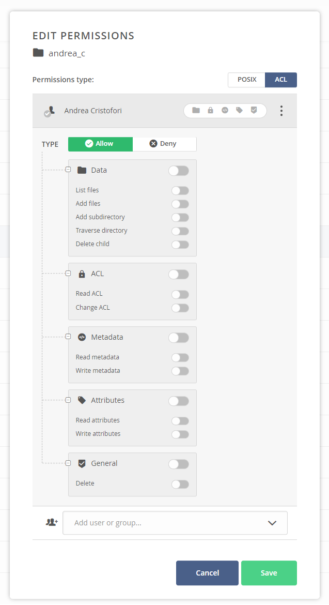
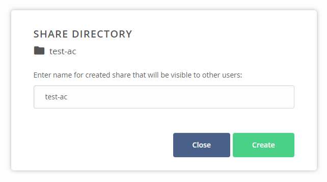
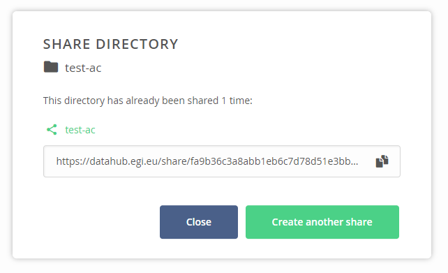
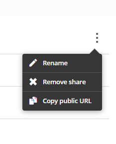

## Web interface

In the [EGI DataHub](../), all files are organized in spaces. The Web User
interface allows for uploading new files as well as opening existing files.

In order to upload a file, open the directory in which the file should be placed
and drag the file into the browser window:


Opening or downloading a file requires double clicking on the file in the file
window.

{} Make sure that the pop-ups for this
browser window are not blocked, and unblock them if necessary.{}

## Direct access via POSIX

Files can also be accessed directly via the POSIX interface, using `Oneclient`
tool. Details on how to use are described in the
[official Oneclient documentation](https://onedata.org/#/home/documentation/doc/using_onedata/oneclient.html).

## CDMI (Cloud Data Management Interface)

For more advanced use cases, files can be managed using the
[CDMI](http://www.snia.org/cdmi) protocol, as described in details
[in the Onedata CDMI documentation](https://onedata.org/#/home/documentation/doc/advanced/cdmi.html).

## File Permissions

You can control access to your data with a combination of:

- classical (POSIX) file permissions
- Access Control Lists (ACL)

## POSIX Permissions

DataHub allows you to control access to your data in a POSIX-like fashion for
users, group and others in terms of read, write and executable permissions.

An important nuance regarding file permissions is that all space members are
treated as a virtual group which is the group owner of all files in the space.
That means that whenever a file is accessed by a space member who is not the
owner of the file, the group permissions are taken into consideration.
Permissions for "others" are considered when accessing
[shares](https://onedata.org/#/home/documentation/doc/using_onedata/shares.html).

Consider the following example of a file's POSIX permissions:

```text
rwx r-- ---
 |   |   |
 |   |   guests
 |   |
 |   space members
 |
 owner user
```

In the above case, the creator of the file, its _owner user_, has a full access
to the file. All _space members_ have read access to the file. Other users,
_guests_, who try to access the file through a share will fail to do so as all
permissions are declined for "others".

In order to edit permissions:

1. Click on **Data** on the left menu bar
1. Select the Space you want to access and the **Data** option
1. Select a **file** or a **directory** and right clicking on it
1. Click on the **Permissions** option
1. Select **POSIX** type of permissions radio button at the top
1. Enter privileges in octal form (e.g. 770)
1. Click **OK** in order to save changes


## Access Control Lists

You can also setup permissions using more advanced Access Control Lists option
to control permissions for individual users and groups.

In order to edit ACLs:

1. Navigate to **Data** tab
1. Select a **file** or a **directory** by right clicking on it
1. Click on the **Permissions** option
1. Click on the **ACL** radio button
1. Edit permissions by clicking on the appropriate **checkbox**
1. Click **OK** in order to save changes

> Note, that access lists take precedence over POSIX permissions. If access list
> is set, POSIX are set to octal value of 000.

The order in which permissions take precedence is indicated with an arrow.



> To limit the risk of making data inaccessible to yourself, it is advisable to
> first add the required ACL if new ones are needed, and if necessary remove the
> ones not needed. While using ACLs there should be at least one active, or no
> user might be able to access the data. To regain the access the space owner
> would then need to modify the permissions.

## File sharing

It is possible to share available DataHub data with other users or externally by
generating a unique URL. This can be done, on the web interface, by selecting a
directory or file, and right-clicking on it or clicking the three dots on the
right like in the following screenshot and selecting "share":


This will open a window allowing you to give a name to the share that you are
about to create. This is shown in the following screenshot:



By clicking on the "Create" button, the share is created and you are taken to
the last window where the URL of the share can be copied for further use. This
is shown in the following screenshot:



To manage existing shares, in the space that is in use, it is sufficient to
click the "Share" section, then a list of the existing ones is shown. By
clicking on the three dots on the right of the share, you can rename, remove or
copy the URL of the share. This is shown in the following screenshot:



By clicking on the share itself, it is possible to edit additional attributes of
the share like the description and the possibility to publish it as Open Data
trough one of the supported handle service.

An API is also available for the
[creation and administration of the shares](https://onedata.org/#/home/api/stable/onezone?anchor=tag/Share).

## Data transfer management

After uploading some data to DataHub, you can manage the replication and
transfer to other DataHub providers supporting the same space. To do so, after
uploading some files, select them, right click on the selection, and select
"Data distribution". This will open the following window:


This will show the providers available for the space being used, and the current
operation being performed if any. By clicking on the three dots, next to the
provider, the following operation can be performed:

- Migrate the data if the provider selected contain the data. This will copy the
  data to the other provider, if not present, and remove them from the selected
  one.
- Replicate the data, if the data is not present in the provider selected
- Evict the data, if the data is present in the current provider, and al least
  in another one

### Data transfer management API

The DataHub
[REST API structure](https://onedata.org/#/home/api/stable/oneprovider?anchor=section/Overview/API-structure)
gives an overview of the REST calls available. In particular the section on
[Transfer](https://onedata.org/#/home/api/stable/oneprovider?anchor=tag/Transfer)
focus on the transfer operation which include the operation previously described
using the web interface and include option to schedule transfers, a feature
which is not available trough the web interface. Furthermore the status of the
transfer can also be checked from the section
[Get transfer status](https://onedata.org/#/home/api/stable/oneprovider?anchor=operation/get_transfer_status)
of the same page.

The `/transfers/` operations provide basic transfer management functionality
based on the ID of transfer returned by `/transfers` `[POST]` operation.

With the API it is possible to get information about a specific transfer by
simply querying the following resource:

```shell
$ curl -X GET -H "X-Auth-Token: $ACCESS_TOKEN" \
    https://$ONEPROVIDER_HOST/api/v3/oneprovider/transfers/<TRANSFER_ID>
```

or request all transfers for given space:

```shell
$ curl -X GET -H "X-Auth-Token: $ACCESS_TOKEN" \
    https://$ONEPROVIDER_HOST/api/v3/oneprovider/spaces/$SPACE_ID/transfers
```

Each transfer can be cancelled using the HTTP DELETE method:

```shell
$ curl -X DELETE -H "X-Auth-Token: $ACCESS_TOKEN" \
    https://$ONEPROVIDER_HOST/api/v3/oneprovider/transfers/<TRANSFER_ID>
```
