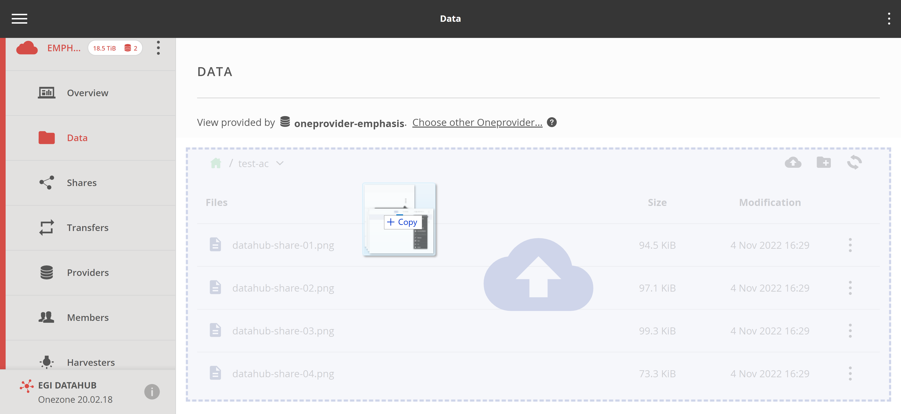
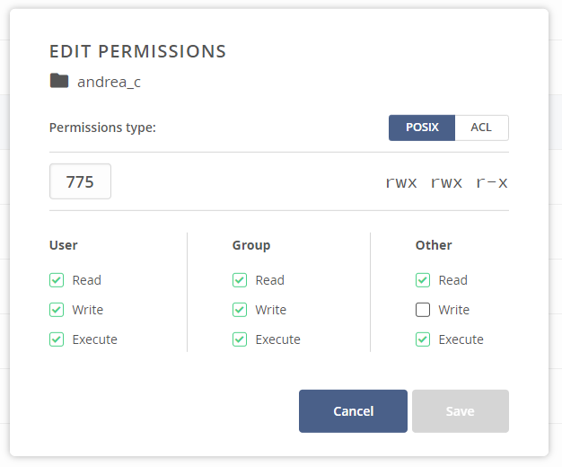

## Web interface

In the [EGI DataHub](../), all files are organized in spaces. The Web User
interface allows for uploading new files as well as opening existing files.

In order to upload a file, open the directory in which the file should be placed
and drag the file into the browser window:



Opening or downloading a file requires double clicking on the file in the file
window.

{} Make sure that the pop-ups for this
browser window are not blocked, and unblock them if necessary.{}

## Direct access via POSIX

Files can also be accessed directly via the POSIX interface, using `Oneclient`
tool. Details on how to use are described in the
[official Oneclient documentation](https://onedata.org/#/home/documentation/doc/using_onedata/oneclient.html).

## CDMI (Cloud Data Management Interface)

For more advanced use cases, files can be managed using the
[CDMI](http://www.snia.org/cdmi) protocol, as described in details
[in the Onedata CDMI documentation](https://onedata.org/#/home/documentation/doc/advanced/cdmi.html).

## File Permissions

You can control access to your data with a combination of:

- classical (POSIX) file permissions
- Access Control Lists (ACL)

## POSIX Permissions

DataHub allows you to control access to your data in a POSIX-like fashion for
users, group and others in terms of read, write and executable permissions.

An important nuance regarding file permissions is that all space members are
treated as a virtual group which is the group owner of all files in the space.
That means that whenever a file is accessed by a space member who is not the
owner of the file, the group permissions are taken into consideration.
Permissions for "others" are considered when accessing
[shares](https://onedata.org/#/home/documentation/doc/using_onedata/shares.html).

Consider the following example of a file's POSIX permissions:

```text
rwx r-- ---
 |   |   |
 |   |   guests
 |   |
 |   space members
 |
 owner user
```

In the above case, the creator of the file, its _owner user_, has a full access
to the file. All _space members_ have read access to the file. Other users,
_guests_, who try to access the file through a share will fail to do so as all
permissions are declined for "others".

In order to edit permissions:

1. Click on **Data** on the left menu bar
1. Select the Space you want to access and the **Data** option
1. Select a **file** or a **directory** and right clicking on it
1. Click on the **Permissions** option
1. Select **POSIX** type of permissions radio button at the top
1. Enter privileges in octal form (e.g. 770)
1. Click **OK** in order to save changes



## Access Control Lists

You can also setup permissions using more advanced Access Control Lists option
to control permissions for individual users and groups.

In order to edit ACLs:

1. Navigate to **Data** tab
1. Select a **file** or a **directory** by right clicking on it
1. Click on the **Permissions** option
1. Click on the **ACL** radio button
1. Edit permissions by clicking on the appropriate **checkbox**
1. Click **OK** in order to save changes

> Note, that access lists take precedence over POSIX permissions. If access list
> is set, POSIX are set to octal value of 000.

The order in which permissions take precedence is indicated with an arrow.


