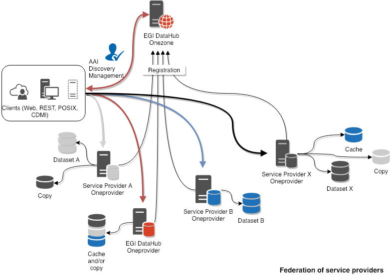
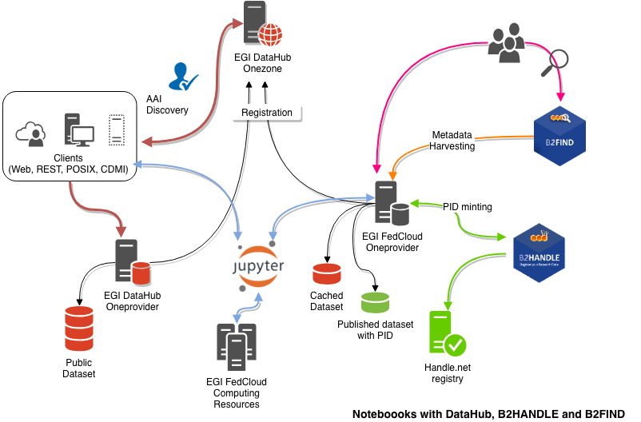
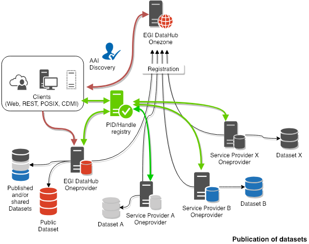
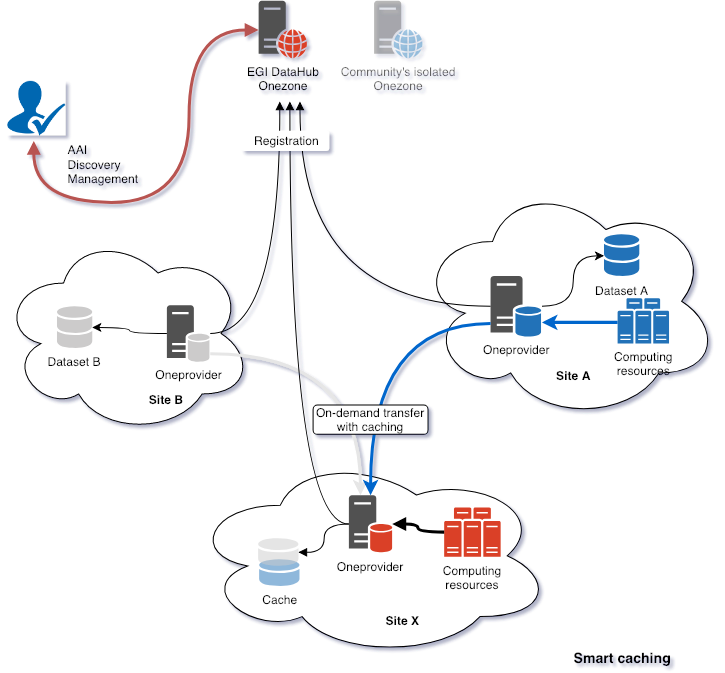

An overview of the use cases and possible deployment scenarios of the
[EGI DataHub](https://datahub.egi.eu/).

## Build Data Spaces for Communities

Users can access with their EGI Check-in credentials data available
at one or more providers which are abstracting over heterogeneous
backends.

Different data access interfaces are available (Web, REST, POSIX,
CDMI).

## Integrate DataHub with EGI Notebooks

EGI Notebooks has been integrated with DataHub in order to easily
access and store files from the JupyterLab interface.

On the central EGI Notebooks instance, a predefined space open to
all users and VO specific spaces are available.

## Make your data FAIR

Users can assign metadata to files, create shares and mint DOIs.

The EGI DataHub offers an OAI-PMH interface which enables standard
discoverability and access to datasets.

## Smart caching

- Site A hosts data and computing resources
- Site B hosts only data
- Site X uses data from A and B without pre-staging
- Pre-staging can also be done using APIs
- Data is accessed locally via POSIX with FUSE

