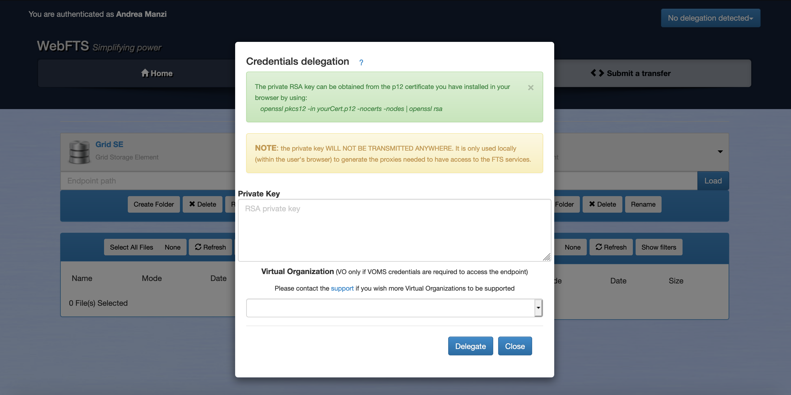
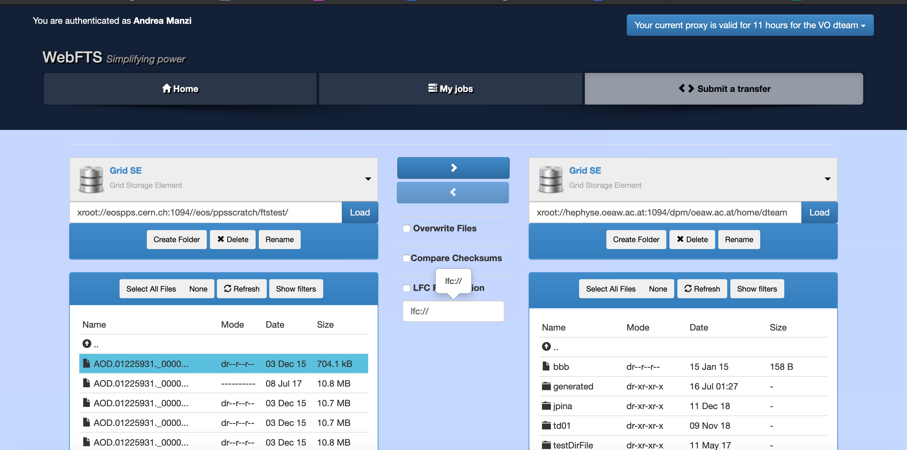
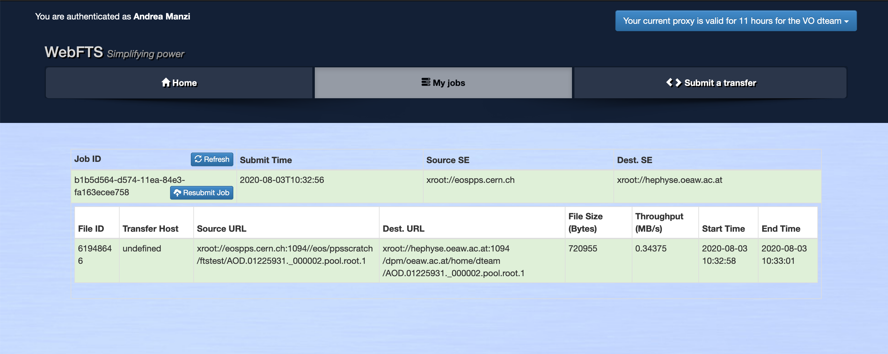

## Overview 

The WebFTS interface offers end users a way to graphically execute and monitor file 
transfer between storages using different protocols. You can check CERN WebFTS 
[documentation](https://fts3-docs.web.cern.ch/fts3-docs/docs/webfts/userguide.html) and 
[FAQ](https://fts3-docs.web.cern.ch/fts3-docs/docs/webfts/faq.html) for more details.

### Credential Delegation

In order to move files between storage endpoints, named also Storage Elements (SE), 
the authentication is done using an X509 certificate which needs to be installed on the browser. 
The Integration with EGI Check-in is under development and will be available at a later date in the production instance.

A pop-up window appears when you choose the "My jobs" or "Submit a transfer" tabs. 
There, you will need to paste the private RSA key of your certificate. 
The private key **WILL NOT BE TRANSMITTED ANYWHERE**. It is only used locally 
(within the user's browser) to generate the proxies needed to have access to the FTS services.



To obtain the private key, you can run in the console:

```console
openssl pkcs12 -in yourCert.p12 -nocerts -nodes | openssl rsa
```

This command requires openssl.

If you need a delegation with VOMS credentials (required to access some types of 
Storage Elements), you will need to introduce the name of the virtual organization (VO)
 you belong to. 

From the right button where the remaining time for the current delegation is shown,
 you can remove the current delegation and delegate again (the delegation window will appear).

### Submit a transfer

Open the "Submit a transfer" tab and Load origin and destination storage elements 
as endpoints.
If one endpoint URL is not known, there is an autocompletion once 3 characters have been typed.
 You should also specify the protocol, the address of the endpoint and the path. (Ex: ```gsiftp://lxfsra10a01.cern.ch/dpm/cern.ch/home/```). 

Browse the content and select all the files you want to transfer. CTRL and SHIFT keys can be use for selecting.

If you need to filter the list of files and folders, you can use the available filters: 
name, size and date.  Once you have loaded both endpoints and selected the files, the transfer buttons will be enabled.
Click the button with the correct direction. A success or error message will appear above the endpoints' containers. 

You can now check the status of you transfer in the "My jobs" tab.



### Listing your transfers

Open the "My jobs" tab. If you have done any transfers recently, they will appear there. 
If you click on an individual transfer, you can see its state and any errors.

You can resubmit transfer jobs, but you would need to delegate your credentials if you did not do it before. You can do this at any state by clicking the "Resubmit" button.

The transfer states are: YELLOW if still running, GREEN if successfully completed and RED if something was wrong.

The transfers that are not completed have a "Cancel" button on the left of the "Resubmit" button. Clicking this button will cancel that transfer.


