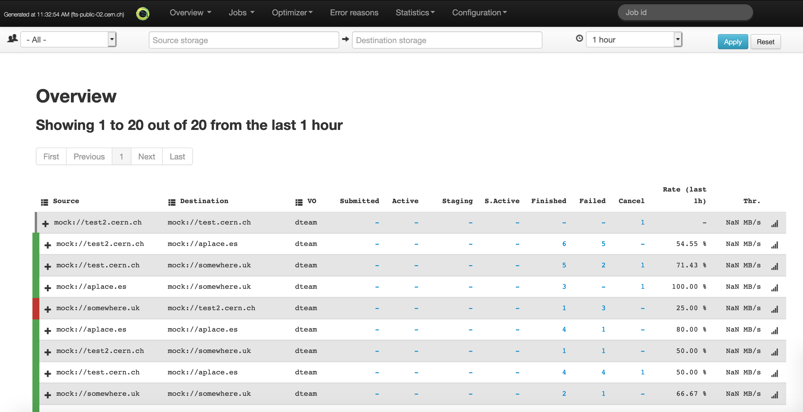
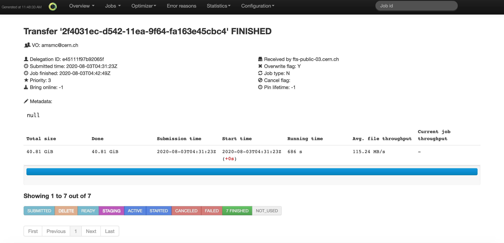
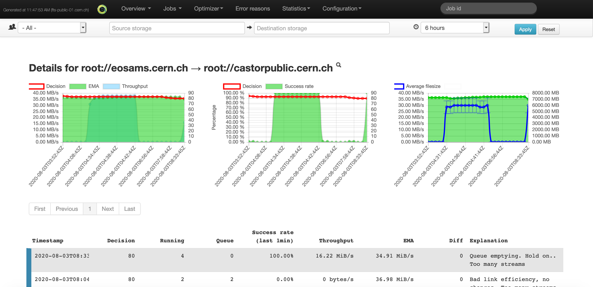

## Overview 
Each instance of the FTS3 service, offers a Web monitoring interface, that can be accessed 
by end-users in order to monitor their submitted transfers and obtain statistics.

## Features

The Web monitoring can be accessed without user authentication, only access to the transfer
 log files needs an X509 user certificate installed on the browser.

### Overview page  

The Overview page offers a way to access the information about the transfers submitted and
 executed in the last 6 hours. Users can filter transfers per Virtual Organization, source 
 or destination storage or JobId.

### Job details page

By selecting a specific job the information about the job details are displayed. Each transfer 
part of the job is listed with his own information. From this page it's also possible to access the transfer logs (upon authentication).

### Optimizer page  

The Optimizer page shows Optimizer information about a specific link, detailing the throughput
 evolution and the parallel transfer/stream per link at a given time

