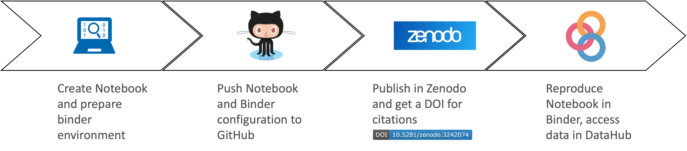

## What is it?

Binder allows the re-creation of a custom computing environment for reproducible
execution of notebooks (and potentially many other types of applications) that
can be easily shared with other users with just a link. Users that create their
own notebooks in the EGI Notebooks to analyze data available in EGI’s
infrastructure can easily create a shareable entry from a Github repository that
anyone can then reproduce in the Binder service.

EGI’s binder offers a similar setup to the publicly accessible
[mybinder.org](https://mybinder.org) service but integrated with the EGI
infrastructure and these features:

- Users have a personal access token that can be used to access other EGI
  services.
- Selected spaces of EGI DataHub are directly available under the /datahub
  folder simplifying the access to shared data
- Environments are guaranteed 2GB of RAM and can reach 4GB as maximum and there
  are no hard limits on the session time per user, although sessions will be
  shut down automatically after 1 hour of inactivity (see
  [session limitations at the public mybinder.org service](https://mybinder.readthedocs.io/en/latest/about/about.html#using-the-mybinder-org-service)).
- User communities can have their customized Binder service instance with extra
  features as requested. EGI offers consultancy and support for setting these
  instances, as well as can operate the setup.

The service builds on [BinderHub](https://github.com/jupyterhub/binderhub), an
Open Source tool that allows to build docker images from a Git repository and
then make it available from JupyterHub.

## Reproducible research

Binder facilitates sharing and reproduce previous research. Users can develop
their research using the EGI Notebooks service and once ready publish it as a
shareable object that can be reproduced by anyone else.

The Zenodo-GitHub integration allows for generating DOIs that can be cited in
publications and can be discovered by fellow researchers, who can use that
reference to recreate the original environment needed for the execution of the
notebook.

## Access to the service

[EGI's Binder](https://binder.notebooks.egi.eu/) has the same access conditions
as the [centrally operated Notebooks service from EGI](../../#service-modes).
Before using the service, you need to have a valid EGI account and be a member
of [one of the supported VOs](../../#notebooks-for-researchers).

## Creating a Binder repository

Binder starts from a code repository that contains the code or notebook you’d
like to run and a set of configuration files that specify what’s the exact
computational environment your code needs to run.

Binder then creates a reproducible container using
[repo2docker](https://github.com/jupyterhub/repo2docker) and generates a user
session to interact with that container and the code that it contains from the
browser.

The configuration for building the container support specifying conda
environments; installing Python, R and Julia environments; installing additional
OS packages; and even complete custom Dockerfiles to bring any application to
the system. The code repository can be hosted on popular git hosting platforms
like GitHub and GitLab and can also be referenced with a DOI from Zenodo,
FigShare or Dataverse. You can learn more on the configuration of your
repository with Binder at the
[Binder user documentation](https://mybinder.readthedocs.io/en/latest/)

You can start by forking the
[EGI-Federation/binder-example GitHub repository](https://github.com/EGI-Federation/binder-example)
for creating your own reproducible environment. To run this directly on EGI's
Binder click on the button below:

You can create such link to share your notebooks from the Binder interface, as
shown in the screenshot below, you can copy the URL shown when the building is
in progress:

The [binder examples](https://github.com/binder-examples) organization on GitHub
contains more sample repositories for common configurations that can help you to
get started.

## Accessing data

Your notebooks running in Binder have outgoing internet connectivity, so you can
connect to externals service to bring data in for analysis or deposit the
notebooks output.

Every session that you start will also provide access to the your spaces in the
[DataHub](../.././data/management/datahub/) under a folder named `datahub`. Only
those spaces configured to be mounted locally will be made available
automatically, Check the documentation for the
[Notebook's DataHub support](../../notebooks/data#egi-datahub) for more
information.
