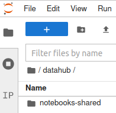
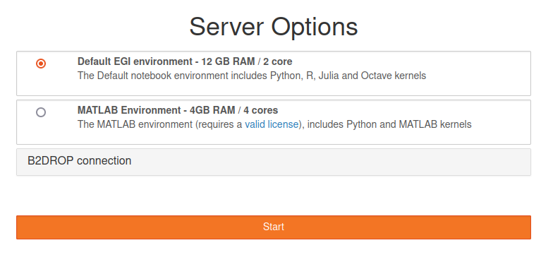
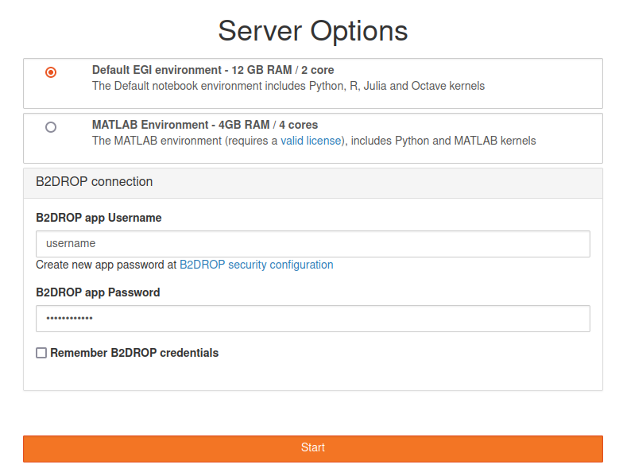
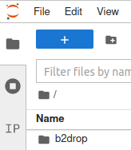

Every user of the EGI Notebooks catch-all instance has a 20GB persistent home to
store any notebooks and associated data. The content of this home directory will
be kept even if your notebook server is stopped (which can happen if there is no
activity for more than 1 hour). **Modifications to the notebooks environment
outside the home directory are not kept** (e.g. installation of libraries). If
you need those changes to persist, let us know via a
[GGUS ticket to the Notebooks Support Unit](https://ggus.eu). You can also ask
for increasing the 20GB home via ticket.

## Import notebooks into your workspace

The Notebooks service default environment includes
[nbgitpuller](https://github.com/jupyterhub/nbgitpuller), an extension to sync a
git repository one-way to a local path. You can generate a shareable link by
filling in the
[nbgitpuller link generator](https://jupyterhub.github.io/nbgitpuller/link?hub=https://notebooks.egi.eu/)
with your git repository.

Alternatively, you can also use [Binder](../../binder) for providing a link to
notebooks and their computing environment.

## Getting data in/out

Your notebooks have outgoing internet connectivity so you can connect to any
external service to bring data in for analysis. As with input data, you can
connect to any external service to deposit the notebooks output.

This is convenient for smaller datasets but not practical for larger ones, for
those cases we can offer integration with several data services.

### EGI DataHub

[EGI DataHub](../../../data/management/datahub) provides a scalable distributed
data infrastructure. It offers a tight integration with Jupyter and notebooks
with specific drivers that make the DataHub Spaces accessible from any notebook.

Whenever you log into the service, supported DataHub spaces will be available
under the `datahub` folder. If you need support for any additional space, please
[open a ticket in GGUS](https://ggus.eu) to add it.

By default the `notebooks-shared` space is open for writing to any EGI Notebooks
user part of the `vo.notebooks.egi.eu` VO. Please check the [File Management](../../../data/management/datahub/file-management/)
section in the EGI DataHub documentation for more information on how to upload
files.

### EUDAT B2DROP

[EUDAT B2DROP](https://eudat.eu/services/b2drop) is a low-barrier,
user-friendly and trustworthy storage environment which allows users
to synchronise their active data across different desktops and to easily
share this data with peers. EUDAT offers a free public instance of B2DROP
for any researcher with a 20 GB quota.

The data on B2DROP can be synchronised with EGI Notebooks so you can
share content between the two services. This offers an easy-to-use
storage and compute platform for the long-tail of science.

Here is how you can get them synchronised. First, make sure
[you have access to B2DROP](https://b2drop.eudat.eu/). Then, configure
`app username` and `app password` on B2DROP's
[security settings](https://b2drop.eudat.eu/settings/user/security).
Now, back to EGI Notebooks, click on the `B2DROP connection` drop-down
menu when you start your session:

Enter the `app username` and `app password` created previously, with
the option to save them for future logins:

You will see a `b2drop` folder in the list of folders (left panel) of the
EGI Notebooks that is synchronised with the content on
[B2DROP](https://b2drop.eudat.eu/):

### D4Science Workspace

[D4Science](https://www.d4science.org/) VREs provide a shared workspace via a
dedicated [API](https://gcube.wiki.gcube-system.org/gcube/StorageHub_REST_API).
EGI Notebooks embedded in D4Science VREs will automatically show the user's
workspace at the `workspace` directory. You can browse and use as any regular
file.

### Shared folders

The Notebooks service can enable shared folders for users, either in read-only
or read-write mode. These are specially meant for community instances for easing
the sharing of data between all the users of the service. In the catch-all
instance the `datasets` directory serves as an example of such feature.

### Other services

We are open for integration with other services for facilitating the access to
input and output data. Please contact `support _at_ egi.eu` with your request so
we can investigate the best way to support your needs.
