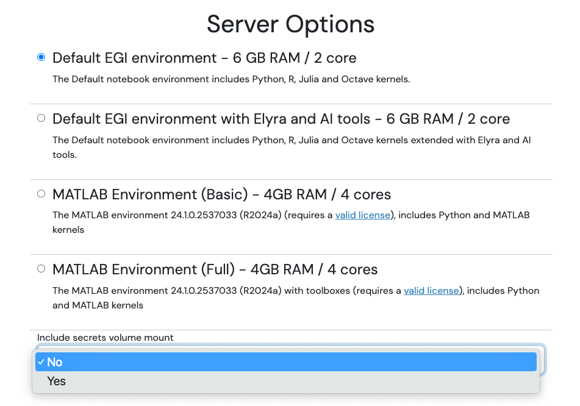
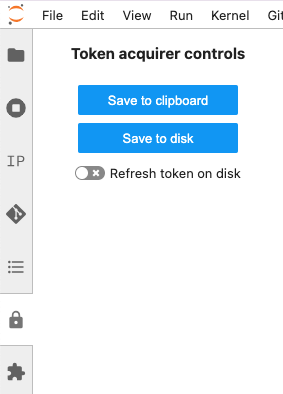

Notebooks running on EGI can access other existing computing and storage
services from EGI or other e-Infrastructures. For data services, check
[data section of the documentation](../data)

## API access to notebooks

You can use the
[JupyterHub REST API](https://jupyterhub.readthedocs.io/en/5.3.0/reference/rest-api.html)
with a
[valid Check-in token](../../../aai/check-in/obtaining-tokens/) at
`https://notebooks.egi.eu/services/jwt`.

The endpoint expects an `Authorization` header to be present in the requests
with your token, e.g.:

```shell
$ curl -H "Authorization: bearer $TOKEN" https://notebooks.egi.eu/services/jwt
{"version":"5.3.0"}
```

You can use the Python requests library to interact with the API.
The code below shows an API GET request to `/user` using the
[token available](#egi-services-access-tokens) in the Notebooks session for
authorization. The response contains information about the user.

```python
import requests

api_url = "https://notebooks.egi.eu/services/jwt"

r = requests.get(api_url + "/users",
    headers={
        "Authorization": "Bearer {}".format(open("/var/run/secrets/oidc/access_token").read())
    }
)

r.raise_for_status()
users = r.json()
```

## EGI services: access tokens

Most services integrated with EGI Check-in can handle valid access tokens for
authorising users. These are short-lived (normally less than 1-hour) and need to
be renewed for longer usage. With EGI Notebooks, you can get a ready-to-use
token at any time.

Whenever you start your session, you can select whether to automatically mount
or not your token in your server. Default is **not** to mount it, so if the
server is [shared for collaborative access](../sharing), this token won't be
accessible for other users. Only select yes when you will not share the server!



You can obtain a new token at any time with the JupyterLab extension available
from the Jupyter Lab interface. You have two options:

1. Copying the token to clipboard
2. Saving the token to disk so it's accessible from your notebook files
   and/or terminal. Optionally you can request the token to be continuously
   refreshed on disk so you don't need to request new tokens.



Whether you have selected to mount the token on the server creation step or
if you save it to disk with the extension, the token will be available at
`/var/run/secrets/egi.eu/access_token`. See for example below some
python code to access cloud providers of the EGI cloud, where a list of
VMs is obtained from CESGA's OpenStack:

```python
from keystoneauth1.identity import v3
from keystoneauth1 import session
from novaclient import client


with open("/var/run/secrets/egi.eu/access_token") as f:
    access_token = f.read()

auth = v3.OidcAccessToken(auth_url="https://fedcloud-osservices.egi.cesga.es:5000/v3",
                          identity_provider="egi.eu",
                          protocol="openid",
                          project_id="3a8e9d966e644405bf19b536adf7743d",
                          access_token=access_token)
sess = session.Session(auth=auth)
nova = client.Client(session=sess, version=2)
nova.servers.list()
```

### fedcloud client

A direct benefit of the integration with access tokens in EGI Notebooks is that
you can easily work with the [fedcloud](https://fedcloudclient.fedcloud.eu/)
client. Once logged into the EGI Notebooks open a terminal and run:

```shell
export OIDC_ACCESS_TOKEN=`cat /var/run/secrets/egi.eu/access_token`
fedcloud token check
```

If the `fedcloud` command is not available, please follow the
[getting started](../../../getting-started/cli) guide to get it.

## EGI Workload Manager (DIRAC)

If you are using a Notebooks instance integrated with
[EGI Workload Manager](../../../compute/orchestration/workload-manager), you may
access the DIRAC client via CVMFS with the following two command lines:

```shell
$ source /cvmfs/dirac.egi.eu/dirac/bashrc_egi_dev
$ dirac-login --issuer=https://dirac.egi.eu/auth
```

## D4Science

If you are using a Notebooks instance integrated with D4Science, you can easily
invoke DataMiner or any other D4Science functionality as the service will
provide the `GCUBE_TOKEN` environment variable with a valid token.

This code will print the list of DataMiner methods available within your VRE:

```python
import os
from owslib.wps import WebProcessingService

# init http header parameter and base folders for gCube REST API
gcube_vre_token_header = {'gcube-token': os.environ["GCUBE_TOKEN"]}
# init WPS access for DataMiner algorithms
dataminer_url = 'https://dataminer-prototypes.d4science.org/wps/WebProcessingService'
wps = WebProcessingService(dataminer_url, headers=gcube_vre_token_header)

for process in wps.processes:
    print('- Name: ', process.title)
```

DataMiner algorithms can be invoked also from Notebooks, this code shows a
sample:

```python
from owslib.wps import ComplexDataInput, monitorExecution

# define processid and inputs
processid = 'org.gcube.dataanalysis.wps.statisticalmanager.synchserver.mappedclasses.transducerers.WOFOST_CLOUD_V0_2_1'
inputs = [
    ('ClassToRun', 'nl.wur.wofostsystem.App'),
    ('FileInput',
        ComplexDataInput(
            'https://data.d4science.org/shub/E_eVhZTzBWWktOaVJxQjJkdTUxR3FHaTFFdE9BTDYrZkZxQnFWcGMyaVVJbXptejdDOEFpSVNmam82RllkRUJ6cA==',
            mimeType="text/xml")
    )
]

# execute the process
execution = wps.execute(processid, inputs)
monitorExecution(execution, sleepSecs=5, download=True)
print(execution.status)
```

Note that inputs that point to a URL should be specified using the
`ComplexDataInput` class as shown above.

## Other third-party services

We are open for integration with other services that may be relevant for your
research. Please contact `support <at> egi.eu` with your request so we can
investigate the best way to support your needs.
