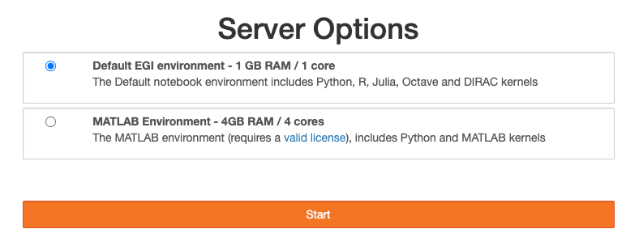

JupyterHub is an extensible platform that supports different combination of
software and hardware for running your applications. For the EGI service, you
have the choice to run:

- the [default environment](./default) that provides a data-science ready stack
  with support for Python, R, Julia, and Octave.
- the [MATLAB environment](./matlab), for running MATLAB.

After logging into the service, you will be shown a form for selecting the
environment, pick the desired one and click start

The list of options is customised for your community, depending on the VOs you
are member of, you will be able to select new options tuned to your needs, e.g.
[eiscat.se VO](https://operations-portal.egi.eu/vo/view/voname/eiscat.se)
members are presented with a runtime environment built matching their needs:

If you have special needs that cannot be covered with the
[default environment](./default) environment, let us know by opening a ticket to
the Notebooks Support Unit in [GGUS](https://ggus.eu).

Additionally, you can build your own environment via [Replay](../../replay).
This will allow you to build reproducible and shareable environments for your
notebooks.
