<!-- cSpell:words datascience -->

The default environment includes a set of
[kernels](https://jupyter.readthedocs.io/en/latest/projects/kernels.html) that
are automatically built from the
[EGI-Federation/egi-notebooks-images](https://github.com/EGI-Federation/egi-notebooks-images)
GitHub repository.

These are the available kernels:

- Python: Default Python 3 kernel, it includes commonly used data analysis and
  machine learning libraries. Created from the
  [jupyter/scipy-notebook](https://jupyter-docker-stacks.readthedocs.io/en/latest/using/selecting.html#jupyter-scipy-notebook)
  stack.

- Julia: The Julia programming language with the libraries described in
  [jupyter/datascience-notebook](https://jupyter-docker-stacks.readthedocs.io/en/latest/using/selecting.html#jupyter-datascience-notebook).

- R: The R programming language with several packages from the R ecosystem as
  provided by
  [jupyter/r-notebook](https://jupyter-docker-stacks.readthedocs.io/en/latest/using/selecting.html#jupyter-r-notebook)
  and some extra libraries.

- RStudio:
  [RStudio Server](https://posit.co/products/open-source/rstudio-server/) offers
  a RStudio IDE from the Notebooks interface.

- Octave: The [Octave](https://www.octave.org/) programming language installed
  on its own conda environment (named `octave`).

## CVMFS

Notebooks mounts several [CVMFS](../../../../compute/software-distribution/)
repositories where you can find software relevant to your community. These are
accessible from the default CVMFS location `/cvmfs` and also linked in your home
directory `/home/jovyan/cvmfs`. These repositories are available:

<!-- cSpell:disable -->

- atlas-condb.cern.ch
- atlas.cern.ch
- auger.egi.eu
- biomed.egi.eu
- cms.cern.ch
- dirac.egi.eu
- eiscat.egi.eu
- grid.cern.ch
- notebooks.egi.eu

<!-- cSpell:enable -->

If you need access to any other repositories, please open a request in
[GGUS](https://helpdesk.ggus.eu).

## Conda Switcher

Conda Switcher is a JupyterLab extension for managing Conda environments
directly from the Notebooks interface. It is available from the left control
panel of the JupyterLab environment and provides a graphical interface for
common environment management operations.

Conda Switcher allows you to create new Conda environments, restore environments
from backups, create environment backups, export environments to YAML, install
Jupyter kernels, and remove environments. The panel also displays the currently
detected environments and provides a live operation log for monitoring
longer-running tasks.

And how do you switch between environments ? Once you have created and you are
managing multiple environments/kernels using Conda Switcher extension, you will
be able to use/switch between options available in those environments by either
selecting them from Jupyterlab launcher, kernel selection or CLI.

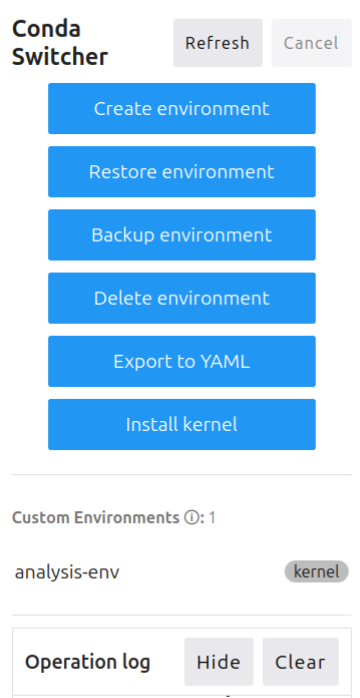

### Create a new environment

Click **Create environment** in the Conda Switcher panel. Enter a name for the new
environment, select the Python version you want to use, and choose which Jupyter
kernels should be installed together with the environment. Python is selected by
default. You can also select R, Julia and Octave, and multiple kernels can be
installed at the same time.

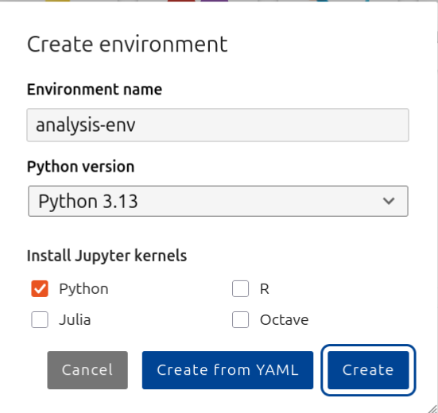

Confirm the dialog to start creating the environment. Conda Switcher first
creates the environment and then installs and registers the selected kernels as
part of the same background operation. The complete progress can be monitored in
the operation log at the bottom of the Conda Switcher panel. Once the operation
is completed, the new environment will appear in the list of available
environments and the selected kernels will be available for use in JupyterLab.

{} Installing multiple kernels
requires more resources, like memory. If you don't have enough spare resources,
the creation of a new environment will most likely fail.

To prevent this, there are couple of approaches you can apply, so you can create
a new environment with desired kernels in it:

1. use a larger Notebook instance (e.g. medium, large) - this will add more
   resources for conda-switcher to work with

1. properly manage your memory - don't open multiple new tabs with active
   kernels, don't run other processes using more resources etc. a good approach
   is also to check your memory indicator on bottom left panel
1. install kernels individually inside a new environment using
   ["Install Kernel"](./#install-a-jupyter-kernel)
{}

The **Custom Environments** section lists the Conda environments currently
detected by Conda Switcher.

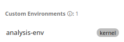

A **kernel** label may be displayed next to an environment name. This label
indicates that the environment has at least one Jupyter **kernel** registered
for it. For example, if an environment contains multiple registered kernels,
only a single kernel label is displayed. An environment without the **kernel**
label is still a valid Conda environment, but it is not currently registered as
a Jupyter kernel.

{}
Creating an environment requires Conda to resolve and download the required
packages. Depending on the selected Python version, network conditions and
current server performance, this operation may take several minutes.
{}

{}
Default and any other conda environment not created using Conda-Switcher are
**not** considered by the extension. If you wish to manage those, you have to
do it manually. There is also an UI hint regarding this.

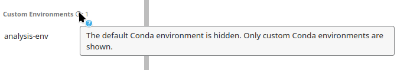
{}

### Backup an environment

Click **Backup environment** and select the environment you want to back up.

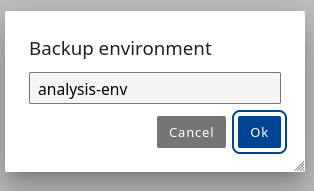

Conda Switcher uses `conda-pack` to create a portable archive containing the
selected environment. Before the backup starts, a file browser opens where you
can select the directory in which the backup archive should be stored. The file
browser starts in your Jupyter home directory. You can later restore the
environment from this archive using
[Restore environment](./#restore-an-environment-from-a-backup).

Backup is performed as a background operation and its progress can be monitored
in the operation log. Large environments may require several minutes to package.

{}
Do not restart or stop your Jupyter server while a backup operation is
still running. Wait until Conda Switcher reports that the operation has
completed.
{}

### Restore an environment from a backup

Click **Restore environment** to restore a previously backed-up environment.
A file browser will open in your Jupyter home directory. Browse to the location
where the backup archive is stored and select the archive you want to restore.

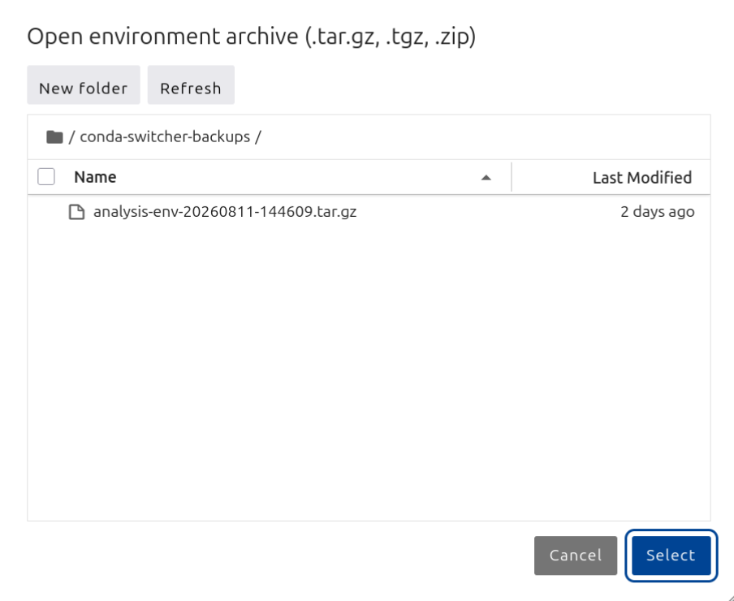

Select the environment archive you want to restore and confirm your selection.
You will then be asked for the name of the restored environment. Conda Switcher
extracts the selected archive and recreates the environment in the managed
environment area.

The restoration process runs in the background and can be followed in the
operation log. Once completed, the restored environment will appear in the list
of available environments.

### Export an environment to YAML

Click **Export to YAML** and select the environment you want to export.
A save dialog will open where you can browse the JupyterLab filesystem,
select the destination directory and enter the desired file name in
the same window.

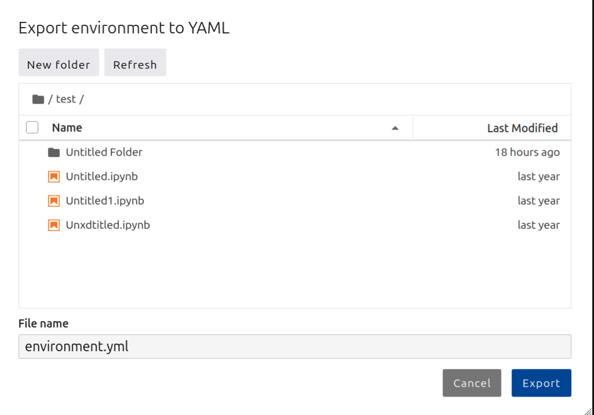

Enter the desired YAML file name and select the destination directory. The .yml
extension is added automatically if it is not specified. After selecting the
destination directory and file name, Conda Switcher asks you to choose an export
method.

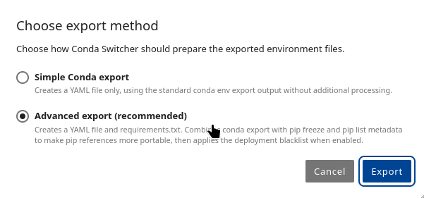

- **Simple Conda export** uses the standard Conda export command and stores its output
  directly in the selected YAML file. This mode does not apply additional
  processing, package filtering or pip metadata handling. It is intended as a
  compatibility option when you want the original Conda export behaviour.

- **Advanced export** is selected by default and is recommended for most users. It
  combines the standard Conda export with information from `pip freeze` and
  `pip list --format=json` to improve portability of pip-installed packages. Git-based
  package references are preserved as repository URLs, while local `file:///`
  references are converted to `package==version` requirements when the installed
  package version can be identified.

  Advanced export generates 2 files: `environment.yaml` and `requirements.txt`

  The exported YAML file describes the packages and configuration of the selected
  Conda environment. In Advanced export mode, Conda Switcher always creates a
  `requirements.txt` file containing information about pip-installed packages, in
  addition to the YAML environment file. The resulting files can be used to
  inspect the environment configuration or to reproduce a similar environment on
  another system.

{}
A YAML export is not a complete copy of the environment. It contains an
environment specification, and the listed packages normally have to be
downloaded again when the environment is recreated. Use
[Backup environment](./#backup-an-environment) instead if you want to create
an archive that can later be restored directly using Conda Switcher.
{}

### Backup vs. YAML export

[Backup environment](./#backup-an-environment) and
[Export to YAML](./#export-an-environment-to-yaml) preserve an environment in
different ways. A backup created by **Backup environment** is a packaged copy of
the actual Conda environment and is intended to be restored using
**Restore environment**. It is the appropriate option when you want to preserve
an environment and return to it later.

A **YAML export** is a textual description of the environment and its packages. It
is easier to inspect, edit and share, but it does not contain the packages
themselves. Recreating an environment from YAML therefore generally requires the
packages to be downloaded and installed again.

Use **Backup environment** when your goal is to preserve and later restore an
environment. Use **Export to YAML** when you need a portable and human-readable
environment specification.

### Install a Jupyter kernel

Click **Install kernel** and select the environment in which you want to
install the kernel. Conda Switcher provides support for Python, Julia, R
and Octave kernels.

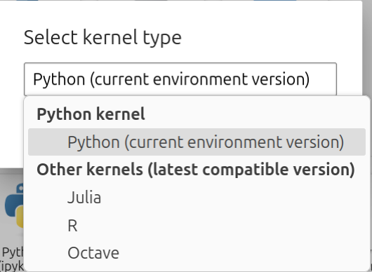

For Python, the kernel uses the Python installation of the selected environment.
For Julia, R and Octave, Conda Switcher installs the packages required to
provide the selected Jupyter kernel and registers it for use by JupyterLab.

Kernels can also be selected when creating a new environment. Use **Install kernel**
when you want to add another kernel to an environment that already exists.
Kernel installation runs as a background operation. Installing a kernel that
requires additional packages can take several minutes because the necessary
packages may have to be resolved and downloaded.

After installation, the kernel becomes available for use with Jupyter notebooks.
If a newly installed kernel is not immediately visible in the Launcher or kernel
selection menu, refresh the JupyterLab interface.

### Remove an environment

Click **Delete environment** and select the environment you want to remove.

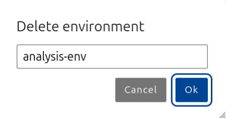

Before deleting an environment, Conda Switcher asks whether you want to create a
backup of the environment first.

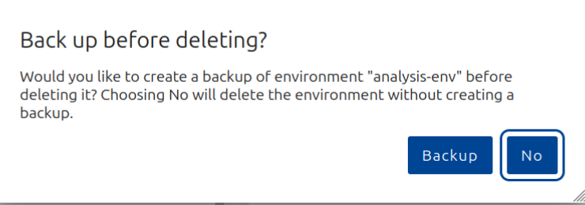

You can choose **Backup** to create a backup before deleting the environment,
or **No** to delete the environment without creating a backup. If **Backup**
is selected, a file browser opens where you can choose the destination directory.
Conda Switcher waits for the backup to complete successfully before removing the
environment.

{}
Deleting an environment without creating a backup is irreversible.
Choose **No** only if you are certain that you no longer need the environment or
already have another copy of it.
{}

### Monitor running operations

Some environment operations can take a significant amount of time.
Conda Switcher therefore performs long-running tasks in the
background and displays their progress in the lower part of the panel.

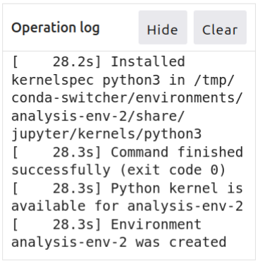

While an operation is running, Conda Switcher displays its current status,
elapsed running time and output produced by the underlying command. The detailed
output is contained in a scrollable log area, so a long log does not expand the
panel or move the environment controls out of view.

The **Hide** button hides the detailed log and changes to **Show**, which can
then be used to display it again. Hiding the log only changes its visibility;
logging continues in the background and the running operation is not interrupted.
The **Clear** button clears the currently displayed log output.

{}
Conda may spend a significant amount of time resolving dependencies,
downloading packages or executing package transactions. During these stages the
operation may appear to make little progress even though it is still running.
Check the operation status and log before assuming that an operation has
stopped.
{}

### Backup storage

Backup archives are stored in the directory selected by the user
when the backup is created. Conda Switcher does not create or require a
dedicated backup directory.

Backup archives can later be restored using **Restore environment**. The file
browser starts in your Jupyter home directory, from where you can navigate to
the location containing the archive.

## Installing your own kernels/environments permanently

{}
This option for installing your kernels is deprecated. Use the
[Conda Switcher](./#conda-switcher) instead to manage your own kernels.
{}

If you want to have a completely customised environment for your Notebooks that
persists across sessions, you can create your own conda environment in your home
directory. Thanks to the
[nb_conda_kernels](https://github.com/Anaconda-Platform/nb_conda_kernels) plugin
these will show up automatically as an option to start notebooks with by
following these steps:

1. Create a `$HOME/.condarc` file specifying where your environments will be
   created, e.g. in `/home/jovyan/conda-envs/`:

   ```yaml
   env_dirs:
     - /home/jovyan/conda-envs/
   ```

1. Create your environments as needed, make sure to install a kernel
   (`ipykernel`) for it to show automatically:

   ```shell
   $ conda create -p /home/jovyan/conda-envs/myenv ipykernel scipy
   ```

1. The environment will show up in the launcher as a new option

   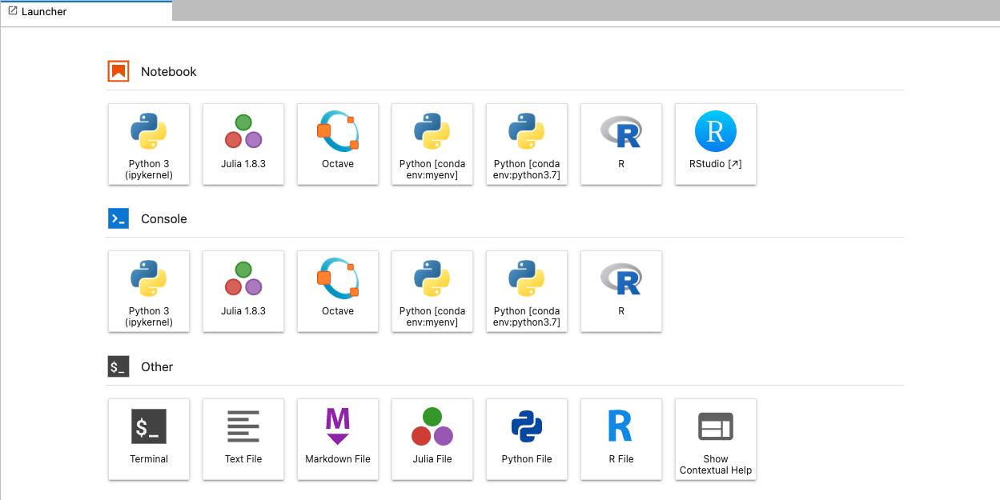
