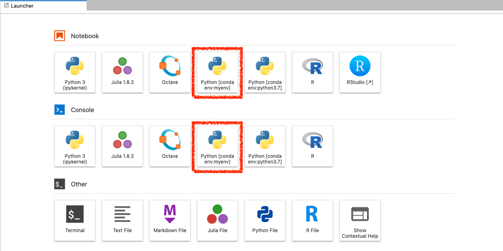

The default environment includes a set of
[kernels](https://jupyter.readthedocs.io/en/latest/projects/kernels.html) that
are automatically built from the
[EGI-Federation/egi-notebooks-images](https://github.com/EGI-Federation/egi-notebooks-images)
GitHub repository.

These are the available kernels:

- Python: Default Python 3 kernel, it includes commonly used data analysis and
  machine learning libraries. Created from the
  [jupyter/scipy-notebook](https://jupyter-docker-stacks.readthedocs.io/en/latest/using/selecting.html#jupyter-scipy-notebook)
  stack.

- Julia: The Julia programming language with the libraries described in
  [jupyter/datascience-notebook](https://jupyter-docker-stacks.readthedocs.io/en/latest/using/selecting.html#jupyter-datascience-notebook).

- R: The R programming language with several packages from the R ecosystem as
  provided by
  [jupyter/r-notebook](https://jupyter-docker-stacks.readthedocs.io/en/latest/using/selecting.html#jupyter-r-notebook)
  and some extra libraries.

- RStudio:
  [RStudio Server](https://posit.co/products/open-source/rstudio-server/) offers
  a RStudio IDE from the Notebooks interface.

- Octave: The [Octave](https://www.gnu.org/software/octave/) programming
  language installed on its own conda environment (named `octave`).

If you want to add a new kernel, just let us know and we will discuss the best
way to support your request.

## CVMFS

Notebooks mounts several [CVMFS](../../../../compute/content-distribution/)
repositories where you can find software relevant to your community. These are
accessible from the default CVMFS location `/cvmfs` and also linked in your home
directory `/home/jovyan/cvmfs`. These repositories are available:

- atlas-condb.cern.ch
- atlas.cern.ch
- auger.egi.eu
- biomed.egi.eu
- cms.cern.ch
- dirac.egi.eu
- eiscat.egi.eu
- grid.cern.ch
- notebooks.egi.eu

If you need access to any other repositories, please open a request in
[GGUS](https://ggus.eu).

## Installing your own kernels/environments permanently

If you want to have a completely customised environment for your Notebooks that
persists across sessions, you can create your own conda environment in your home
directory. Thanks to the
[nb_conda_kernels](https://github.com/Anaconda-Platform/nb_conda_kernels) plugin
these will show up automatically as an option to start notebooks with by
following these steps:

1. Create a `$HOME/.condarc` file specifying where your environments will be
   created, e.g. in `/home/jovyan/conda-envs/`:

   ```yaml
   env_dirs:
     - /home/jovyan/conda-envs/
   ```

1. Create your environmnets as needed, make sure to install a kernel
   (`ipykernel`) for it to show automatically:

   ```shell
   $ conda create -p /home/jovyan/conda-envs/myenv ipykernel scipy
   ```

1. The environment will show up in the launcher as a new option

   
