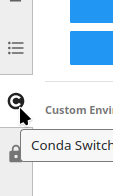
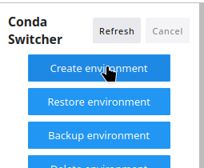
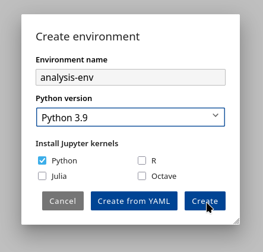
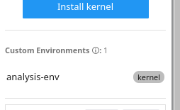
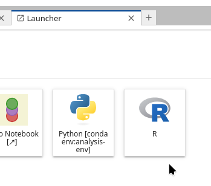
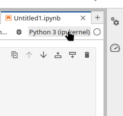
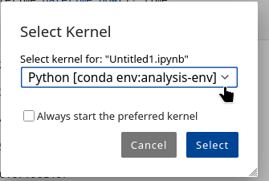

First you need to create a new environment, you can do it by selecting
Conda-Switcher on left sidebar.

Then you create a new environment by clicking on **Create Environment** option
and you select options you need:

Here I selected I want to create an environment with Python 3.9 and IPykernel
Jupyter of same version

Once the environment is created, you can check it by looking on list of
available environments managed by Conda-Switcher

In the tab launcher you can now open a Jupyter kernel from 3.9 environment
version you just created

Or if you have an existing Notebook, you open it in Jupyterlab Notebook editor
and then you select a kernel you desire, in this case we will select 3.9 Python
kernel from the created environment.

You can select the kernel by clicking on the top right corner and select the
kernel you wish.

