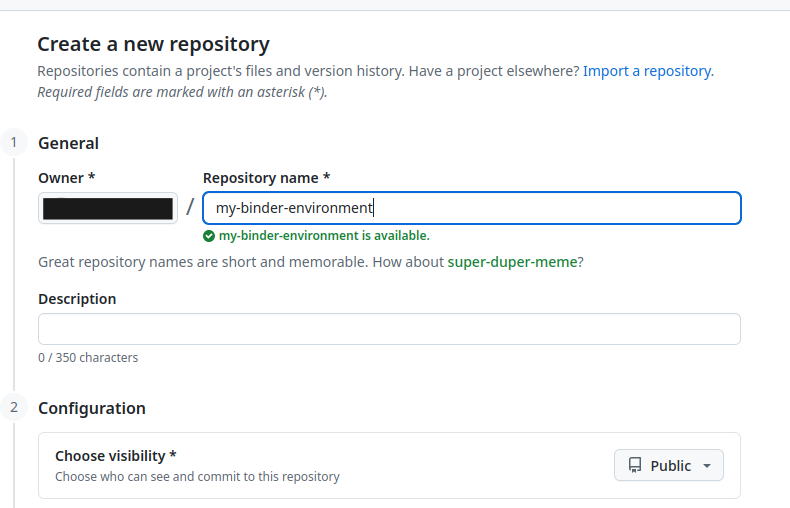
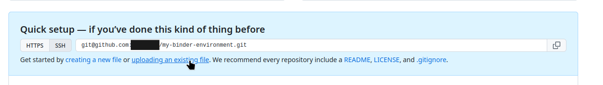
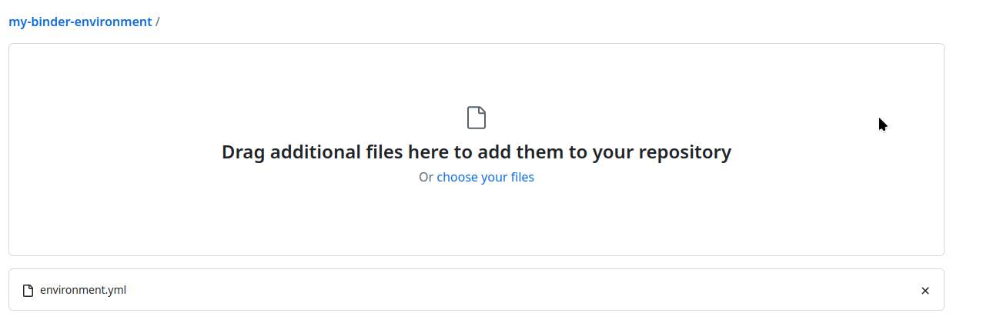
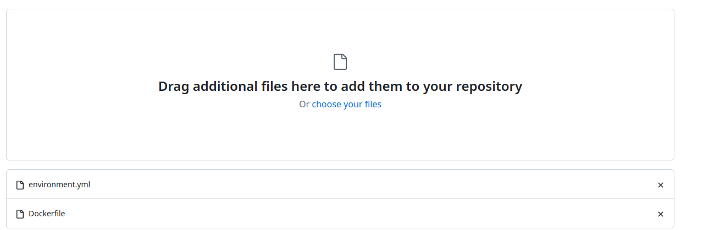
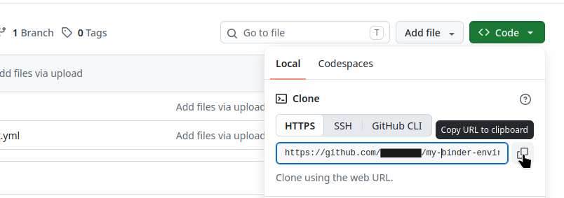
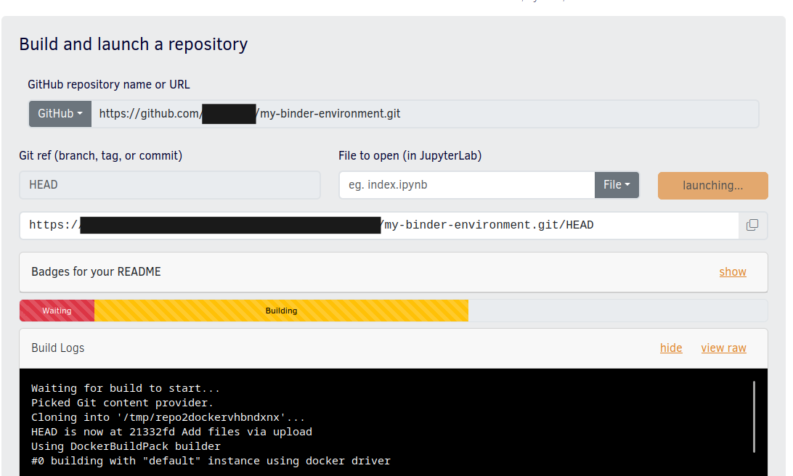

<!-- cSpell:words datascience -->

First, you will need a [YAML export of your environment](../#export-an-environment-to-yaml).

Once you have your YAML environment manifest, you can upload it to your github
repository. First create your new repository, make sure it is set to public!



Then you can add you YAML manifest there via file upload or by pushing via git
based on your preference




{}
Please, make sure your YAML manifest is called `environment.yaml` before uploading
it, because otherwise Replay won't recognize it.
{}

Now you have to add another file, named `Dockerfile`. This file details the
container image build instructions. In this case we will add instructions that
will allow us to build the conda environment from the exported YAML manifest in
Replay.

Your `Dockerfile` should contain the following lines:

```dockerfile
FROM quay.io/jupyter/datascience-notebook:<IMAGE_TAG>

COPY environment.yml /tmp/environment.yml

RUN conda env create -f /tmp/environment.yml
```

`<IMAGE_TAG>` should be replaced with the current image tag used to build the
Notebooks environment. You can get the exact tag at the
[EGI notebooks image repository](https://github.com/EGI-Federation/egi-notebooks-images/blob/master/base/Dockerfile#L9).

Once you added the image tag, you can upload your `Dockerfile` into the repository
and commit changes.



After that you can obtain a link to your repository



And start a build in Replay:


