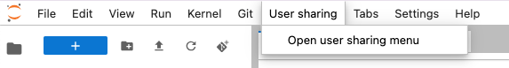
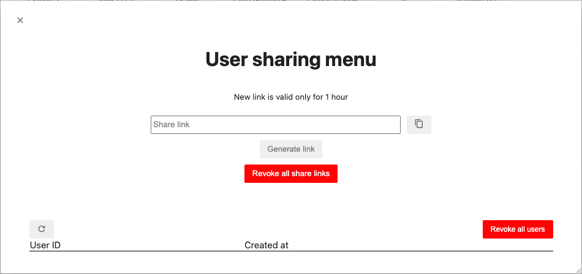
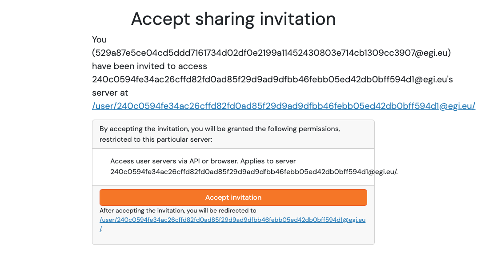
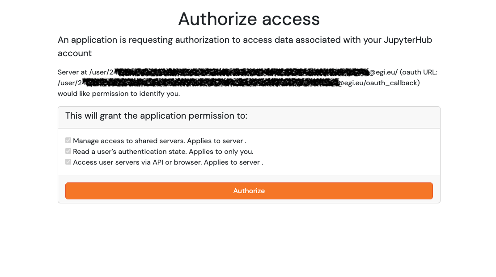
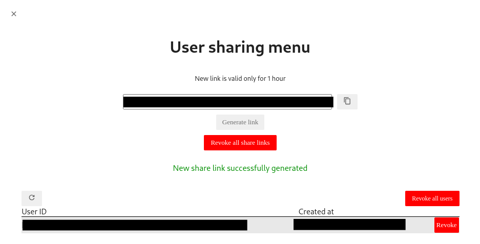
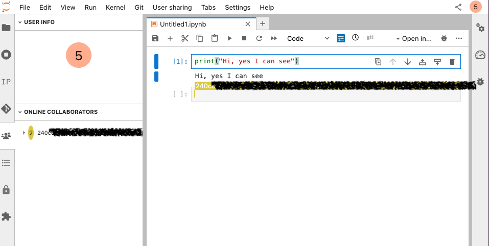

User-initiated sharing is a mechanism allowing users to share access to their
Jupyter server with other users via the Jupyterhub user sharing API. EGI
Notebooks provide you this feature via user sharing menu.

{}

By allowing other users to access your server, you also allow them to access the
files present on your Jupyter server. **Do not** store any secrets on your server if
you are planning to share it!

{}

## Sharing access

### Creating an invitation

You can find the user sharing menu can be opened from the top bar, click on
**User sharing -> Open user sharing menu**

With the user sharing menu window opened, you can now generate invite links and
share them with other users.

{}

- Each link is valid only **1 hour**
- The link can be used by **multiple** users to get an access to your server
- Only users **with access to the EGI Notebooks service** can access your server
- Once all users you want to share access with are connected to your server, you
  can revoke the validity of the generated link by clicking on the button
  **Revoke all share links**

{}

Once the invited user has accepted an invitation and authorized access, you can
start collaborating on the same server.

### Accepting an invitation

If you receive a link for getting access to an existing Notebook server, you
will be asked to accept the sharing invitation

and then a request to Authorize access:

Once you accept and authorize, you will be able to collaborate on the existing server.

### Managing invitations

You can see IDs of all users who accepted your invitation and the time when they did
from the User sharing menu. Click the Refresh button or re-open the user sharing
menu window to get an updated view.

Click on the corresponding **Revoke** button to revoke access for a concrete
user or click on **Revoke All users** to revoke access for all users.

Other users access will last until you stop your server. At the start of each new session,
all granted access will be revoked.

{}

- Even after revoking, invited users can **still** be on your running server for
  some time before the Jupyter server prevents them from more access. Therefore,
  if you wish to see changes immediately, you have to open the top bar menu
  **File -> Hub Control Panel** and then **stop** your server.

- Also remember that generated invitation links can still be used to get access
  to your server until they expire or you revoke them.

{}

## Real-time collaboration

Real-time collaboration(RTC) allows you to leverage the power of user-initiated
sharing to see each other's edits in real time.

You should see on the top-right corner of your Jupyter Lab your user initial.

Whenever other users access your server you will see the details in the extension
panel on the left of the Jupyter Lab interface. Now you can see users collaborating
with you on your server and changes from other users will be shown in real time:

