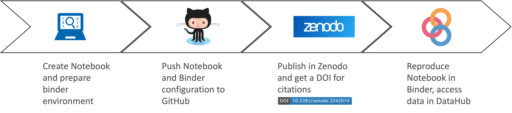
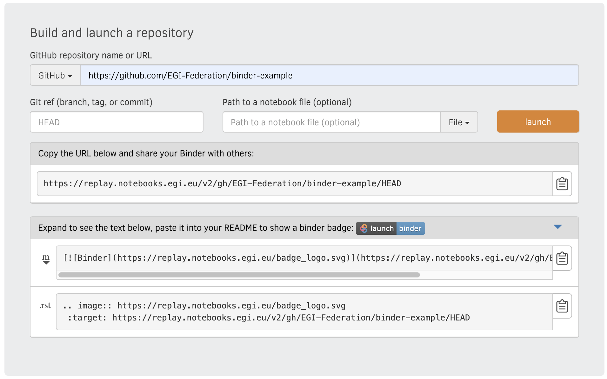
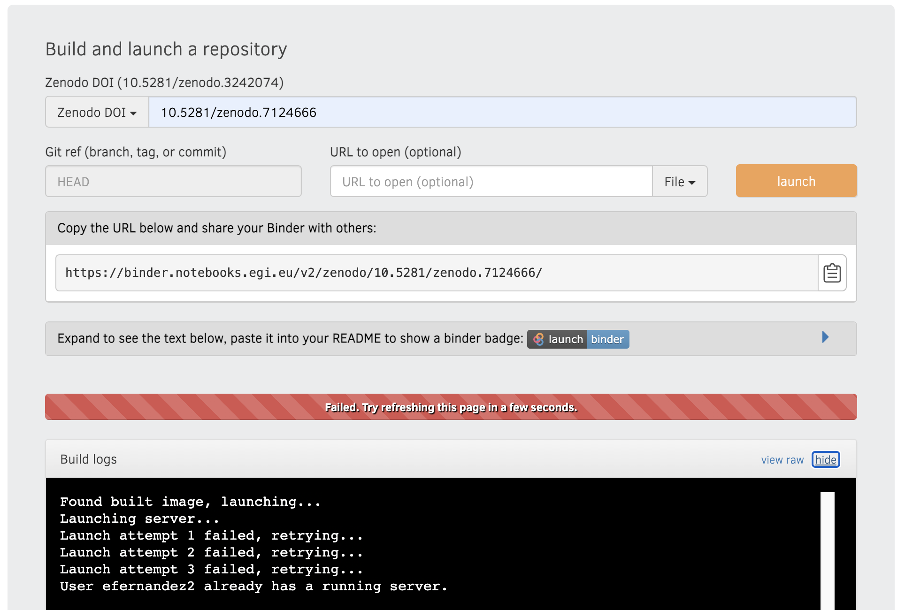
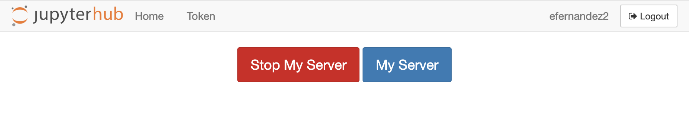

## What is it?

Replay allows the re-creation of a custom computing environment for reproducible
execution of notebooks (and potentially many other types of applications). Users
who create their own notebooks in the [EGI Notebooks](../notebooks/) to analyze
data can easily create a shareable link for those notebooks in the form of a
GitHub repository. Based on this link, anyone can then reproduce the same data
analysis using the link in the [EGI Replay](https://replay.notebooks.egi.eu)
service.

The service builds on [BinderHub](https://github.com/jupyterhub/binderhub), an
Open Source tool that allows to build docker images from a Git repository and
then makes them available through your browser.

EGI Replay offers a service similar to the publicly accessible
[mybinder.org](https://mybinder.org) site. However, EGI Replay has the following
additional features:

- Access with academic user accounts: login via [Check-in](../../aai/check-in)
  that’s connected to eduGAIN and social media accounts.
- Access to scalable storage: selected storage spaces of EGI DataHub are
  directly available under the `datahub` folder, simplifying the access to
  shared data from Binder notebooks.
- Guaranteed capacity: environments have 2GB of RAM guaranteed and can reach 4GB
  as maximum.
- Persistent sessions: There is no hard limit on the session time per user,
  although sessions will be shut down automatically after 1 hour of inactivity
  (see
  [session limitations at the public mybinder.org service](https://mybinder.readthedocs.io/en/latest/about/user-guidelines.html)).
- Access to the rest of EGI services: a personal access token is available in
  the Replay session to interact with the rest of the EGI infrastructure.
- Community Replay environments: User communities can have their customized
  Replay service instance from EGI, with extra features as requested (such as
  access to GPUs, integration with community specific data repositories and
  services). EGI offers consultancy and support the setup of these instances,
  and provides operational oversight for them.

## Reproducible research

Replay facilitates the sharing and reproducibility of digital data analysis:

1. Users can define their computational analysis in the
   [EGI Notebooks](../notebooks/) service.
1. Once the notebook is ready for publishing, it can be shared in a GitHub
   repository.
1. Optionally, users can use the Zenodo-GitHub integration for generating DOIs
   that can be cited in publications and can be discovered by fellow researchers
1. Anyone can use the link to the GitHub repository or Zenodo DOI to reproduce
   the computational analysis in [EGI Replay](https://replay.notebooks.egi.eu).

## Access to the service

[EGI's Replay](https://replay.notebooks.egi.eu/) has the same access conditions
as the
[centrally operated Notebooks service from EGI](../notebooks/#service-modes).
Before using the service, you need to have an EGI account and be a member of
[one of the supported resource pools](../notebooks/#notebooks-for-researchers)
(alias Virtual Organisations). Follow the instructions on the
[EGI Replay login page](https://replay.notebooks.egi.eu) for access.

## Creating a Binder repository

Replay starts from a code repository that contains the code or notebook you’d
like to run and a set of configuration files that specify what’s the exact
computational environment your code needs to run.

Replay then creates a reproducible container using
[repo2docker](https://github.com/jupyterhub/repo2docker), and generates a user
session to interact with the container in the browser.

The configuration for building the container supports specifying conda
environments; installing Python, R and Julia environments; installing additional
OS packages; and even complete custom Dockerfiles to bring any application to
the system. The code repository can be hosted on popular git hosting platforms
like GitHub and GitLab and can also be referenced with a DOI from Zenodo,
FigShare or Dataverse. You can learn more on the configuration of your
repository with Replay at the
[Binder user documentation](https://mybinder.readthedocs.io/).

You can start by forking the
[EGI-Federation/binder-example GitHub repository](https://github.com/EGI-Federation/binder-example)
for creating your own reproducible environment. To run this directly on EGI's
Replay click on the button below:

You can create such link to share your notebooks from the Replay interface, as
shown in the screenshot below, you can copy the URL shown when the building is
in progress:

The [binder examples](https://github.com/binder-examples) organisation on GitHub
contains more sample repositories for common configurations that can help you
getting started.

## Accessing data

Your notebooks running in Replay have outgoing internet connectivity, so you can
connect to external services to bring data in for analysis or deposing the
notebooks output.

Every session that you start will also provide access to your spaces in the
[DataHub](../.././data/management/datahub/) under a folder named `datahub`. Only
those spaces configured to be mounted locally will be made available
automatically. Check the documentation for the
[Notebook's DataHub support](../notebooks/data#egi-datahub) for more
information.

## Errors when launching

You can only have one notebook server instance running at any given time, if you
try to launch a second instance while there is already one running you will get
an error like shown in the screenshot:

In that case, you can either stop your existing server or connect to it from your
[Replay JupyterHub home](https://replay.notebooks.egi.eu/hub/home):

