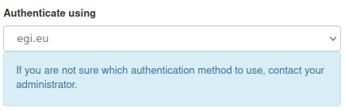
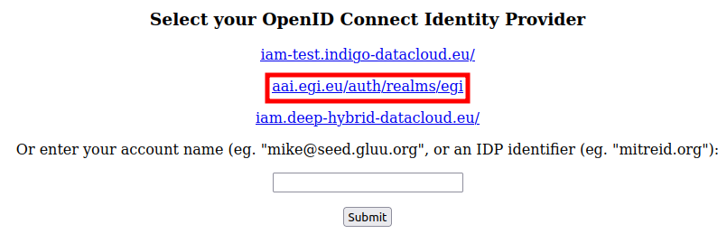

[OpenStack](https://openstack.org) providers in the EGI infrastructure
offer services and features via OpenStack APIs, and the
[command-line interface](../cli) (CLI), both integrated with
[EGI Check-in](../../aai/check-in) accounts.

The extensive [OpenStack user documentation](https://docs.openstack.org/user/)
includes details on every OpenStack project, but most providers offer:

- [Keystone](https://docs.openstack.org/keystone/latest/), for identity
- [Nova](https://docs.openstack.org/nova/latest/), for VM management
- [Glance](https://docs.openstack.org/glance/latest/), for VM image
  management
- [Cinder](https://docs.openstack.org/cinder/latest/), for block storage
- [Swift](https://docs.openstack.org/swift/latest/), for object storage
- [Neutron](https://docs.openstack.org/neutron/latest/), for network
  management
- [Horizon](https://docs.openstack.org/horizon/latest/), as a web
  dashboard

The Horizon web-dashboard of the OpenStack providers can be
used to manage and use services. It can be accessed using EGI Check-in
credentials directly. Select _EGI Check-In_:


Or _OpenID Connect_:


Or _egi.eu_:



In the **Authenticate using** drop-down menu of the login screen.

Additionally you may need to select _aai.egi.eu/auth/realms/egi_ as well:



{} You can quickly find the dashboards of
all providers in the EGI infrastructure that are accessible to you (use the
correct VO) with the [FedCloud Client](../cli):

```shell
$ fedcloud endpoint list --service-type org.openstack.horizon --site ALL_SITES
```

The same way you can also discover other types of resources, just use the
correct resource type:

- `org.openstack.horizon` for dashboards
- `org.openstack.nova` for virtual machines
- `org.openstack.swift` for object storage
{}

{} For more advanced information discovery,
including resources not based on OpenStack deployments, check out the
[EGI architecture summary](../architecture/#information-discovery).
{}
