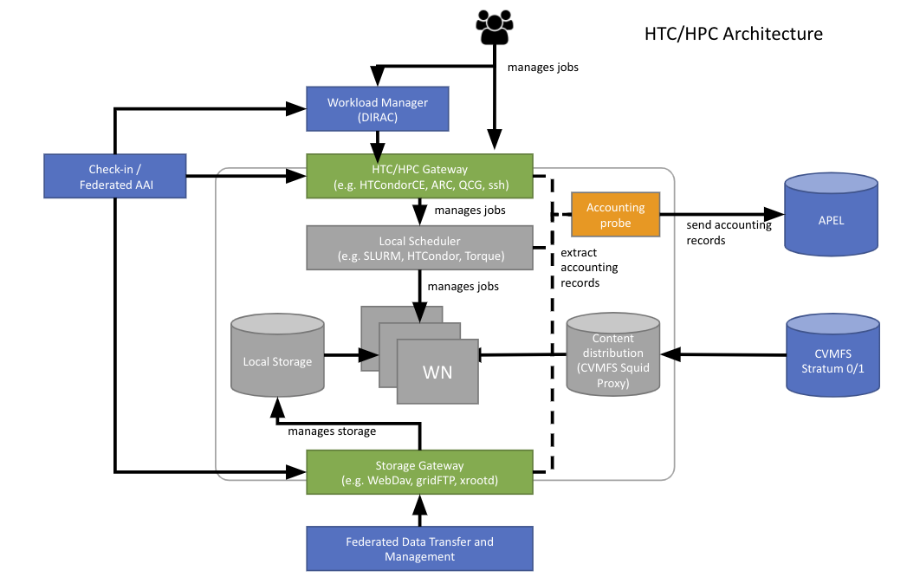

EGI High Throughput Compute service is provided by a distributed network of computing centres, accessible via a standard interface and membership of a Virtual Organisation.
### What is High Throughput Compute? 
High Throughput Compute (HTC) can be described as a use case for an infrastructure that includes a big number of tasks (that could be data analysis tasks, also computing jobs for analysing data or other similar tasks) that are submitted in big numbers and loosely coupled. They can be executed individually and don’t need to interact with each other (too much). Users usually submit these tasks to the infrastructure in a big number of them and once the jobs have been scheduled and executed in the distributed resources of the infrastructure, the user can collect the output from the services that have executed their jobs.

### The EGI HTC Infrastructure
EGI HTC infrastructure is the federation of GRID resources provided by EGI providers, that aims to share and federate in a secure way distributed IT resources as part of the EGI infrastructure. It comprises
- Computer resources -- execution environment of computing tasks in clusters distributed in many different resource centers over Europe and outside Europe ; 
- Data infrastructure -- storage servers where users can upload and download their data/files in a distributed manner in the different resource centers 
- Federated operations -- a set of federated operations that are constituted of global tasks (central activities/ services, e.g., AAI, accounting, helpdesk) that are needed to federate the heterogeneous resources from different resource centers and their operation activities that are carried out by the different National Grid Initiative (NGIs). 
- User support --  NGIs also carry out user support. EGI.eu provides the central user support and coordinates NGIs’ support activities.

### Target Users 
The target customers for EGI HTC service are research communities who need to share, store, process, and produce large sets of data. Typically, their research collaborations involve different organizations across Europe and the world. They may already have local resources, for example, universities, and research institutions, and these local resources normally can only be accessed by local users, according to the organisational authentication rules and access policies. For example, university researchers can go to their IT department and ask for grant access to the university cluster. However, when researchers join collaborations that need to share their research activities, data collections, repositories among different organisations, they will need more homogenous and coordinated operation of the resources that are not currently uniformly accessible. In addition, nowadays, many researcher collaborations generate a big amount of data, and managing such big data is time consuming and error prone. 

EGI HTC not only provides the basic access to resources but also offers a set of high-level tools allowing users to manage a large amount of data in a collaborative, for example, there are authorization and access control tools that can be regulated by the research collaboration in a central manner and uniformly distributed in the distributed infrastructure. And there are also tools to handle and manage a big amount of data (to move data, to create data catalogs for the distributed datasets, to balance the execution workloads, etc.).

### Main features
EGI HTC provides easy access to shared computing and data services from independent resource providers in a uniform way optimizing usage.  Most software deployed in the distributed resources centers are based on open standards, and are open source middleware services. Resource access is based on Virtual Organisation (VO). VOs are fully managed by communities allowing them to manage their users and grant control access to their services and resources. In order to optimize the usage of the resources, users can have opportunistic usage of unused resources. This means users can either own their resources and use EGI services to federate them and have easy access to them or use the resources already available in the EGI infrastructure. The opportunity resources are not dedicated to the users’ organization, but since you are enabled in these resources as the part of the EGI infrastructure, you can access when the research centers have some spare resources. And in this way, the resource providers are also happy since their resources are used in a more efficient way.

In summary, the main feature of the EGI HTC service are as follows: 
- Access to high-quality computing resources
- Integrated monitoring and accounting tools to provide information about the availability and resource consumption
- Workload and data management tools to manage all computational tasks
- Large amounts of processing capacity over long periods of time
- Faster results for your research
- Shared resources among users, enabling collaborative research

### EGI HTC Architecture and the Access Models
#### Architecture and Service Components

Key Components:
- _Logical File Catalog (LFC)_: Used to store logical file names that users created to refer to a data item they upload to the GRID storage. It keeps track of the physical locations of data and the replicas, storing the mappings between logical ID and physical ID of the data. Users can query the LFC server and get the logical file names then be able to get back the physical locations of the files. There are normally multiple replicas, and LFC will choose one of them and download the file. 
- _File Transfer Service (FTS)_
- _Storage Services_: Data can be stored in different storage systems in the EGI HTC, they are distributed services and there are a lot of different implementations of the storage services but can be accessible with common interfaces, different storage technologies accessed through common interfaces. There are different distributed storage services where all data can be distributed and replicated among different locations. To handle this distributed environment there is a need for file replica catalog, metadata catalogus and file transfer services to replicate or move data between the sites. The SRM is the most common interface and the most common protocol. There are 3 major storage management services: DPM, dCache and StoRM, they provide similar features and expose a SRM interface that can be used by users and by applications. Usually, computing jobs/tasks access data inputs and outputs through SRM. SRM allows a fine grained file management also space allocation tools 
- _Computing Elements (CE)_: Computing resources are made available through GRID interfaces called Computing Elements. Several implementations of CE include, HTCondor, ARC-CE
#### Access Model
##### Virtual Organisations (VOs)
EGI is a multi-disciplinary e-Infrastructure, that means the same resources are shared among different research communities. Research communities access the e-Infrastructure by grouping their users into Virtual Organizations (VOs). Usually there is one-to-one mapping between research communities and Virtual Organizations. This is not mandatory. There are cases such as a big community enabling multiple VOs for different disciplines. These VOs are basically groups of users and they are enabled on the resources (can be both Grid or Cloud) attached to the VOs. In this way, users are not individually enabled on the resources but through VOs. On the other hand, a user can belong to different VOs, e.g., s/he works with different communities. There are normally fine-grinded Authorization mechanisms beside VOs to put on detailed authorization rules for evaluating a decision to grant or deny the access.
 
##### Authentication
EGI HTC authentication is based on [X509](https://tools.ietf.org/html/rfc5280) certificates. The certificates are issued by Certification Authorities (CAs) part of the [EUGridPMA](https://www.eugridpma.org/) federation which is also part of [IGTF](https://www.igtf.net/) (International Global Trust Federation). 

The role of a Certification Authorities (CA) is to guarantee that users are who they claim to be and are entitled to own their certificate. It is up to the users to discover which CA they should contact. In general, CAs are organised geographically and by research institutes. Each CA has its own procedure to release certificates.

Users must request their credentials to a [EUGridPMA](https://www.eugridpma.org/) registration authority. All EGI HTC sites, services and tools accept certificates part of the [EUGridPMA](https://www.eugridpma.org/) distribution. If your community VO is enabled on that site, your certificate will be accepted by that site since all certificates are recognized at site level. 

Usually, a certificate can be installed by command line tools, but they can also be stored in the web browser to access EGI web tools and services. 

##### Authorization
EGI services do not (usually) handle authorization at a user level. It is the resources sites who authorized the access to their resources to a VO according to their own access policies, resource location, how many resources is the VO allowed to use. There are finer authorization policies, including groups, roles, in this way, the users can be structured in a VO. So, it is not a 0/1 authorization policy.

The community has full control of the access to the VO according to community authorization policies. The VO membership, groups and roles are managed by VO managers (Privileged VO members) independently by using the Virtual Organization Membership Service (VOMS).
##### VOMS
The Virtual Organization Membership Service (VOMS) is an attribute authority which serves as central repository for VO user authorization information, providing support for sorting users into group hierarchies, keeping track of their roles and other attributes in order to issue trusted attribute certificates and SAML assertions used in the Grid environment for authorization purposes. VOMS is composed of two main components: 
- the VOMS core service, which issues attribute certificates to authenticated clients 
- the VOMS Admin service, which is used by VO manager to administer VOs and manage user membership details.

How does it work? Usually, users submit tasks/jobs to the infrastructure that are attached with their own credential, and the credential is attached with a proxy certificate that is a short-term credential signed with the user certificate and is extended with the VO attributes. In general speaking, a user credential  is just an ID, and a proxy contains the VO details, so a resource site by receiving the proxy can recognize that the user is part of such a VO with such a role from such a group. A user can be part of multiple VO, thus can generate multiple proxies.
