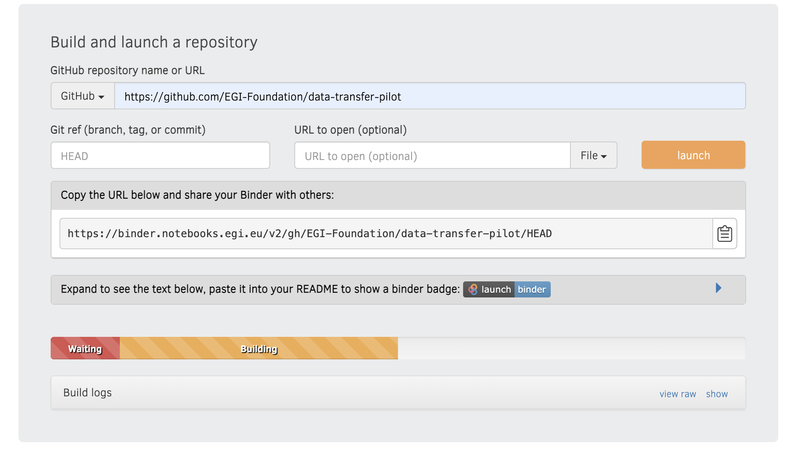

EGI offers a Binder instance within the Notebooks service. Binder allows to
build a custom and shareable computing environment that you can interact with.

It builds on [BinderHub](https://github.com/jupyterhub/binderhub), an Open
Source tool that allows to build docker images from a Git repository and then
make it available from JupyterHub.

EGI's Binder offers similar features to the publicly available
[mybinder.org](https://mybinder.org/) with larger capacity available for each
user.

## Access

[EGI's Binder](https://binder.notebooks.egi.eu/) has the same access conditions
as the
[centrally operated Notebooks service from EGI](../../#service-modes).
Before using the service, you need to have a valid EGI account and be a member
of
[one of the supported VOs](../../#notebooks-for-researchers).

## Linking to EGI's binder

You can create a link to share your notebooks easily from the Binder interface,
just copy the URL shown when the building is in progress

