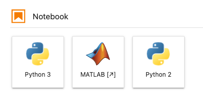
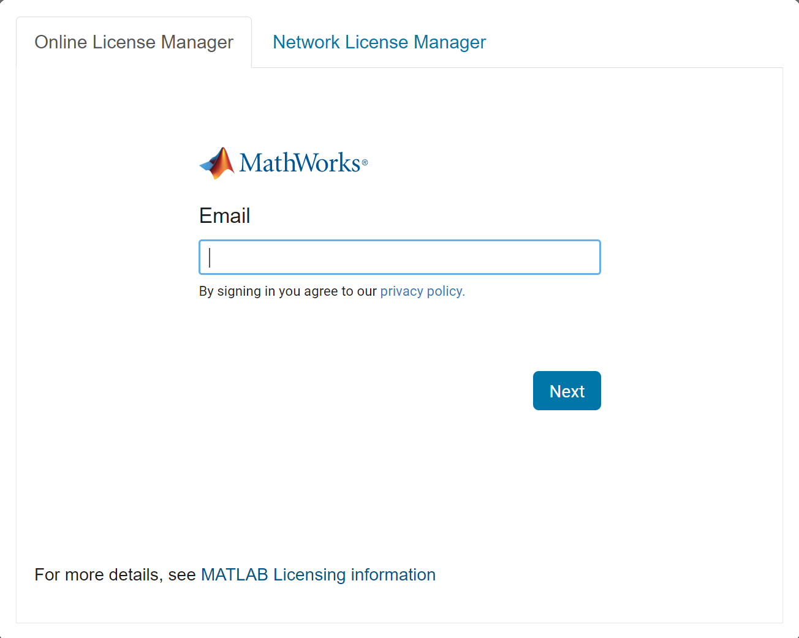
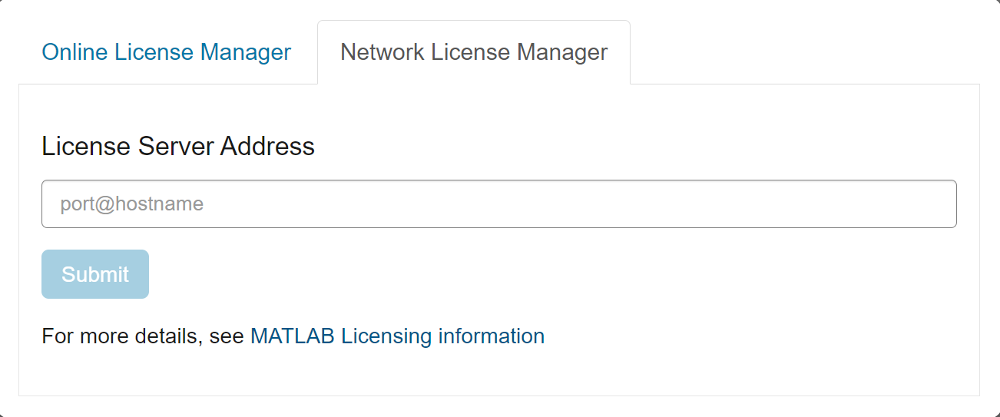
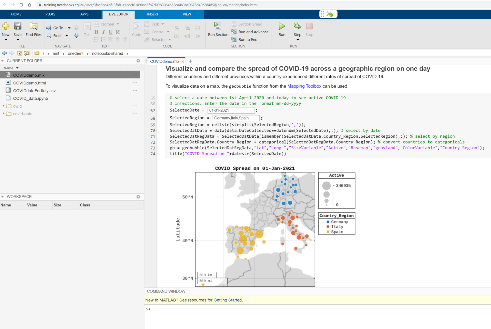
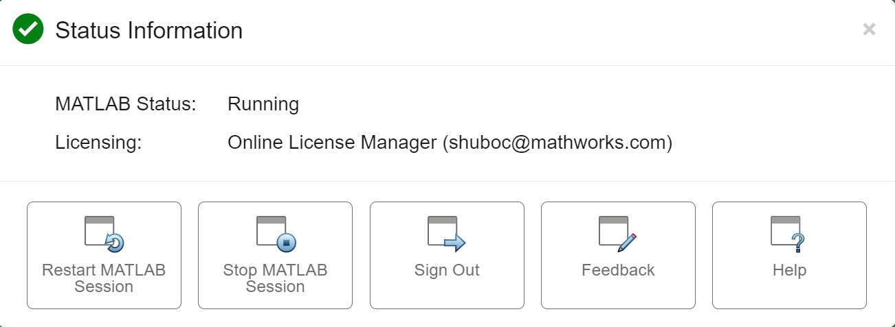

EGI offers MATLAB on the cloud using the
[MATLAB Integration for Jupyter](https://www.mathworks.com/products/reference-architectures/jupyter.html)
and shares data and code with other EGI users. MATLAB is also available directly
on compute services offered by the members of the EGI Federation.

MATLAB on the EGI infrastructure can be used by scientists and engineers for
Open Science by enabling them to share their data and code using computational
notebooks.

## Before getting started

### MATLAB Licenses

To use the MATLAB Integration on the EGI Notebooks service, a
[supported MATLAB license](https://github.com/mathworks/jupyter-matlab-proxy/blob/main/MATLAB-Licensing-Info.md)
is required. You can also use the toolboxes linked to your MATLAB license.

If you are unsure of your MATLAB license type, contact your System Administrator
or
[MathWorks support](https://www.mathworks.com/support/contact_us.html?s_tid=hp_ff_s_support).

### Tutorials

If you are not familiar or have limited experience with MATLAB,
[MATLAB Onramp](https://www.mathworks.com/learn/tutorials/matlab-onramp.html)
provides a free, self-paced tutorial. Additional
[Onramps](https://www.mathworks.com/services/training.html) are available for
other topics using MATLAB.

## Getting started

1. Once your server has started up (after selecting the MATLAB environment),
   click on the MATLAB icon

   

1. A dialog for handling MATLAB licensing will appear.

   - Individual and Campus Wide MATLAB Licenses

     If you have access to a MATLAB Individual License or a MATLAB
     [Campus Wide License](https://www.mathworks.com/academia/tah-support-program/eligibility.html),
     use the Online License Manager tab to log in using your MathWorks account
     (does not need to match the email used on the EGI Identity Provider) and
     click on next.

     

   - Concurrent/Network Licenses

     If you have Network Licenses, enter the `port@hostname` of your License
     Server on the Network License Manager tab of the login screen. Before doing
     so, please check with your system administrator about allowing the EGI
     access to your on-prem Network License Manager (License Server).

     

   - Free trial MATLAB Licenses If you do not have a MATLAB license and would
     like to try it out, you can download a free MATLAB trial license
     [here](https://www.mathworks.com/campaigns/products/trials/targeted/dkr.html.html).
     Note that the trial license is for MATLAB only and does not have any
     toolboxes.

   More information on MATLAB licensing with this integration can be found
   [here](https://github.com/mathworks/jupyter-matlab-proxy/blob/main/MATLAB-Licensing-Info.md).

1. Following this, the MATLAB IDE will appear in your browser.

   

1. To facilitate sharing your research output, you can use
   [MATLAB Live Scripts](https://www.mathworks.com/help/matlab/matlab_prog/create-live-scripts.html)
   combining rich text, equations, images, code and inline output all in one
   document. Live Scripts can be accessed from the
   [Live Editor](https://www.mathworks.com/products/matlab/live-editor.html)
   tab. Here is
   [an example of a tutorial Live Script](https://datahub.egi.eu/share/885c788bfb3a5740489f745c32e756dfch3790)
   from the EGI webinar showing steps required to analyze some public COVID-19
   data with MATLAB. Some other examples of Live Scripts can be found
   [here](https://www.mathworks.com/products/matlab/live-script-gallery.html).

## Limitations

Browser based MATLAB has some differences as compared to MATLAB on the desktop.
For more information, see the limitations
[here](https://www.mathworks.com/products/matlab-online/limitations.html).
Additionally, Simulink is not supported on the EGI at this time.

## Restarting, stopping or signing out of the MATLAB session

At any time, clicking on this symbol will bring up a dialog to stop, restart or
sign out of the current MATLAB session.

## Open Science using MATLAB on EGI Notebooks

You can access publicly available datasets via the EGI DataHub and analyze them
in-the-cloud directly using MATLAB, without the need for time consuming
downloads. Your MATLAB code can also be shared with your community in a variety
of interoperable and open formats.

## Analyzing public datasets using MATLAB on EGI

This [short video](https://www.youtube.com/watch?v=Hbf1yg32sso) and this
[webinar](https://youtu.be/zT9aW1xHCJU?t=167s) explains how to access EGI Data
Services from MATLAB in detail. Data from different data providers can be
accessed from the [DataHub](../../../datahub/). More information on Data Management
from Notebooks and persistent storage can be found [here](../../data).

## MATLAB support for data formats

MATLAB supports several
[scientific](https://www.mathworks.com/help/matlab/scientific-data.html) and
[standard data formats](https://www.mathworks.com/help/matlab/data-import-and-export.html?s_tid=CRUX_lftnav)
including
[web data](https://www.mathworks.com/help/matlab/import_export/download-data-from-web-service.html)
and those from
[specialized hardware](https://www.mathworks.com/hardware-support/home.html).

## Sharing data and code

You can
[share your data and analyses](https://www.youtube.com/watch?v=zT9aW1xHCJU&t=2727s)
by sharing your EGI provided persistent storage space with others. Users
belonging to a specific community can
[request community Notebooks](https://docs.egi.eu/users/notebooks/#service-modes).

### Interoperability with Python and other languages

You can collaborate with users of
[other languages](https://www.mathworks.com/products/matlab/matlab-and-other-programming-languages.html)
by
[calling these languages](https://www.mathworks.com/help/matlab/external-language-interfaces.html)
(eg. Python) from MATLAB for conducting specific analyses. You can also
[save data in formats compatible with other languages](https://youtu.be/zT9aW1xHCJU?t=2789s).

Here are some other ways in which
[MATLAB enables Open Science](https://www.mathworks.com/discovery/open-science.html)

## Using MATLAB on other EGI services

In addition to MATLAB on EGI Notebooks, you can also use your MATLAB license to
access MATLAB on any of the
[Institutions participating in the EGI Federation](https://www.egi.eu/about/egi-council/).
To run your compute-intensive MATLAB code faster or to run code in parallel, you
will need
[MATLAB Parallel Server](https://www.mathworks.com/products/matlab-parallel-server.html)
and
[MATLAB Parallel Computing Toolbox](https://www.mathworks.com/products/parallel-computing.html)
on your MATLAB license. If you have access to a
[Campus Wide License](https://www.mathworks.com/academia/tah-support-program/eligibility.html)
, you can now scale up to
[use all available workers on the HPC cluster of your choice](https://www.mathworks.com/products/matlab-parallel-server/campus.html).

To access MATLAB on any site of the
[EGI Federation](https://www.egi.eu/about/egi-council/), follow these steps.

- Check if you have access to MATLAB Parallel Server and Parallel Computing
  Toolbox

- Ask the system administrator of the site about MATLAB as part of EGI

- Contact [Shubo Chakrabarti](mailto:%20shuboc@mathworks.com) at MathWorks or
  [Enol Fernandez](mailto:enol.fernandez@egi.eu) at EGI for setting up access to
  MATLAB at the site.
