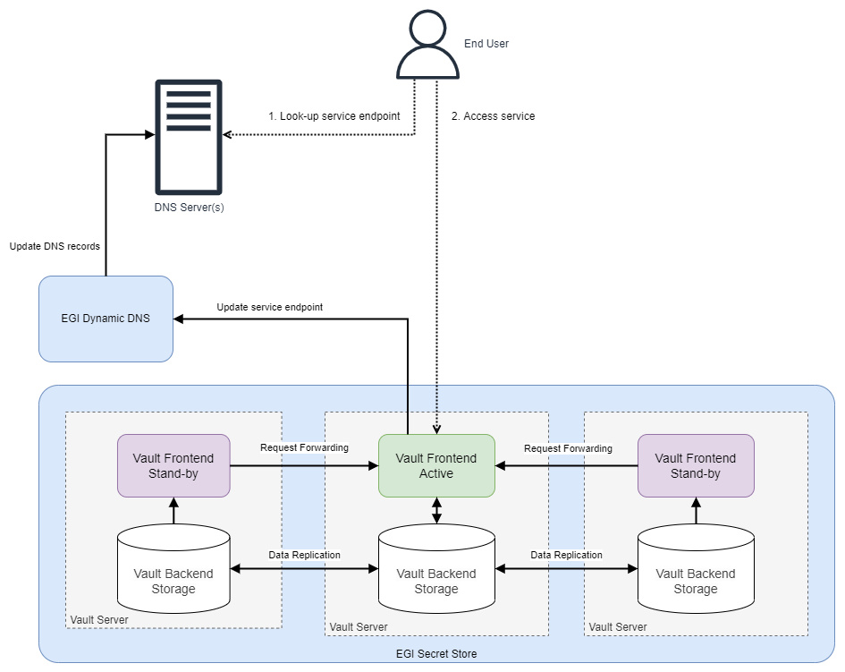

EGI Secrets Store is based on [Hashicorp Vault](https://www.vaultproject.io/)
and is fully integrated with [EGI Check-in](../../../aai/check-in/), allowing
users to use it with their community credentials.

{} When this
service is adopted by an application, it becomes a critical dependency for that
application, thus the EGI Secrets Store is implemented using a highly-available
(HA) approach.{}

## Service design

Multiple Vault servers in
[HA mode](https://developer.hashicorp.com/vault/docs/concepts/ha),
located at different geographical locations (in different resource centres) are
connected into a cluster, with **one active and multiple standby** instances.
Data is replicated among servers using the _Raft Consensus_ algorithm supported
by the
[Vault Integrated Storage](https://developer.hashicorp.com/vault/docs/concepts/integrated-storage).

Should the active server fail, one of the standby servers will become active
automatically. Each server does a periodic check, and the active one will
update the main service endpoint to point to itself, via
[Dynamic DNS](../../../compute/cloud-compute/dynamic-dns/).

## Service endpoints

During normal operation users can access any of the nodes of EGI Secrets Store
directly:

- [IISAS node](https://vault-iisas.services.fedcloud.eu:8200)
- [IFCA node](https://vault-ifca.services.fedcloud.eu:8200)
- [INFN node](https://vault-infn.services.fedcloud.eu:8200)

{} Accessing EGI Secrets Store via the
node endpoints is not recommended: if a server is down, its endpoint is not
accessible.{}

For convenience and high availability, you should use the
[generic endpoint](https://vault.services.fedcloud.eu:8200) to access the
service. This generic endpoint will be pointed to one of the service nodes
automatically via [Dynamic DNS](../../../compute/cloud-compute/dynamic-dns/).
A simple cron script periodically checks and assigns the generic hostname to
a healthy server.

The recovery time of the generic endpoint, in the case of an unscheduled
downtime of the generic endpoint’s server, is _T+1_ minutes, where _T_ is the
interval between cron checks (usually 1 minute). In the case of scheduled
downtime for maintenance, administrators simply assign the generic endpoint to
another server instance.
