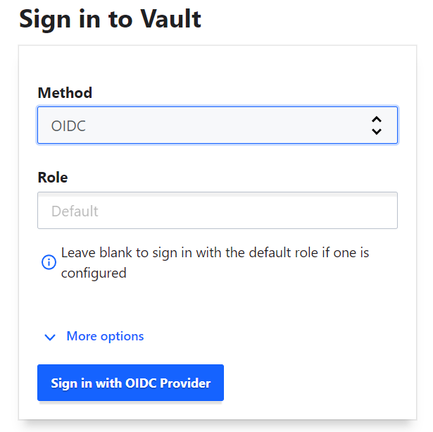
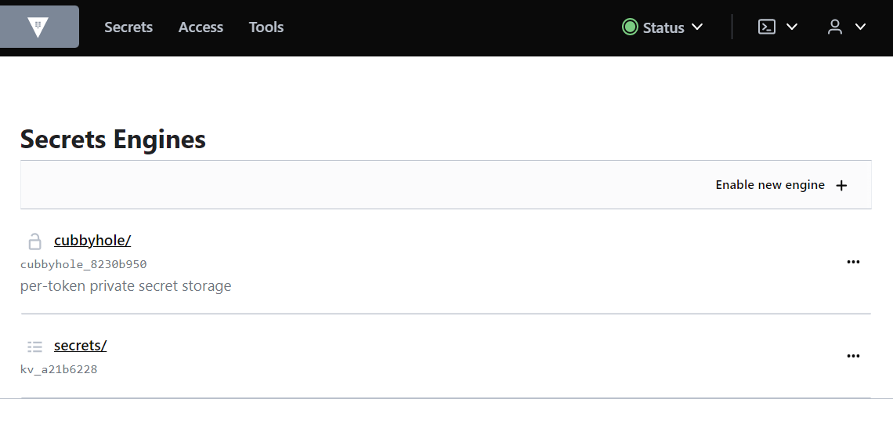
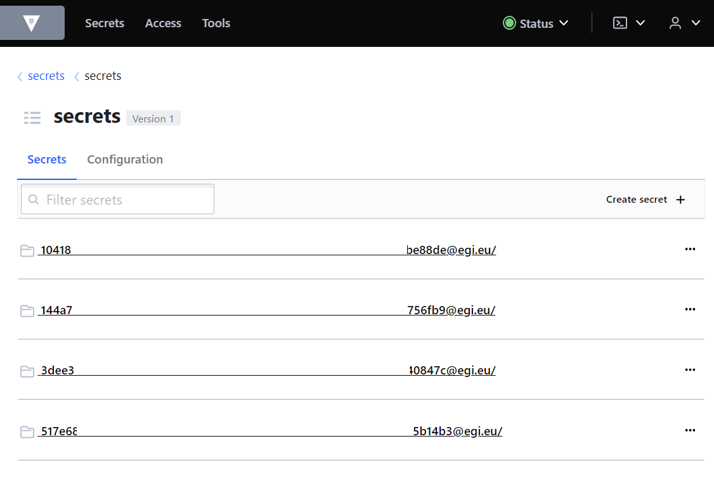
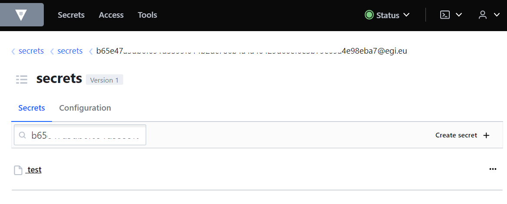
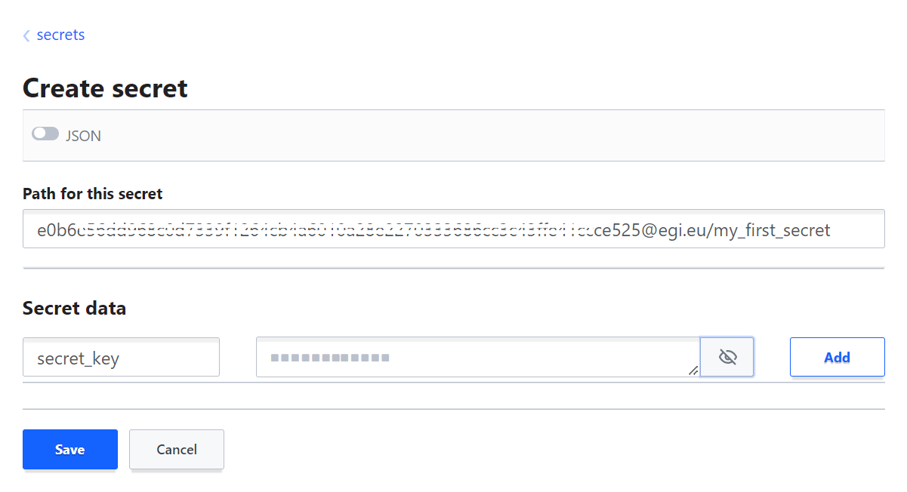

Although the recommended way to access and use EGI Secrets Store is via the
[command-line interface](../cli), the service can also be accessed via its
web interface.

{} Tutorials about using the web interface
are available on the
[Hashicorp Vault site](https://developer.hashicorp.com/vault/tutorials/getting-started-ui).
{}

## Using the web interface

Follow the steps below to access the web interface of EGI Secrets Store:

<!-- markdownlint-disable no-bare-urls -->
- Open https://vault.services.fedcloud.eu:8200 in your browser.
- Choose the _OIDC authentication_ method in the pulldown menu, then click
_Sign in with OIDC provider_.
- Login via _EGI Check-in_ and authorize the Vault GUI.
<!-- markdownlint-enable no-bare-urls -->

The main page will open, with a top folder **secrets** that contains a space for
each user.

### Browse secrets

To browse and manage your secrets, click on _Secrets_ in the top navigation
bar, then click on folder **secrets**.

Each user has a private secret space, or a "home directory", under the root
folder **secrets**, with the user's EGI Check-in ID as the folder name. You can
only create secrets in your own secret space.

{} Your "home directory" is not created
automatically, you have to create it the first time you login using the web
interface. [Create a secret](#create-secrets) with your EGI Check-in ID as the
path.{}

{} You can find your EGI Check-in ID
[via the user registry](https://aai.egi.eu/registry/) or by clicking the down
arrow next to the user icon in the top right corner.{}

Once you identified your secret space, click on it to browse your secrets.

### Create secrets

To create your first secret, click on _Secrets_ in the top navigation bar,
then click on folder **secrets**, then click _Create secret_ on the right.

<!-- markdown-link-check-disable -->
Use your EGI Check-in ID (e.g. e0b6...@egi.eu in the image below) as the path,
followed by the name of your secret. Add at least one key to your secret,
together with a value.
<!-- markdown-link-check-enable -->

Click _Save_ and your "home directory" will be created together with your
first secret.

Once you created your first secret, you can create the subsequent secrets
without having to enter your Check-in ID in the path. Just navigate to your
"home folder" and create a secret there.
