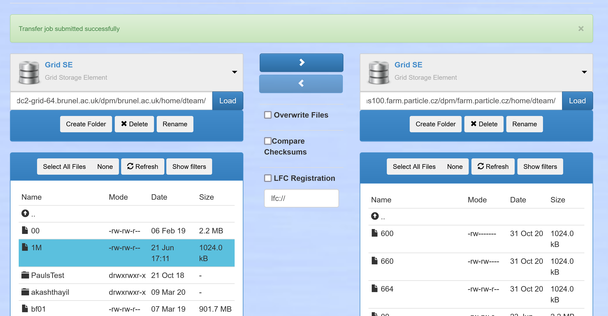

## Overview

This tutorial describes the EGI Data Transfer using FTS transfers services and
WebFTS. In the following paragraphs you will learn how to:

- use the [FTS](#fts-client-usage) command-line client
- use the [WebFTS](#using-the-webfts-data-transfer-interface) web interface

to perform data transfers between two Grid storage.

## Prerequisites

As first step please make sure that you have installed the FTS client as
described in [Data Transfer](../../data/management/data-transfer), and in particular
[Clients](../../data/management/data-transfer/clients) for the command-line FTS and to have
your certificate installed in your browser to use
[WebFTS](../../data/management/data-transfer/webfts) browser based client.

To access services and resources in the
[EGI Federated Cloud](../../getting-started), you will need:

- An [EGI Check-in](../../aai/check-in) account, you can
  [sign up here](../../aai/check-in/signup)
- Enrollment into a [Virtual Organisation](../../aai/check-in/vos) (VO) that has
  access to the services and resources you need

## FTS client usage

### Step 1 Configuration check

To verify that everything is configured properly you can check with the
following command and pointing to the certificates directly:

```shell
$ fts-rest-whoami --key ~/.globus/userkey.pem --cert ~/.globus/usercert.pem \
   -s https://fts3-public.cern.ch:8446/
User DN: /DC=org/DC=terena/DC=tcs/C=NL/O=Stichting EGI/CN=Jane Doe jd@egi.eu
VO: JaneDoejd@egi.eu@tcs.terena.org
VO id: XXXXXXXX-XXXX-XXXX-XXXX-XXXXXXXXXXXX
Delegation id: XXXXXXXXXXXXXXXX
Base id: XXXXXXXX-XXXX-XXXX-XXXX-XXXXXXXXXXXX
```

In general the commands can be used by specifying the user public and private
key like shown in the example or by creating a proxy certificate as described in
the following section.

### Step 2 Proxy creation

As you have seen in the previous section it is possible to use the FTS commands
by specifying the location of the user public and private key. With the use of
`voms-proxy-init` it is possible to create a `proxy` certificate for the user.
With this you don't need to specify the location of the public and private key
for each FTS command. When running `voms-proxy-init` it's possible to specify
the location of the public and private key. If this are not included as options,
the tool expect to find them in:

- ~/.globus/usercert.pem for the public key
- ~/.globus/userkey.pem for the private key with read access only for the owner

Following is an example of running this command with the public and private key
already setup as described:

```shell
$ voms-proxy-init
Your identity: /DC=org/DC=terena/DC=tcs/C=NL/O=Stichting EGI/CN=Jane Doe jd@egi.eu
Creating proxy ........................................... Done

Your proxy is valid until Wed Aug 25 04:18:14 2021
```

The output of the command shows, a proxy certificate valid for 12 hours has been
generated This is the default behaviour and can be usually increased, for
example to 48 hours, with the following option:

```shell
$ voms-proxy-init -valid 48:00
Your identity: /DC=org/DC=terena/DC=tcs/C=NL/O=Stichting EGI/CN=Jane Doe jd@egi.eu
Creating proxy ................................... Done

Your proxy is valid until Thu Aug 26 16:23:01 2021
```

To verify for how long the proxy is still valid you can use the following
command: command:

```shell
$ voms-proxy-info
subject   : /DC=org/DC=terena/DC=tcs/C=NL/O=Stichting EGI/CN=Jane Doe jd@egi.eu/CN=1451339003
issuer    : /DC=org/DC=terena/DC=tcs/C=NL/O=Stichting EGI/CN=Jane Doe jd@egi.eu
identity  : /DC=org/DC=terena/DC=tcs/C=NL/O=Stichting EGI/CN=Jane Doe jd@egi.eu
type      : RFC compliant proxy
strength  : 1024 bits
path      : /tmp/x509up_u1000
timeleft  : 19:59:57
```

When the `timeleft` reaches zero the same command will produce the following
message:

```shell
$ fts-rest-whoami -s https://fts3-public.cern.ch:8446/
Error: Proxy expired!
```

The last option that you need to use is specify the VO that you want to use for
the proxy being created. In the following example the _dteam_ VO has been used:

```shell
$ voms-proxy-init --voms dteam
Your identity: /DC=org/DC=terena/DC=tcs/C=NL/O=Stichting EGI/CN=Jane Doe jd@egi.eu
Creating temporary proxy ................................................................... Done
Contacting  voms2.hellasgrid.gr:15004 [/C=GR/O=HellasGrid/OU=hellasgrid.gr/CN=voms2.hellasgrid.gr] "dteam" Done
Creating proxy .............................................................................. Done

Your proxy is valid until Wed Sep  8 04:37:07 2021
```

With a proxy now available for the user it is now possible to execute the FTS
commands without specifying the public and private keys as it will be shown in
the following sections.

### Step 3 Find the storage

In general, the source and destination storage for a specific project should be
already known. However, to discover the available source or destination
endpoints to be used for a transfer, you can use the
[VAPOR service](https://operations-portal.egi.eu/vapor/resources/GL2ResVO).


Once the page is loaded on the left column it is possible to filter by VO or
scroll the list and click the desired VO as show in the following picture:


Once selected, you can see all the resources associated with the specific VO. In
particular in this case you are interested in the information on the status,
capacity, type of storage, etc. Following is a screenshot of the visualisation
of the list of storage available to _dteam_.


### Step 4 Starting a transfer

Once you have identified the source and destination storage needed for the
transfer you can proceed with the transfer between the two endpoints. To do that
you can use a command of this type, returning the job ID corresponding to the
transfer that you started:

```shell
$ fts-transfer-submit -s https://fts3-public.cern.ch:8446/ \
  --source https://dc2-grid-64.brunel.ac.uk/dpm/brunel.ac.uk/home/dteam/1M \
  --destination https://golias100.farm.particle.cz/dpm/farm.particle.cz/home/dteam/1M \
  -o cfc884f8-1181-11ec-b9c7-fa163e5dcbe0
```

To check the status of the transfer you can use the returned job ID and use the
following command specifying the server controlling the transfer, the source and
the transfer itself:

```shell
$ fts-transfer-status -s https://fts3-public.cern.ch:8446/ \
  cfc884f8-1181-11ec-b9c7-fa163e5dcbe0
FINISHED
```

The last option `-o` specify that the file should be overwritten if present on
the destination. If this option is not present and a file with the same name
exists on the destination, the transfer itself will fail. If you use this option
you should make sure that it is safe to do so.

## Using the WebFTS Data Transfer interface

### Step 1 Access the WebFTS interface

The WebFTS is accessible at this [CERN FTS URL](https://webfts.cern.ch/).
Similarly to what has been done from the command-line interface you need to
provide our private key for delegation of the credential. To do that you use the
following command:

```shell
$ openssl pkcs12 -in yourCert.p12 -nocerts -nodes | openssl rsa
Enter Import Password:
writing RSA key
(...)
```

Which extract the private key in RSA format and you can paste it in the windows
that opens:


And select the desired VO. Once the delegation is set it's possible to move to
the following steps.

{} please be careful and avoid
sharing this information with any third party or saving this information in
plain text. WebFTS uses the key to acquire a proxy certificate on your behalf as
described previously and does not store it. {}

### Step 2 Submitting a transfer

The tab `Submit a transfer` is divided in two parts in which is possible to add
two endpoints that can be used both as source or destination. After adding the
URL for the two endpoints, it is possible to browse and select the files and
directories to be transferred. In the destination select the destination
directory. In the following example the file 1MB has been selected and by simply
clicking the arrow in the middle directing to the right you are instructing the
system to copy the file from the storage and path on the left to the one on the
right:



Similarly to what can be done with the command-line interface, there is the
option to overwrite the destination if it already exists. To enable this option
tick the `Overwrite Files` below the arrow for the transfer. On the top of the
page is also shown a confirmation that the transfer has been submitted
successfully. This same web page shows the status of the current transfers in
the `My jobs` tab shown in the following screenshot:


Each line on the list shows a different job. When clicked it will expand to show
additional details. The reason for the failure of a job which can be seen by
moving the mouse pointer over the `File ID` on the detailed view.
