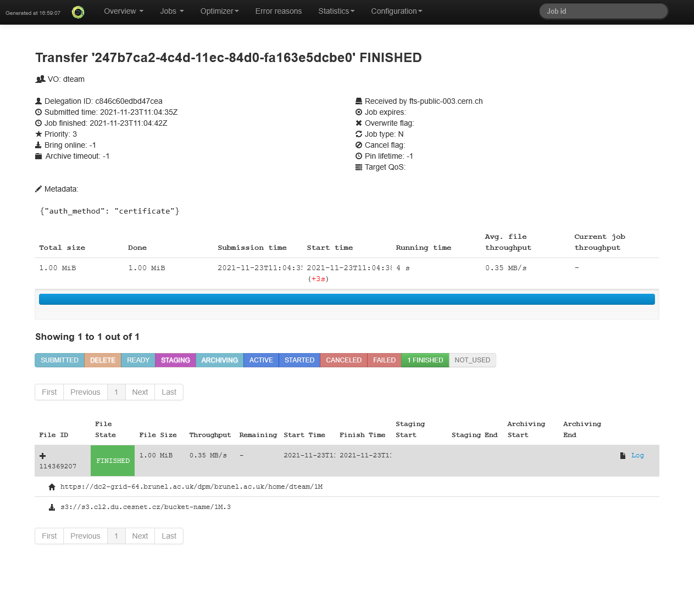

## Overview

This tutorial describes the EGI Data Transfer using FTS transfers services and
WebFTS. In the following paragraphs you will learn how to:

- use the [FTS](#fts-client-usage) command-line client
- use the [WebFTS](#step-6-web-interface) web interface

to perform data transfers between a Grid storage and object storage or between
two object storage.

{} This procedure has been tested
with the FTS client 3.11. Older version do not support all the options
necessary. To install the latest version please add the
[FTS3 Production](https://fts-repo.web.cern.ch/fts-repo/fts3-prod-el7.repo)
repository to your configuration and update the client{}

## Prerequisites

As first step please make sure that you have installed the FTS client as
described in [Data Transfer](../../data/management/data-transfer), and in
particular [Clients](../../data/management/data-transfer/clients) for the
command-line FTS and to have your certificate installed in your browser to use
[WebFTS](../../data/management/data-transfer/webfts) browser based client.

To access services and resources in the
[EGI Federated Cloud](../../getting-started), you will need:

- An [EGI Check-in](../../aai/check-in) account, you can
  [sign up here](../../aai/check-in/signup)
- Enrollment into a [Virtual Organisation](../../aai/check-in/vos) (VO) that has
  access to the services and resources you need
- An [Object Storage](../../data/storage/object-storage) for which you need to
  have all the credentials available (any S3 compatible storage should work)
- Permission to add the Object Storage credential to the FTS server or
  alternatively for this operation you may contact support **at** egi.eu.

## FTS client usage

### Step 1 Configuration check and Proxy creation

For this two steps please refer to the
["Data transfer with grid storage"](../data-transfer-grid-storage) tutorial.

### Step 2 Find the storage

As for the "Data transfer with grid storage" tutorial you can look for the
available storage on
[VAPOR service](https://operations-portal.egi.eu/vapor/resources/GL2ResVO) while
the Object Store can be one created as described in the
[Object Storage](../../data/storage/object-storage) section or trough a provider
such as Amazon, Azure, etc

### Step 3 Add the Object Storage credential to the FTS server

Following is an example of the command that can be used to add the Object Store
credential to the FTS server. The fist step is to register the Object Storage.
The name of the storage, is S3: + the domain part of the URL (for example
`https://s3.cl2.du.cesnet.cz` -> `S3:s3.cl2.du.cesnet.cz`)

```shell
$ curl -E "${X509_USER_PROXY}" \
  --cacert "${X509_USER_PROXY}" \
  --capath "/etc/grid-security/certificates" \
  https://fts3devel01.cern.ch:8446/config/cloud_storage \
  -H "Content-Type: application/json" \
  -X POST \
  -d '{"storage_name":"S3:s3.cl2.du.cesnet.cz"}'
```

And then, add the keys, so the requests can be signed.

```shell
$ curl -E "${X509_USER_PROXY}" \
  --cacert "${X509_USER_PROXY}" \
  --capath "/etc/grid-security/certificates" \
  "https://fts3devel01.cern.ch:8446/config/cloud_storage/S3:s3.cl2.du.cesnet.cz" \
  -H "Content-Type: application/json" \
  -X POST \
  --data @config.json
```

Where `config.json` is a JSON file with the following content:

```json
{
  "vo_name": "/dteam/Role=NULL/Capability=NULL",
  "access_key": "ACCESS_KEY",
  "secret_key": "SECRET_KEY"
}
```

Where ACCESS_KEY and SECRET KEY are the corresponding key necessary to access
the object storage. See also the
[S3 Support](https://fts3-docs.web.cern.ch/fts3-docs/docs/s3_support.html#doing-a-transfer)
pages on the FTS docs pages.

### Step 4 Transfer between a grid storage and an object storage

For the grid storage to use please follow the details described in the section
"Find the storage" of the "Data transfer with grid storage" tutorial. In the
following examples, an object storage available in `s3://s3.cl2.du.cesnet.cz/`
with an already available bucket is used. To manage the object storage is
possible to use any compatible tool. Following will be only shown an example of
transfer.

```shell
$ fts-transfer-submit --s3alternate \
  -s https://fts3-public.cern.ch:8446 \
  https://dc2-grid-64.brunel.ac.uk/dpm/brunel.ac.uk/home/dteam/1M \
  s3://s3.cl2.du.cesnet.cz/bucket-name/1M.3
247b7ca2-4c4d-11ec-84d0-fa163e5dcbe0
```

The command returns a job ID that we can use to check the status of the transfer
itself:

```shell
$ fts-transfer-status -d \
  -s https://fts3-public.cern.ch:8446 \
  247b7ca2-4c4d-11ec-84d0-fa163e5dcbe0
FINISHED
```

### Step 5 Transfer between two object storage

We can also use the data transfer service to perform transfers between two
object storage. In this case the transfer will be controlled by the FTS service
you can use a command like:

```shell
$ fts-transfer-submit --s3alternate \
  -s https://fts3-public.cern.ch:8446 \
  s3://s3.cl2.du.cesnet.cz/bucket-name/1M.3 \
  s3://s3.cl2.du.cesnet.cz/bucket-name/A
c1d4a8e6-4c81-11ec-8926-fa163e5dcbe0
```

In this case too we can verify the status of the transfer with the same command
as before using the new job ID.

```shell
$ fts-transfer-status -d \
  -s https://fts3-public.cern.ch:8446 \
  c1d4a8e6-4c81-11ec-8926-fa163e5dcbe0
FINISHED
```

### Step 6 Web interface

An alternative way to check the status of the job is to use the FTS web
interface to see using one the FTS servers and appending the job ID returned
from one of the previous examples. For instance the link below will show the
status of the specified job:

```text
https://fts-public-003.cern.ch:8449/fts3/ftsmon/#/job/247b7ca2-4c4d-11ec-84d0-fa163e5dcbe0
```


