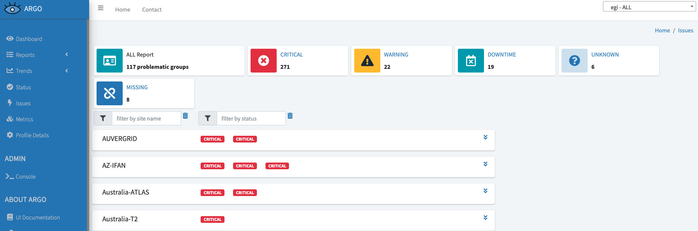

## Overview

This tutorial describes how to submit
[High Throughput Compute (HTC)](../../compute/high-throughput-compute) jobs
using command-line.

> This tutorial is meant for somewhat advanced users or the ones willing or
> needing to interact with the resources at a low level.

## Prerequisites

To submit an EGI HTC job, you will have to:

1. Obtain an X.509 user certificate. The supported certificates are issued by
   Certification Authorities (CAs) part of the
   [European Policy Management Authority for Grid Authentication (EUGridPMA)](https://www.eugridpma.org),
   which is also part of the
   [International Global Trust Federation (IGTF)](https://www.igtf.net).
1. Enrol into a VO having access to HTC resources.

> This tutorial will be using `dteam` a test Virtual Organisation that can be
> used by resource providers, commands should be adjusted to the appropriate VO.

## Step 1: getting access to a User Interface (UI)

In order to interact with HTC resources, you should have access to a
`User Interface`, often referred to as a `UI`. This software environment will
provide all the tools required to interact with the different middleware, as
different sites can be using different Computing Element (CE), such as
HTCondorCE and ARC-CE (CREAM is a legacy software stack that is not officially
supported).

Different possibilities are available to access an UI:

- Having access to an UI provided by/for your community, please get in touch
  with them about this.
- Deploying a UI, as documented below.

### Deploying an UI

The UI is available as a package in the [UMD](https://go.egi.eu/umd) software
distribution, but it will also require additional software and configuration.

In order to help with deploying an UI, different solutions are possible:

- Deploying an UI manually, using the packages available from
  [UMD repositories](https://go.egi.eu/umd). You will need to install at least
  the `ui` meta-package, the
  [IGTF distribution](../../../providers/operations-manuals/howto01_using_igtf_ca_distribution),
  and
  [configure the system to use voms-client](#configuring-the-system-to-use-voms-client).
- Some
  [Ansible roles](https://docs.ansible.com/ansible/latest/user_guide/playbooks_reuse_roles.html)
  are available in the
  [EGI Federation GitHub organisation](https://github.com/EGI-Federation?q=ansible-role),
  mainly [ansible-role-ui](https://github.com/EGI-Federation/ansible-role-ui)
  that should be used together with
  [ansible-role-VOMS-client](https://github.com/EGI-Federation/ansible-role-VOMS-client),
  providing software and material required for the authentication and
  authorisation, and
  [ansible-role-umd](https://github.com/EGI-Federation/ansible-role-umd)
  configuring the software repositories from where all the software will be
  installed.
- The repository
  [ui-deployment](https://github.com/EGI-Federation/ui-deployment) provides a
  [terraform](https://terraform.io) based deployment allowing to deploy a
  `User Interface (UI)` in a
  [Cloud Compute virtual machine](../../compute/cloud-compute). This integrated
  deployment is based on the Ansible modules, and should be adjusted to your
  environment and needs.

> This tutorial is based on using a VM deployed using the
> [ui-deployment](https://github.com/EGI-Federation/ui-deployment) repository,
> refer to the repository for detailed instructions on deploying the UI.

## Step 2: creating a VOMS proxy

> The
> [Virtual Organization Membership Service (VOMS)](https://italiangrid.github.io/voms/index.html)
> enables Virtual Organisation (VO) access control in distributed services. A
> proxy allows limited delegation of rights, allowing remote services to
> securely interact with other resources and services on behalf of the user.

### Configuring the system to use voms-client

> When using
> [ansible-role-VOMS-client](https://github.com/EGI-Federation/ansible-role-VOMS-client),
> the full environment has been setup for you, and there is no need for manual
> configuration.

Before being able to use `voms-client`, it is required to
[configure access to the VOMS server of the chosen VO](https://italiangrid.github.io/voms/documentation/voms-clients-guide/),
using the proper `.vomses` and `.lsc` files, based on the information available
on the VOMS server of the specific VO.

- as an example with `dteam`, you can find the VOMS server address in the
  [Operations Portal](../../../internal/operations-portal):
  [https://operations-portal.egi.eu/vo/view/voname/dteam](https://operations-portal.egi.eu/vo/view/voname/dteam).
  Then looking at
  [dteam VOMS configuration](https://voms2.hellasgrid.gr:8443/voms/dteam/configuration/configuration.action),
  you can create:
  - `/etc/vomses/dteam-voms2.hellasgrid.gr` with the content of the **VOMSES
    string**.
  - `/etc/grid-security/vomsdir/dteam/voms2.hellasgrid.gr.lsc` with the content
    for the **LSC configuration**.

If you cannot edit content in `/etc/vomses` and `/etc/grid-security/vomsdir`,
you can respectively use `~/.glite/vomses` and `~/.glite/vomsdir`. You may have
to export `X509_VOMSES` and `X509_VOMS_DIR` in your shell, as documented
[on CERN's twiki](https://twiki.cern.ch/twiki/bin/view/DREAM/GridSetup):

```shell
$ export X509_VOMSES=~/.glite/vomses
$ export X509_VOMS_DIR=~/.glite/vomsdir
```

### Preparing the X.509 credentials

Once you have obtained an X.509 user certificate issued by a Certification
Authority (CA) part of the
[International Global Trust Federation (IGTF)](https://www.igtf.net), you should
extract the certificate and private key, and add them to a `~/.globus`
directory.

If the X.509 certificate is in your browser's keyring, you should export it to a
passphrase protected `.p12` file, then using
[`openssl pkcs12`](https://www.openssl.org/docs/man1.0.2/man1/pkcs12.html) you
can extract the required **PEM** files:

```shell
# Creating and protecting ~/.globus directory
$ mkdir -p ~/.globus
$ chmod 750 ~/.globus
# Extracting the certificate from the p12 file "exported_cert.p12"
openssl pkcs12 -in exported_cert.p12 -out ~/.globus/usercert.pem -clcerts -nokeys
# Adjusting rights on the user certificate
$ chmod 640 ~/.globus/usercert.pem
# Extracting the certificate key from the p12, protecting it with a passphrase
$ openssl pkcs12 -in exported_cert.p12 -out ~/.globus/userkey.pem -nocerts
# Adjusting rights on the certificate key
$ chmod 400 ~/.globus/userkey.pem
```

If you are using a certificate provided by the
[GÉANT Trusted Certificate Service (TCS)](https://wiki.geant.org/display/TCSNT/),
in addition to the official documentation provided by your organisation, you may
be interested by looking at the following documentation:

- [Generation 4 GEANT Trusted Certificate Service TCS](https://ca.dutchgrid.nl/tcs/),
  covering how to get and install your credentials, addressing potential issues
  with an improper _.p12_. **Highly recommended**.
- [SUNET TCS 2020- Information for administrators](https://wiki.sunet.se/display/TCS/SUNET+TCS+2020-+Information+for+administrators),
  an exhaustive documentation mainly for administrators but also covering
  client-related aspects.

### Using voms-client

Once the
[configuration for the VOMS client](#configuring-the-system-to-use-voms-client)
has been completed, and when the
[X.509 credentials have been prepared](#preparing-the-x509-credentials), you can
create a **VOMS proxy** for `dteam` VO:

```shell
# Creating the proxy
$ voms-proxy-init -voms dteam
Enter GRID pass phrase for this identity:
Contacting voms2.hellasgrid.gr:15004 [/C=GR/O=HellasGrid/OU=hellasgrid.gr/CN=voms2.hellasgrid.gr] "dteam"...
Remote VOMS server contacted successfully.


Created proxy in /tmp/x509up_u1001.

Your proxy is valid until Wed Oct 26 23:27:30 CEST 2022
# Checking the proxy
$ voms-proxy-info
subject   : /DC=org/DC=terena/DC=tcs/C=NL/O=Stichting EGI/CN=Jane Doe/CN=123456319
issuer    : /DC=org/DC=terena/DC=tcs/C=NL/O=Stichting EGI/CN=Jane Doe
identity  : /DC=org/DC=terena/DC=tcs/C=NL/O=Stichting EGI/CN=Jane Doe
type      : RFC3820 compliant impersonation proxy
strength  : 2048
path      : /tmp/x509up_u1001
timeleft  : 11:58:48
key usage : Digital Signature, Key Encipherment
```

### References

- [VOMS Documentation](https://italiangrid.github.io/voms/documentation.html)
- [USG Proxy Certificates](https://wiki.egi.eu/wiki/USG_Proxy_Certificates)

## Step 3: identifying available resources

It is possible to identify available resources by
[querying the information system](../../compute/high-throughput-compute/querying-information-system).

Two Computing Element (CE) "flavours" are used in production:

- [HTCondorCE](https://htcondor.org/htcondor-ce/overview/), a Compute Entrypoint
  (CE) based on [HTCondor](http://htcondor.org/).
- [ARC-CE](http://www.nordugrid.org/arc/ce/), the
  [ARC](http://www.nordugrid.org/arc/) Compute Element (CE).

In this section we will document querying the EGI Information System to retrieve
information about the available resources.

{} It's also possible to use
[VAPOR to query resources using a graphical interface](../../../internal/operations-portal/using-vapor#using-vapor-to-query-resources-using-a-graphical-interface).
{}

### Use case: identifying all the Computing Elements supporting the dteam VO

As documented in the pages covering the
[querying of the Information System](../../compute/high-throughput-compute/querying-information-system),
in **GLUE 2.0**, the access granted to a given VO to a compute or storage
resource, is published using the `GLUE2Share` and `GLUE2Policy` objects. The
`GLUE2ComputingShare` object specifically documents sharing of compute
resources.

```shell
# Querying GLUE2ComputingShare for all the computing resources available to dteam VO
$ ldapsearch -x -LLL -H ldap://lcg-bdii.egi.eu:2170 \
    -b "GLUE2GroupID=grid,o=glue" \
    '(&(objectClass=GLUE2ComputingShare)(GLUE2ShareID=*dteam*))'
```

It is possible to filter for the different types of Computing Element, and
select only specific attributes.

Once you will have selected a site, using the `ldapsearch` queries from the next
subsections, you will be able to send jobs to them, as documented in the
[Step4: submitting and managing jobs](#step-4-submitting-and-managing-jobs).

{} The following Computing Elements
have been arbitrarily chosen, like due to the site location, available
resources, prior experience, or any other reason, and will be used in this
tutorial:

- HTCondorCE: `condorce1.ciemat.es`
- ARC-CE: `alex4.nipne.ro` {}

#### Looking for a HTCondorCE for dteam

```shell
# Information about the HTCondorCE supporting dteam VO
$ ldapsearch -x -LLL -H ldap://lcg-bdii.egi.eu:2170 \
    -b "GLUE2GroupID=grid,o=glue" \
    '(&(objectClass=GLUE2ComputingShare)(GLUE2ShareID=*dteam*)(GLUE2ComputingShareComputingEndpointForeignKey=*HTCondorCE*))' \
    GLUE2ShareEndpointForeignKey \
    GLUE2ShareID \
    GLUE2ComputingShareTotalJobs \
    GLUE2ComputingShareRunningJobs \
    GLUE2ComputingShareWaitingJobs

# XXX Most HTCondorCE have the Endpoint ending in `HTCondorCE`, but some have
# it ending with `htcondorce`, like in this tutorial for `condorce1.ciemat.es`
# XXX The attribute `GLUE2ComputingShareComputingEndpointForeignKey` is matched
$ in a case sensitive way, and the filter should be updated to match them
$ ldapsearch -x -LLL -H ldap://lcg-bdii.egi.eu:2170 \
    -b "GLUE2GroupID=grid,o=glue" \
    '(&(objectClass=GLUE2ComputingShare)(GLUE2ShareID=*dteam*)(|(GLUE2ComputingShareComputingEndpointForeignKey=*HTCondorCE*)(GLUE2ComputingShareComputingEndpointForeignKey=*htcondorce*)))' \
    GLUE2ShareEndpointForeignKey \
    GLUE2ShareID \
    GLUE2ComputingShareTotalJobs \
    GLUE2ComputingShareRunningJobs \
    GLUE2ComputingShareWaitingJobs
```

As it was decided to go for `condorce1.ciemat.es`, the information about the CE
can be requested using the following request, filtering on the `GLUE2ShareID`
from the previous query: `grid_dteam_condorce1.ciemat.es_ComputingElement`.

```shell
# condor_submit needs CE (condorce1.ciemat.es) and pool (condorce1.ciemat.es:9619)
$ ldapsearch -x -LLL -H ldap://lcg-bdii.egi.eu:2170 \
    -b "GLUE2GroupID=grid,o=glue" \
    '(&(objectClass=GLUE2ComputingShare)(GLUE2ShareID=*grid_dteam_condorce1.ciemat.es_ComputingElement*))' \
    GLUE2ShareID \
    GLUE2ShareDescription \
    GLUE2ComputingShareExecutionEnvironmentForeignKey \
    GLUE2EntityOtherInfo
```

HTCondorCE are usually running on port `9619`, this is confirmed by the results.
Based on those results, it's possible to guess the following parameters that
will have to be used when submitting the job:

- **CE Name**: `condorce1.ciemat.es` (reported in
  `GLUE2ComputingShareExecutionEnvironmentForeignKey: condorce1.ciemat.es`)
- **CE Pool**: `condorce1.ciemat.es:9619` (reported in
  `GLUE2EntityOtherInfo: HTCondorCEId=condorce1.ciemat.es:9619/htcondorce-condor-group_dteam`)

#### Looking for an ARC-CE for dteam

// jscpd:ignore-start

```shell
# Information about the ARC-CE supporting dteam VO
$ ldapsearch -x -LLL -H ldap://lcg-bdii.egi.eu:2170 \
    -b "GLUE2GroupID=grid,o=glue" \
    '(&(objectClass=GLUE2ComputingShare)(GLUE2ShareID=*dteam*)(GLUE2ComputingShareComputingEndpointForeignKey=*urn:ogf*))' \
    GLUE2ComputingShareComputingEndpointForeignKey \
    GLUE2ShareEndpointForeignKey \
    GLUE2ComputingShareTotalJobs \
    GLUE2ComputingShareRunningJobs \
    GLUE2ComputingShareWaitingJobs
```

As it was decided to go for `alex4.nipne.ro`, the information about the CE can
be requested using the following request, filtering on the `GLUE2ShareID` from
the previous query: `urn:ogf:ComputingShare:alex4.nipne.ro:dteam_dteam`.

```shell
# arcsub needs CE name (alex4.nipne.ro)
$ ldapsearch -x -LLL -H ldap://lcg-bdii.egi.eu:2170 \
    -b "GLUE2GroupID=grid,o=glue" \
    '(&(objectClass=GLUE2ComputingShare)(GLUE2ShareID=*urn:ogf:ComputingShare:alex4.nipne.ro:dteam_dteam*))' \
    GLUE2ShareID \
    GLUE2ShareDescription \
    GLUE2ComputingShareComputingServiceForeignKey \
    GLUE2ComputingShareExecutionEnvironmentForeignKey
```

// jscpd:ignore-end

- **CE Name**: `alex4.nipne.ro` (exported from the
  `GLUE2ComputingShareComputingServiceForeignKey: urn:ogf:ComputingService:alex4.nipne.ro:arex`)

## Step 4: submitting and managing jobs

### To an HTCondorCE Computing Element

> The [HTCondor-CE](https://htcondor.com/htcondor-ce/#what-is-htcondor-ce)
> software is a Compute Entrypoint (CE) based on
> [HTCondor](http://htcondor.org/) for sites that are part of a larger computing
> grid (e.g. [EGI](https://www.egi.eu/),
> [Open Science Grid (OSG)](https://osg-htc.org/)).

The `condor` package will install all the required dependencies.

```shell
yum install condor
```

> Condor will use the
> [VOMS proxy created earlier](#step-2-creating-a-voms-proxy).

While HTCondor provides an official
[HTCodnor Quick Start Guide](https://htcondor.readthedocs.io/en/latest/users-manual/quick-start-guide.html),
the main steps for managing a job will be highlighted below.

Create `env.sub`, the compute job to be executed on the remote Computing
Element:

```shell
executable              = /usr/bin/env
log                     = env.log
output                  = outfile.txt
error                   = errors.txt
should_transfer_files   = Yes
when_to_transfer_output = ON_EXIT
queue
```

The format of the submit description file, is documented in
[HTCondor manual](https://htcondor.readthedocs.io/en/latest/users-manual/submitting-a-job.html)
and
[`condor_submit` man page](https://htcondor.readthedocs.io/en/latest/man-pages/condor_submit.html#submit-description-file-commands).

> Submission of a job with the -spool option causes HTCondor to spool all input
> files, the job event log, and any proxy across a connection to the machine
> where the condor_schedd daemon is running. After spooling these files, the
> machine from which the job is submitted may disconnect from the network or
> modify its local copies of the spooled files.

Submit job using
[condor_submit](https://htcondor.readthedocs.io/en/latest/man-pages/condor_submit.html):

```shell
# Submitting a job, spooling input and output files to
$ condor_submit --spool --name condorce1.ciemat.es \
    --pool condorce1.ciemat.es:9619 env.sub
Submitting job(s).
1 job(s) submitted to cluster 97412.
```

Monitor the status of the job using
[condor_q](https://htcondor.readthedocs.io/en/latest/man-pages/condor_q.html):

```shell
# Checking the status of a specific job
$ condor_q --name condorce1.ciemat.es --pool condorce1.ciemat.es:9619 97412


-- Schedd: condorce1.ciemat.es : <192.101.161.188:9619?... @ 10/26/22 16:31:00
OWNER    BATCH_NAME    SUBMITTED   DONE   RUN    IDLE  TOTAL JOB_IDS
dteam050 ID: 97412   10/26 16:21      _      _      _      1 97412.0

Total for query: 1 jobs; 1 completed, 0 removed, 0 idle, 0 running, 0 held, 0 suspended
Total for all users: 884 jobs; 412 completed, 0 removed, 200 idle, 259 running, 13 held, 0 suspended


# Checking the status of all jobs running on that
$ condor_q --name condorce1.ciemat.es --pool condorce1.ciemat.es:9619


-- Schedd: condorce1.ciemat.es : <192.101.161.188:9619?... @ 10/26/22 16:25:03
OWNER    BATCH_NAME    SUBMITTED   DONE   RUN    IDLE  TOTAL JOB_IDS
dteam050 ID: 97400   10/26 15:46      _      _      _      1 97400.0
dteam050 ID: 97412   10/26 16:21      _      _      _      1 97412.0

Total for query: 2 jobs; 2 completed, 0 removed, 0 idle, 0 running, 0 held, 0 suspended
Total for dteam050: 2 jobs; 2 completed, 0 removed, 0 idle, 0 running, 0 held, 0 suspended
Total for all users: 883 jobs; 411 completed, 0 removed, 200 idle, 259 running, 13 held, 0 suspended
```

It is also possible to view the output of a running job using
[condor_tail](https://htcondor.readthedocs.io/en/latest/man-pages/condor_tail.html).

Download the job output to the **UI** using
[condor_transfer_data](https://htcondor.readthedocs.io/en/latest/man-pages/condor_transfer_data.html):

```shell
# Retrieving the output of a specific job
 $ condor_transfer_data -name condorce1.ciemat.es -pool condorce1.ciemat.es:9619 97412.0
Fetching data files...
```

#### References

- [HTCondor Quick Start Guide](https://htcondor.readthedocs.io/en/latest/users-manual/quick-start-guide.html)
- [HTCondor Application Programming Interfaces (APIs)](https://htcondor.readthedocs.io/en/latest/apis/index.html)
- [OSG Site Documentation: HTCondor-CE Overview](https://osg-htc.org/docs/compute-element/htcondor-ce-overview/)

### To an ARC-CE Computing Element

> [ARC](http://www.nordugrid.org/arc) Compute Element (CE) is a Grid front-end
> on top of a conventional computing resource (e.g. a Linux cluster or a
> standalone workstation). ARC CE is sometimes also called **ARC server**.

While there is an official documentation on
[How to submit a job](http://www.nordugrid.org/arc/arc6/users/submit_job.html),
the main steps will be documented below.

If you haven't already generated a credential with `voms-proxy-init`, you can
generate a proxy certificate using ARC's own tool: `arcproxy`, which is using
the same credentials as `voms-proxy-init`, and should produce an equivalent
proxy. To do this you first need to
[prepare your X.509 credentials](#preparing-the-x509-credentials).

```shell
# Generating a proxy for ARC
$ arcproxy --voms dteam
Enter pass phrase for private key:
Your identity: /DC=org/DC=terena/DC=tcs/C=NL/O=Stichting EGI/CN=Jane Doe
Contacting VOMS server (named dteam): voms2.hellasgrid.gr on port: 15004
Proxy generation succeeded
Your proxy is valid until: 2022-10-27 02:23:52
```

Create `testjob.xrsl`, a test job expressed in
[xRSL](https://www.nordugrid.org/arc/arc6/users/xrsl.html), showing environment
where it will run:

```text
&( executable = "/usr/bin/env" )
( jobname = "arctest" )
( stdout = "stdout" )
( join = "yes" )
( gmlog = "gmlog" )
```

Then review the ARC CE information and send the job using
[`arcsub`](https://www.nordugrid.org/arc/arc6/users/client_tools.html#arcsub):

```shell
# Getting info about the selected CE
# Example CE: alex4.nipne.ro:2811/nordugrid-SLURM-dteam
$ ldapsearch -x -LLL -H ldap://lcg-bdii.egi.eu:2170
    -b "Mds-Vo-Name=local,o=grid" \
    '(&(objectClass=GlueCE)(GlueCEUniqueID=alex4.nipne.ro:2811/nordugrid-SLURM-dteam))'
# Submitting the job, the JOB_ID will be written on the output
$ arcsub --jobdescrfile testjob.xrsl --computing-element alex4.nipne.ro
Job submitted with jobid: gsiftp://alex4.nipne.ro:2811/jobs/....
# Export JOB_ID to be used for other commands
$ JOB_ID="gsiftp://alex4.nipne.ro:2811/jobs/...."
```

Then you can use
[`arcstat`](https://www.nordugrid.org/arc/arc6/users/client_tools.html#arcstat)
to monitor the job:

```shell
# Monitoring the status of the job
$ arcstat "$JOB_ID"

# Use -l parameter with arcstat to get more information on the status of the Job
$ arcstat -l "$JOB_ID"
```

The jobs will be in state _Finished_ once completed.

You can finally retrieve the output of a finished job using
[`arcget`](https://www.nordugrid.org/arc/arc6/users/client_tools.html#arcget):

```shell
# Retrieve output files of the finished job, removing them from the server
$ arcget "$JOB_ID"

Results stored at: Ow7KmRKv71nuvw3Vp3UrRNqABFKDmABFKDmfJKDmABFKDmoeT5zn
Jobs processed: 1, successfully retrieved: 1, successfully cleaned: 1
```

Instead of manually selecting a site, it's possible to do some automatic
selection from CE registered in a central registry, such as `nordugrid.org`.

```shell
# Automatic selection on the CE in the nordugrid.org registry
$ arcsub --jobdescrfile testjob.xrsl --registry nordugrid.org
(...)
gsiftp://vm3.tier2.hep.manchester.ac.uk:2811/jobs/...
JOB_ID="gsiftp://vm3.tier2.hep.manchester.ac.uk:2811/jobs/.."

# Use -l parameter to get more information on the status of the Job
$ arcstat -l "$JOB_ID"
```

#### References

- [ARC: submit a job](http://www.nordugrid.org/arc/arc6/users/submit_job.html)
- [ARC client tools](http://www.nordugrid.org/arc/arc6/users/client_tools.html)

### To a CREAM Computing Element

> The CREAM (Computing Resource Execution And Management) Service is a simple,
> lightweight service that implements all the operations at the Computing
> Element (CE) level.

The first step is to prepare a JDL as `testjob.jdl`. The
[CREAM JDL Guide](https://cream-guide.readthedocs.io/en/latest/JDL_Guide.html),
documents the creation of the JDL:

```text
[
Type = "Job";
JobType = "Normal";
Executable = "/usr/bin/env";
StdOutput = "output.txt";
StdError = "error.txt";
OutputSandbox = {"output.txt", "error.txt"};
]
```

Then you can submit, monitor and retrieve the output of the job.

> Those commands are broken on the UI installed from UMD via
> [our Ansible module](https://github.com/EGI-Federation/ansible-role-ui), but
> are provided here as a reference, and for users having access to UI maintained
> by or for their community and providing the required commands.

```shell
# Submitting a job, job ID would be printed to the output
$ glite-ce-job-submit 'lpsc-cream-ce.in2p3.fr:8443/cream-pbs-dteam' testjob.jdl
# Use a variable with the job ID to be reused later
JOB_ID='...'
# Monitoring the job
$ glite-ce-job-status "$JOB_ID"
# Retrieving the output of the job
$ glite-ce-job-output "$JOB_ID"
```

#### References

- [CREAM User's guide](https://cream-guide.readthedocs.io/en/latest/User_Guide.html)
- [CREAM User's Guide for EMI-3](https://wiki-igi.cnaf.infn.it/twiki/bin/view/CREAM/UserGuideEMI3)

### Via the EGI Workload Manager

> The [EGI Workload Manager](https://www.egi.eu/services/workload-manager/) is a
> service provided to the EGI community to efficiently manage and distribute
> computing workloads on the EGI infrastructure.

Using the
[Workload Manger web interface](../../compute/orchestration/workload-manager/#the-egi-workload-manager-web-portal)
or the
[DIRAC command-line interface (CLI)](../../compute/orchestration/workload-manager/#the-dirac-client-tool)
is documented in the
[EGI Workload Manager](../../compute/orchestration/workload-manager).

### Troubleshooting

In case you receive errors when submitting jobs to Computing Elements, it may
be possible that the service is in Downtime for an intervention/upgrade or there
is an issue already reported by the EGI Monitoring System [ARGO](https://argo.egi.eu/).

To check the information about downtimes or issues you can browse the
[ARGO Issues Page](https://argo.egi.eu/egi/issues/ALL) and, as shown in the
figure below, check if there are active Downtimes for the service you are
trying to use (By clicking on the Downtime button) or issues (By clicking on
the CRITICAL button).



## Asking for help

If you find issues please do not hesitate to [contact us](../../../support/).
