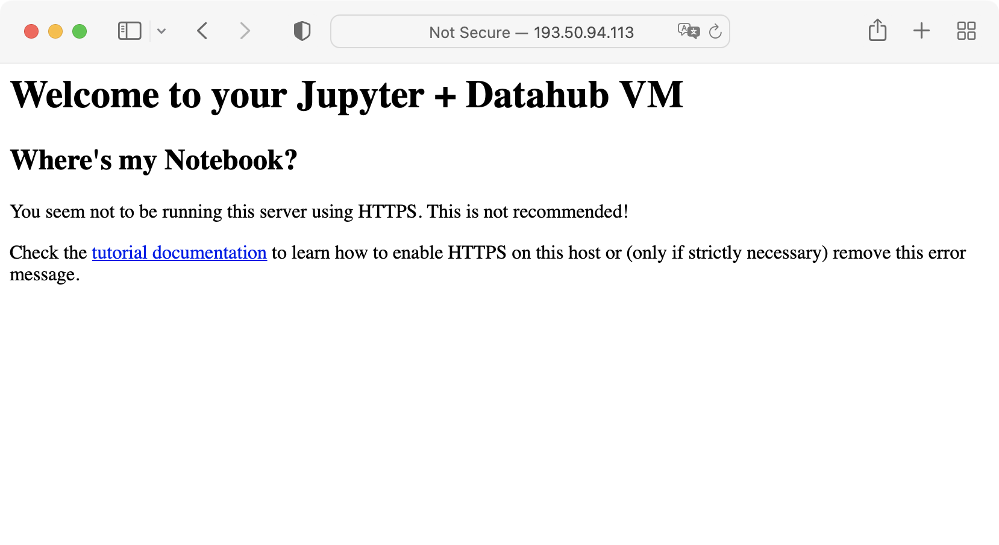
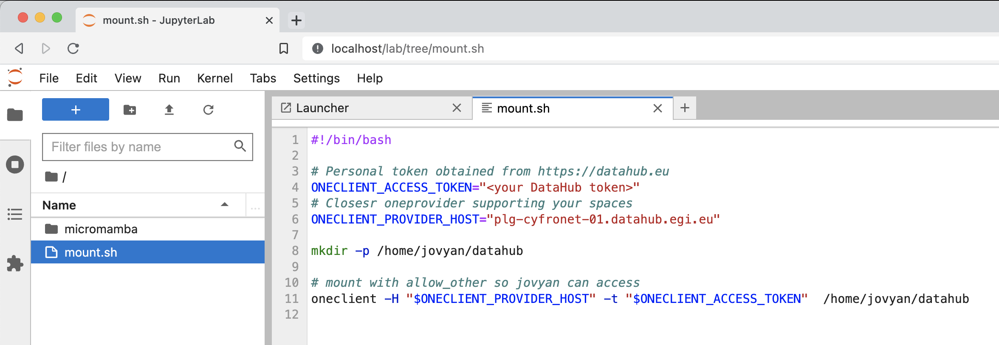
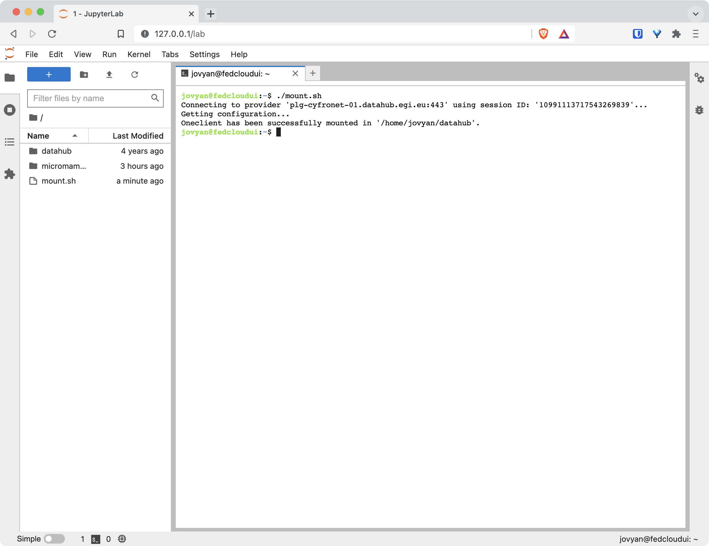

## Overview

This tutorial describes how to start a Virtual Machine in the EGI Federation
that runs a browser-accessible Jupyter server with DataHub spaces mounted. This
setup can be used in the EGI Federation or in any other provider which
synchronise images from AppDB but is not part of the federation.

## Requirements

This tutorial assumes you have:

- A valid EGI account: learn to can create one in
  [Check-in](../../aai/check-in/signup).
- Access to a cloud provider where the
  [Jupyter DataHub VM is available](https://appdb.egi.eu/store/vappliance/jupyter.datahub.vm).
  Alternatively, this VM can be run on your computer using a virtualisation tool
  like VirtualBox.

## Create a VM with Jupyter and DataHub

### Step 1: Start your VM

Start your VM on your cloud provider or virtualisation tool. You can check
[the tutorial on how to start a VM](../create-your-first-virtual-machine) to
learn how to start a VM at EGI's Federated Cloud infrastructure.

This VM does not contain any default credentials, in order to access it you need
a ssh key. Check
[this FAQ entry](../../compute/cloud-compute/faq/#how-can-i-inject-my-public-ssh-key-into-the-machine)
for more information. If you are starting this VM on VirtualBox, you will need
to pass some valid context for cloud-init, see
[here how to prepare it](https://superuser.com/a/853957).

The VM image is ready to listen on port `22` for ssh access and port `80` for
accessing the notebooks interface. Make sure your have those ports open on your
security groups, otherwise you will not be able to reach the Jupyter notebooks.

Once your instance is ready,
[assign it a public IP](../../compute/cloud-compute/faq/#how-can-i-assign-a-public-ip-to-my-vm)
so you can reach it from your computer.

### Step 2: Get a hostname and certificate for your VM

Your VM is ready to be accessible, but runs a plain HTTP server, which is not
secure enough. If you try to connect with your browser to your VM, you will get
a message as shown in the screenshot below:



You must enable HTTPS to encrypt requests and responses, thus making your VM
safer and more secure.

Firstly, you need a valid name for your VM. You can use the
[FedCloud Dynamic DNS](https://nsupdate.fedcloud.eu) to create a name. See
[Dynamic DNS docs](../../compute/cloud-compute/dynamic-dns/) for more
information on the service. Once you have your name ready, assign it your VM's
IP.

Secondly, you need to get a certificate to enable HTTPS. The VM has
[certbot](https://certbot.eff.org/) already installed, you just need to run it
with the hostname you have allocated and your email address as shown here:

```shell
# log into your VM
$ ssh ubuntu@<your VM's IP>
# now request the certificate
$ sudo certbot --nginx -d <your registered name> -m <your email>
```

Finally, open your browser and go to `https://<your registered name>/` to see
Jupyter started. Follow next steps for getting the credentials to access the
service.

{} If you really need
to use HTTP (e.g. your VM is running without inbound connectivity and cannot
create a certificate for it), you can disable the error shown by default in the
nginx configuration.

Open `/etc/nginx/sites-enabled/default` and comment out lines 14-16:

```nginx
    # if ( $https != 'on' ) {
    #     return 406;
    # }
```

And restart nginx:

```shell
$ sudo systemctl restart nginx
```

{}

### Step 3: Get your token for the Jupyter server

Your VM will spawn a Jupyter notebooks server upon starting. This server runs as
an unprivileged user named `jovyan` with the software installed using
[micromamba](https://mamba.readthedocs.io/). The server uses a randomly
generated token for authentication that you can obtain by logging into the VM
and becoming `jovyan`:

```shell
$ ssh ubuntu@<your VM's IP>
# become jovyan user and activate the default environment
$ sudo su - jovyan
$ micromamba activate
$ jupyter server list --jsonlist | jq -r .[].token
<your token>
```

### Step 4: Start your notebooks

Now point your browser to `http://<your VM's IP>` and you will be able to enter
the token to get started with Jupyter.

You can install additional packages with mamba from a terminal started from
Jupyter or via ssh. For example for installing `tensorflow`:

```shell
$ micromamba activate
$ micromamba install -c conda-forge tensorflow
```

### Step 5: Mount DataHub spaces

Log into [EGI's DataHub](https://datahub.egi.eu/) and
[create a token](../../data/management/datahub/clients/#generating-tokens-for-using-oneclient-or-apis)
for mounting your data in the VM.

You will also need the IP or address of your closest Oneprovider for the spaces
you are interested in accessing. This information is easily obtainable via
[DataHub's web interface](../../data/management/datahub/clients/#using-the-web-interface).

Go to your Jupyter session in your browser and edit the `mount.sh` file in your
home directory. Set the `ONECLIENT_ACCESS_TOKEN` and `ONECLIENT_PROVIDER_HOST`
values to get access to DataHub:



Open a terminal from the launcher screen and execute the `mount.sh` script:



You should now see a `datahub` folder with all your spaces available directly
from your Jupyter interface
