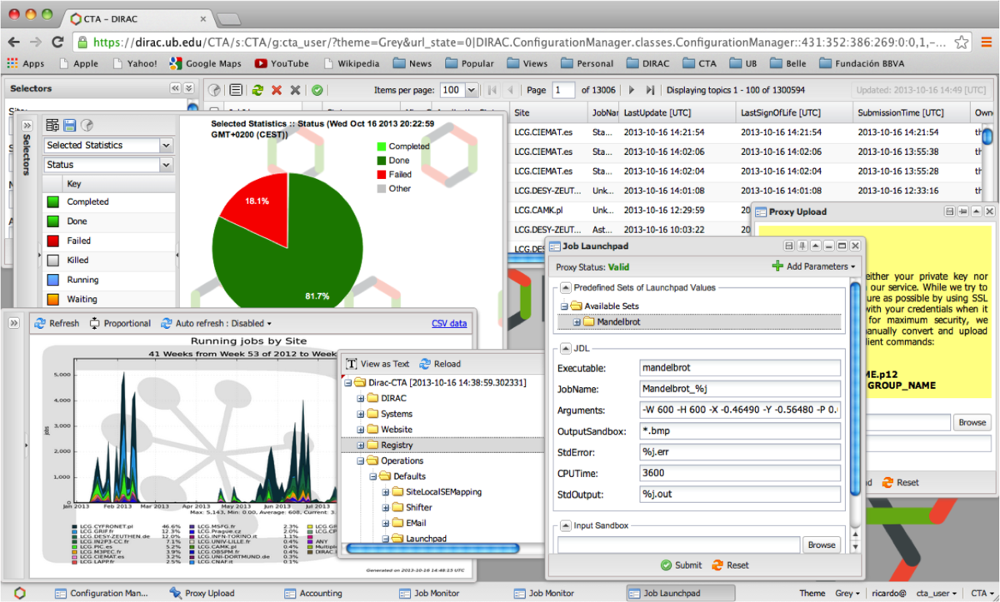
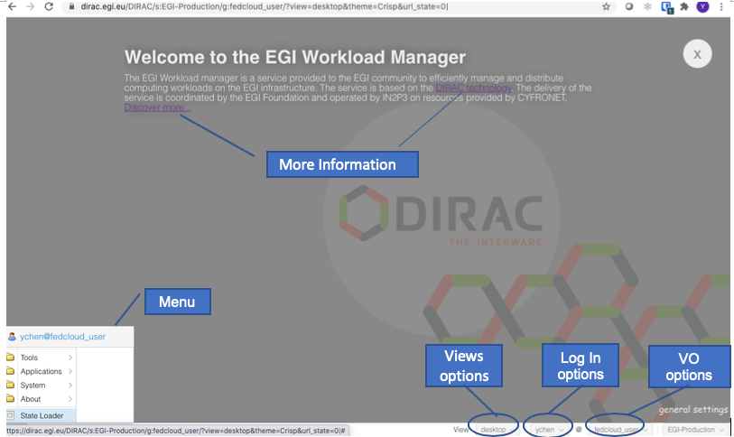
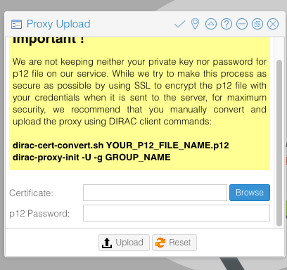
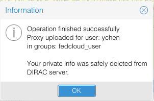
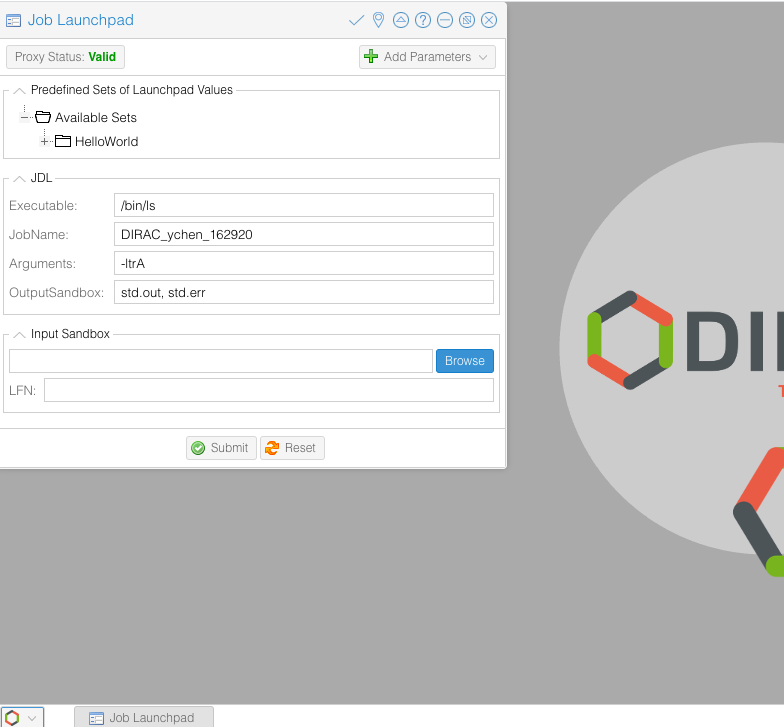
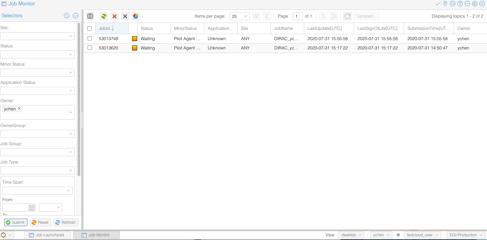

## What is the EGI Workload Manager?

The EGI Workload Manager is a service provided to the EGI community to
efficiently manage and distribute computing workloads on the EGI infrastructure.
The service, based on the DIRAC technology, is configured to support a number
of HTC and cloud resource pools from the EGI Federation.
This pool of computing resources can be easily extended and customized to
support the needs of new scientific communities.
In the LHCb experiment the service has proven production scalability up to peaks
of more than 100.000 concurrently running jobs.
WeNMR, the structural biology community, uses the service for a number of
community services.
The community reported an improvement of jobs submission from previous 70% to
99% with the EGI Workload Manager service.
The delivery of the service is coordinated by the EGI Foundation and operated by
IN2P3 on resources provided by CYFRONET.

## Main Features

The EGI Workload Manager:

* Maximizes usage efficiency by choosing appropriately computing and storage
resources on real-time.
* Provides a large-scale distributed environment to manage and handle data
storage, datamovement, accessing and processing.
* Handles job submission and workload distribution in a transparent way.
* Improves the general job throughput compared with native management of EGI
grid or cloud computing resources.
* Offers pilot-based task scheduling method, that submits pilot jobs to
resources to check the execution environment before to start the user's jobs.
From a technical standpoint, the user's job description is delivered to the
pilot, which prepares its execution environment and executes the user application.
The pilot-based scheduling feature solves many problems of using
heterogeneity and unstable distributed computing resources.
* Includes easy extensions to customize the environment checks to address the
needs of a particular community.
Users can choose appropriately computing and storage resources maximising their
usage efficiency for particular user requirements.
* Handles different storage supporting both cloud and grid capacity.
* Provides a user-friendly interface that allows users to choose among different
DIRAC services.

## Target User Groups

The service suits for the established Virtual Organization communities, long
tail of users, SMEs and Industry

* EGI and EGI Federation participants
* Research communities

## Architecture

The EGI Workload Manager service (DIRAC4EGI) is a cluster of DIRAC services
running on EGI resources (HTC, CLOUD, HPC) supporting multi-VO.  All the DIRAC
services are at or above TRL8.  The main service components include:

* Workload Management System (WMS) architecture is composed of multiple loosely
coupled components working together in a collaborative manner with the help of
a common Configuration Services ensuring reliable service discovery
functionality. The modular architecture allows to easily incorporate new types
of computing resources as well as new task scheduling algorithms in response to
evolving user requirements. DIRAC services can run on multiple geographically
distributed servers which increases the overall reliability and excellent
scalability properties.
* REST server providing language neutral interface to DIRAC service.
* Web portal provides simple and intuitive access to most of the DIRAC
functionalities including management of computing tasks and distributed data.
It also has a modular architecture designed specifically to allow easy extension
for the needs of particular applications.



Fig. 1 - The DIRAC Web portal

## How to access the EGI Workload Manager service

There are several options to access the service:

1. Members of a scientific community whose resources pool is already configured
   in the DIRAC4EGI instance > can use the DIRAC4EGI web portal to access the
   service, or use DIRAC Client.
1. Individual researchers who want to do some number crunching for a limited
   period of time, with a reasonable (not too high) number of CPUs > can use
   the catch-all VO resource pool (vo.access.egi.eu). Submit a request for this
   (CST to check identity and justification of use).
1. Representatives of a community who want to try DIRAC and EGI > Same as #2.
1. Representative of a community who wants to request DIRAC for the community's
   own resource pool > Submit a request via the Marketplace, CST to call back
   and discuss the details (which resource pool, what number of users, AAI,
   etc.).

## Getting Started

### Submit a service order via the Marketplace

User can request access to the service submitting a service-order to use the EGI
HTC service directly from the EOSC or the EGI Marketplace:

EOSC Marketplace:
[https://marketplace.eosc-portal.eu/services/egi-workload-manager](https://marketplace.eosc-portal.eu/services/egi-workload-manager)

EGI Marketplace:
[https://marketplace.egi.eu/compute/73-workload-manager.html](https://marketplace.egi.eu/compute/73-workload-manager.html)

Service orders are usually handled within 5 working days by the EGI User Support
Team on shift.

### Before to start

#### Apply for your user credentials

DIRAC uses X.509 certificates to identify and authenticate users. These
certificates are delivered to each individual by trusted certification
authorities.  
If you have a personal certificate issued by a EUGridPMA-certified
authority you can use it for this tutorial. Otherwise, IHEP certification
authority can deliver one for you. Click on the link Online for User Request on
this page and follow the instructions. Your certificate may take a few days to
be delivered, so please ask for your certificate well in advance and in any
case, before the tutorial starts.

#### Export your credentials from your browser

Your personal certificate is usually delivered to you via a web site and is
automatically loaded in your browser.  You need to export it from the browser
and put it in the appropriate format for DIRAC to use. This is a one-time
operation. Please follow the instructions in this document to export your
certificate to a local file and named $HOME/MyCertificate.

#### Install your credentials

You can user the commands below in any Unix machine to get your user credentials
in the format and location expected by DIRAC:

```
$ mkdir -p $HOME/.globus
$ chmod 700 $HOME/.globus
$ openssl pkcs12 -in $HOME/MyCertificate \ -clcerts -nokeys -out $HOME/.globus/usercert.pem
$ openssl pkcs12 -in  $HOME/MyCertificate\ -nocerts -out $HOME/.globus/userkey.pem
$ chmod 600 $HOME/.globus/usercert.pem $HOME/.globus/userkey.pem ```
```

#### Send your certificate's subject to the DIRAC team

In order to configure the DIRAC server so that you get registered as a user, the
team needs to know your certificate's subject.

Please use the command below on any Unix machine and send its output to Andrei
Tsaregorodtsev (atsareg`<AT>`in2p3`<DOT>`fr):

```sh
$ openssl x509 -in $HOME/.globus/usercert.pem -subject -noout
```

### The EGI Workload Manager Web Portal

To access the EGI Workload Manager open a web browser to:
[https://dirac.egi.eu/DIRAC/](https://dirac.egi.eu/DIRAC/)



Fig. 2 - The EGI Workload Manager service Web portal

If you are a new user, you can see the welcome page where you can find links to
user documentations.  VO options: you can switch to different VOs that you have
membership.  Log In options: the service supports both X.509, Certificate and
Check-in log-in.  View options: allow to choose either desktop or tabs layout.
Menu: a list of tools that enable the selected VO.

#### Upload Proxy

Before submitting your job, you need to upload your Proxy.  Login to the portal.
Go to:  
`Menu` > `Tools` > `Proxy Upload`, enter your certificates .p12 file and
the passphrase, click `Upload`.




Fig. 3 - The wizard to upload the .p12 proxy certificate

#### Job Submission

Go to:  
`Menu` > `Tools` > `Job Launchpad`.  First check the `Proxy Status`, click it
until it shows `Valid` in green color.

In the Job Launchpad, you can select your jobs from the list; add parameters,
indicating the output Sandbox location.

Now, select `Helloworld` from the  job list, and click `Submit`, you just launch
your very first job to the EGI HTC cluster.



Fig. 4 - Submit a job with the Job Launchpad

#### Monitor Job status

Go to:  
`Menu` > `Applications` > `Job Monitor`.  The left panel gives all kinds
of search options for your jobs.  Set your search criteria, and click ‘Submit’,
the jobs will list on the right panel.  Try the various options to view
different information about the jobs.



Fig. 5 - Monitor the job execution with the Job Monitor panel

#### Get Results from Sandbox

Once the job has been successfully processed, the `Status` of the job will
change to green.  Right click the job, select:  
`Sandbox` > `Get Output file(s)`,
you can get the result file(s).

#### Full User Guide for DIRAC Web Portal

For further instructions, please refer to DIRAC Web Portal Guide

### The DIRAC client tool

The easiest way to install the client is via Docker Container. If you have a
Docker client installed in your machine, install the DIRAC CLI as follows:

```sh
$ docker run -it -v $HOME:$HOME -e HOME=$HOME diracgrid/client:egi
```

Once the client software is installed, it should be configured in order to
access the EGI Workload Manager service:

```sh
$ source /opt/dirac/bashrc
```

To proceed further a temporary proxy of the user certificate should be created.
This is necessary to get information from the central Configuration Service:

```sh
$ dirac-proxy-init -x
Generating proxy...
Enter Certificate password:
...
```

Now the client can be configured to work in conjunction with the EGI Workload
Manager service:

```sh
$ dirac-configure defaults-egi.cfg Executing:
/home/larocca/DIRAC/DIRAC/Core/scripts/dirac-configure.py defaults-egi.cfg


Checking DIRAC installation at "/home/larocca/DIRAC" Created vomsdir file
/home/larocca/DIRAC/etc/grid-security/vomsdir/vo.formation.idgrilles.fr/cclcgvomsli01.in2p3.fr.lsc
[..]
Created vomsdir file
/home/larocca/DIRAC/etc/grid-security/vomsdir/fedcloud.egi.eu/voms2.grid.cesnet.cz.lsc
Created vomses file `/home/larocca/DIRAC/etc/grid-security/vomses/fedcloud.egi.eu`
```
Generate the proxy containing the credentials of your VO. Specify the VO in the `--group` option:

**In this example, we are going to use the resources allocated for the WeNMR
project.**

```sh
$ dirac-proxy-init --debug --group wenmr_user -U --rfc
$ dirac-proxy-init --debug --group wenmr_user -U --rfc
Generating proxy...
Enter Certificate password:
Contacting CS...
Checking DN /DC=org/DC=terena/DC=tcs/C=NL/O=Stichting EGI/CN=Giuseppe La Rocca
larocca@egi.eu
Username is glarocca
Creating proxy for glarocca@wenmr_user
(/DC=org/DC=terena/DC=tcs/C=NL/O=Stichting EGI/CN=Giuseppe La Rocca larocca@egi.eu)
Requested adding a VOMS extension but no VOMS attribute defined for group wenmr_user
Uploading proxy for wenmr_user...
Uploading wenmr_user proxy to ProxyManager...
Loading user proxy Uploading proxy on-the-fly
Cert file /home/larocca/.globus/usercert.pem Key file
/home/larocca/.globus/userkey.pem
Loading cert and key User credentials loaded
Uploading...  Proxy uploaded Proxy generated:
subject      : /DC=org/DC=terena/DC=tcs/C=NL/O=Stichting EGI/CN=Giuseppe La Rocca larocca@egi.eu/CN=5721279051
issuer       : /DC=org/DC=terena/DC=tcs/C=NL/O=Stichting EGI/CN=Giuseppe La Rocca larocca@egi.eu
identity     : /DC=org/DC=terena/DC=tcs/C=NL/O=Stichting EGI/CN=Giuseppe La Rocca larocca@egi.eu
timeleft     : 23:59:58
DIRAC group  : wenmr_user
rfc          : True
path         : /tmp/x509up_u0
username     : glarocca
properties   : LimitedDelegation, GenericPilot, Pilot, NormalUser

Proxies uploaded: DN
| Group               | Until (GMT) /DC=org/DC=terena/DC=tcs/C=NL/O=Stichting
EGI/CN=Giuseppe La Rocca larocca@egi.eu | access.egi.eu_user  | 2021/09/14 23:54
/DC=org/DC=terena/DC=tcs/C=NL/O=Stichting EGI/CN=Giuseppe La Rocca
larocca@egi.eu | fedcloud_user       | 2021/09/14 23:54
/DC=org/DC=terena/DC=tcs/C=NL/O=Stichting EGI/CN=Giuseppe La Rocca
larocca@egi.eu | access.egi.eu_admin | 2021/09/14 23:54
/DC=org/DC=terena/DC=tcs/C=NL/O=Stichting EGI/CN=Giuseppe La Rocca
larocca@egi.eu | wenmr_user          | 2021/09/14 23:54
```

As a result of this command, several operations are accomplished:

* A long user proxy (with the length of the validity of the certificate) is
uploaded to the DIRAC ProxyManager service, equivalent of the gLite MyProxy
service;
* A short user proxy is created with the DIRAC extension carrying the DIRAC
group name and with the VOMS extension corresponding to the DIRAC group if the
gLite UI environment is available.

If the gLite UI environment is not available, the VOMS extensions will not be
loaded into the proxy.  This is not a serious problem, still most of the
operations will be possible.

For checking the details of you proxy, run the following command:

```sh
$ dirac-proxy-info
subject      : /DC=org/DC=terena/DC=tcs/C=NL/O=Stichting EGI/CN=Giuseppe La Rocca larocca@egi.eu/CN=5721279051
issuer       : /DC=org/DC=terena/DC=tcs/C=NL/O=Stichting EGI/CN=Giuseppe La Rocca larocca@egi.eu
identity     : /DC=org/DC=terena/DC=tcs/C=NL/O=Stichting EGI/CN=Giuseppe La Rocca larocca@egi.eu timeleft     : 23:59:26
DIRAC group  : wenmr_user
rfc          : True
path         : /tmp/x509up_u0
username     : glarocca
properties   : LimitedDelegation, GenericPilot, Pilot, NormalUser
```

#### Managing simple jobs

In the following table there is a comparison between the glite-WMS CLI and the
DIRAC one:

| gLite-WMS commands | DIRAC commands | Note |
|---|---|---|
| glite-wms-job-delegate-proxy | ------ | Not needed |
| glite-wms-job-list-match | ------ | Not needed |
| glite-wms-job-status | dirac-wms-job-status | To check the status of a job |
| glite-wms-job-cancel | dirac-wms-job-delete | To delete a job |
| glite-wms-job-logging-info | dirac-wms-job-logging-info | To retrieve history
of transitions for a DIRAC job |
| glite-wms-job-output | dirac-wms-job-get-output | To retrieve the job output |
| glite-wms-job-submit | dirac-wms-job-submit | To submit a job |

Table. 1 - gLte-WMS vs. DIRAC commands

Have a look at the official command reference documentation for the complete
list of the Workload Management commands.

In general, you can submit jobs, check their status, and retrieve the output in
the same way as the glite-WMS. For example:

Create a simple JDL file (test.jdl) to submit the job:

```sh
[ JobName = "Simple_Job"; Executable = "/bin/ls"; Arguments = "-ltr";
StdOutput = "StdOut"; StdError = "StdErr"; OutputSandbox = {"StdOut","StdErr"};
]
```

Submit the job:

```sh
$ dirac-wms-job-submit test.jdl JobID = 53755998
```

Check the job status:

```sh
$ dirac-wms-job-status 53755998 JobID=23844073 Status=Waiting;
MinorStatus=Pilot Agent Submission; Site=ANY;
```

```sh
$ dirac-wms-job-status 53755998 JobID=53755998 Status=Done;
MinorStatus=Execution Completed; Site=EGI.NIKHEF.nl; Site=EGI.HG-08-Okeanos.gr;
```

Retrieve the outputs of the job (when the status is Done):

```sh
$ dirac-wms-job-get-output --Dir joboutput/ 53755998 Job output sandbox
retrieved in joboutput/53755998/
```

#### Jobs with Input Sandbox and Output Sandbox

In most cases the job input data or executable files are available locally and
should be transferred to the grid to run the job. In this case the `InputSandbox`
attribute can be used to move the files together with the job.

Create the `InputAndOuputSandbox.jdl`

```sh
JobName    = "InputAndOuputSandbox";
Executable = "testJob.sh";
StdOutput = "StdOut";
StdError = "StdErr";
InputSandbox = {"testJob.sh"};
OutputSandbox = {"StdOut","StdErr"};
```

Create a simple shell script (`testJob.sh`)

```sh
#!/bin/bash
/bin/hostname
/bin/date
/bin/ls -la
```

After creation of JDL file the next step is to submit the job, using the
command:

```sh
$ dirac-wms-job-submit InputAndOuputSandbox.jdl JobID = XXXXXXXX
```

#### More details

* JDL language and simple jobs submission:
  [JDLs and Job Management](http://dirac.readthedocs.io/en/latest/UserGuide/Tutorials/JDLsAndJobManagementBasic/index.html)
* Basic Submitting Parametric and MPI jobs, using DIRAC API:
  [Advanced Job Management](http://dirac.readthedocs.io/en/latest/UserGuide/Tutorials/JobManagementAdvanced/index.html)
* [Past tutorials](https://github.com/DIRACGrid/DIRAC/wiki/TutorialIHEP2013-11)

#### Technical Support

* DIRAC User Guide:
  [https://dirac.readthedocs.io/en/latest/UserGuide/](https://dirac.readthedocs.io/en/latest/UserGuide/)

* For technical issues and bug reports, please submit a ticket in
[GGUS](https://ggus.eu/?mode=ticket_submit), in `Assign to support unit`, indicate:  
  `EGI Services and Service Components` > `Workload Manager (DIRAC)`.
