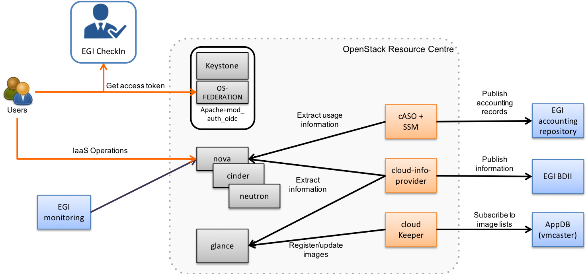

---
title: "OpenStack"
weight: 20
type: "docs"
description: >
  Integration of OpenStack providers
---

This manual provides information on how to set up a Resource Centre
providing cloud resources in the EGI infrastructure. Integration with
FedCloud requires a *working OpenStack installation* as a
pre-requirement (see <http://docs.openstack.org/> for details). Support
for OpenStack is provided for the following versions:

-   OpenStack Mitaka \-- LTS under Ubuntu 16.04 (otherwise EOL)
-   OpenStack Ocata
-   OpenStack Pike
-   OpenStack Queens (note that support for Keystone-VOMS is not
    available, only necessary for legacy VOs)

Support for other versions is not guaranteed and they are not
recommended in production as they are EOL\'d. See
<http://releases.openstack.org/> for more details on the OpenStack
releases.

EGI expects the following OpenStack services to be available and
accessible from outside your site:

-   Keystone
-   Nova
-   Cinder
-   Glance
-   Neutron
-   Swift (if providing Object Storage)

FedCloud components are distributed through [CMD (Cloud Middleware
Distribution)](https://wiki.egi.eu/wiki/EGI_Cloud_Middleware_Distribution)
or docker container images available in
[dockerhub](https://hub.docker.com/). These docker containers come
pre-packaged and ready to use in the EGI FedCloud Appliance so you do
not need to install any extra components on your site but just run a VM
and configure it approprietely to interact with your services.

The integration is performed by a set of EGI components that interact
with the OpenStack services APIs:

-   Authentication of EGI users into your system is performed by
    configuring the native OpenID Connect support of Keystone. Support
    for legacy VOs using VOMS requires the installation of the
    **Keystone-VOMS Authorization plugin** to allow users with a valid
    VOMS proxy to obtain tokens to access your OpenStack deployment.
-   **cASO** collects accounting data from OpenStack and uses **SSM** to
    send the records to the central accounting database on the EGI
    Accounting service ([APEL](https://apel.github.io/))
-   **cloud-info-provider** registers the RC configuration and
    description through the EGI Information System to facilitate service
    discovery
-   **cloudkeeper** (and **cloudkeeper-os**) synchronises with [EGI
    AppDB](https://appdb.egi.eu/browse/cloud) so new or updated images
    can be provided by the RC to user communities (VO).

Not all EGI components need to share the same credentials. They are
individually configured, you can use different credentials and
permissions if desired.

Optionally, **ooi (OpenStack OCCI Interface)** translates between
OpenStack API and OCCI.

## Installation options

EGI distributes the integration components as:

-   A Virtual Appliance (VA) that uses Docker containers to bundle all
    of the components in a single VM and just needs minor configuration
    to get started
-   RPM and DEB Packages in the [CMD
    distribution](https://wiki.egi.eu/wiki/EGI_Cloud_Middleware_Distribution)

### FedCloud Virtual Appliance

The EGI FedCloud Appliance is available at
[AppDB](https://appdb.egi.eu/store/vappliance/fedcloud.integration.appliance.openstack)
as an OVA file. You can easily extract the VMDK disk by untaring and
optionally converting it to your preferred format with qemu-img:

    # get image and extract VMDK
    curl https://cephrgw01.ifca.es:8080/swift/v1/egi_endorsed_vas/FedCloud-Appliance.Ubuntu.16.04-2017.08.09.ova | \
           tar x FedCloud-Appliance.Ubuntu.16.04-2017.08.09-disk001.vmdk
    # convert to qcow2
    qemu-img convert -O qcow2 FedCloud-Appliance.Ubuntu.16.04-2017.08.09-disk001.vmdk fedcloud-appliance.qcow2

The appliance running at your OpenStack must:

-   Be accessible via public IP with port 2170 open for external
    connections.
-   Have a host certificate to send the accounting information to the
    accounting repository. DN of the host certificate must be registered
    in GOCDB with service type `eu.egi.cloud.accounting`. The host
    certificate and key in PEM format are expected in
    `/etc/grid-security/hostcert.pem` and
    `/etc/grid-security/hostkey.pem` respectively.
-   Have enough disk space for handling the VM image replication (\~
    100GB for `fedcloud.egi.eu` VO). By default these are stored at
    /image\_data. You can mount a volume at that location.

### CMD Packages

The CMD-OS repository provides packages that have gone through a quality
assurance process for the supported distributions. Follow the [the
instructions for seting up the
repos](http://repository.egi.eu/category/os-distribution/cmd-os-1/) to
install the packages.

## Open Ports

The following **services** must be accessible to allow access to an
OpenStack-based FedCloud site (default ports listed below, can be
adjusted to your installation)

| Port         | Application            | Note |
| ------------ | ---------------------- | --------------------------------------- |
| **5000**/TCP | **OpenStack**/Keystone | Authentication to your OpenStack. |
| **8776**/TCP | **OpenStack**/cinder   | Block Storage management. |
| **8774**/TCP | **OpenStack**/nova     | VM management. |
| **9696**/TCP | **OpenStack**/neutron  | Network management. |
| **9292**/TCP | **OpenStack**/glance   | VM Image management. |
| **2170**/TCP | **BDII**/LDAP          | EGI Service Discovery/Information System. |

## Permissions

This is an overview of the expected account permissions used in an
OpenStack site, these accounts can be merged as needed for your
deployment:

| Component    | Permission |
| -------------| ---------- |
| cloud-info   | Member of all projects supporting EGI VOs |
| accounting   | Member of all projects and able to list users (allowed to `identity:list_users` in keystone) |
| cloud-keeper | Permission to manage the images for all the projects supporting EGI VOs |
| Other users  | Automatically created by Keystone and permission set as configured in the mappings |

## EGI AAI

### OpenID Connect Support

The integration of OpenStack service providers into the EGI Check-in is
a two-step process:

1.  Test integration with the development instance of EGI Check-in. This
    will allow you to check complete the complete functionality of the
    system without affecting the production Check-in service.
2.  Once the integration is working correctly, register your provider
    with the production instance of EGI Check-in to allow members of the
    EGI User Community to access your service.

#### Registration into Check-in development instance

Before your service can use the EGI Check-in OIDC Provider for user
login, you must set up a client at
<https://aai-dev.egi.eu/oidc/manage/#admin/clients> in order to obtain
OAuth 2.0 credentials and register one or more redirect URIs.

Make sure that you fill in the following options:

-   *Main* tab:

    > -   Set redirect URL to
    >     `https://<your keystone endpoint>/v3/auth/OS-FEDERATION/websso/openid/redirect`.
    >     Recent versions of OpenStack may deploy Keystone at
    >     `/identity/`, be sure to include that in the
    >     `<your keystone endpoint>` part of the URL if needed.

-   *Access* tab:

    > -   Enable *openid*, *profile*, *email*, *eduperson\_entitlement*
    >     and in the **Scope** field
    > -   Enable *authorization code* in the **Grant Types** field
    > -   Enable *Allow calls to the Introspection Endpoint?* in
    >     **Introspection** field

Once done, you will get a client id and client secret. Save them for the
following steps

#### Keystone setup

##### Pre-requisites

1.  Keystone must run as a WSGI application behind an HTTP server
    (Apache is used in this documentation, but any server should be
    possible if it has OpenID connect/OAuth2.0 support). Keystone
    project has deprecated eventlet, so you should be already running
    Keystone in such way.
2.  Keystone must be run with SSL
3.  You need to install
    [mod\_auth\_openidc](https://github.com/pingidentity/mod_auth_openidc)
    for adding support for OpenID Connect to Apache.

{}
EGI monitoring checks that your Keystone accepts clients with
certificates from the IGTF CAs. Please ensure that your server is
configured with the correct Certificate and Revocation path:

For Apache HTTPd

:   HTTPd is able to use CAs and CRLs contained in a directory :

        SSLCACertificatePath    /etc/grid-security/certificates
        SSLCARevocationPath     /etc/grid-security/certificates

For haproxy

:   CA and CRLS have to be bundled into one file.

    Client verification should be set as optional otherwise accepted CAs
    won\'t be presented to the EGI monitoring. :

        # crt: concatenated cert, key and CA
        # ca-file: all IGTF CAs, concatenated as one file
        # crl-file: all IGTF CRLs, concatenated as one file
        # verify: enable optional X509 client authentication
        bind XXX.XXX.XXX.XXX:443 ssl crt /etc/haproxy/certs/host-cert-with-key-and-ca.pem ca-file /etc/haproxy/certs/igtf-cas-bundle.pem crl-file /etc/haproxy/certs/igtf-crls-bundle.pem verify optional

For nginx

:   CA and CRLS have to be bundled into one file.

    Client verification should be set as optional otherwise accepted CAs
    won\'t be presented to the EGI monitoring. :

        ssl_client_certificate /etc/ssl/certs/igtf-cas-bundle.pem;
        ssl_crl /etc/ssl/certs/igtf-crls-bundle.pem;
        ssl_verify_client optional;

Managing IGTF CAs and CRLs

:   IGTF CAs can be obtained from UMD, you can find repo files for your
    distribution at
    <http://repository.egi.eu/sw/production/cas/1/current/>

    IGTF CAs and CRLs can be bundled using the examples command
    hereafter.

    Please update CAs bundle after IGTF updates, and CRLs bundle after
    each CRLs update made by fetch-crl. :

        cat /etc/grid-security/certificates/*.pem > /etc/haproxy/certs/igtf-cas-bundle.pem
        cat /etc/grid-security/certificates/*.r0 > /etc/haproxy/certs/igtf-crls-bundle.pem
        # Some CRLs files are not ending with a new line
        # Ensuring that CRLs markers are separated by a line feed
        perl -pe 's/----------/-----\n-----/' -i /etc/haproxy/certs/igtf-crls-bundle.pem
{}

#### Apache Configuration

Include this configuration on the Apache config for the virtual host of
your Keystone service, using the client id and secret obtained above:

    OIDCResponseType "code"
    OIDCClaimPrefix "OIDC-"
    OIDCClaimDelimiter ;
    OIDCScope "openid profile email eduperson_entitlement"
    OIDCProviderMetadataURL https://aai-dev.egi.eu/oidc/.well-known/openid-configuration
    OIDCClientID <client id>
    OIDCClientSecret <client secret>
    OIDCCryptoPassphrase <some crypto pass phrase>
    OIDCRedirectURI https://<your keystone endpoint>/v3/auth/OS-FEDERATION/websso/openid/redirect

    # OAuth for CLI access
    OIDCOAuthIntrospectionEndpoint https://aai-dev.egi.eu/oidc/introspect
    OIDCOAuthClientID <client id>
    OIDCOAuthClientSecret <client secret>

    # Increase Shm cache size for supporting long entitlements
    OIDCCacheShmEntrySizeMax 65536

    <Location ~ "/v3/auth/OS-FEDERATION/websso/openid">
            AuthType openid-connect
            Require valid-user
    </Location>

    <Location ~ "/v3/OS-FEDERATION/identity_providers/egi.eu/protocols/openid/auth">
            Authtype oauth20
            Require valid-user
    </Location>

If you have multiple keystone hosts, configure an alternative caching
mechanism as per
<https://github.com/zmartzone/mod_auth_openidc/wiki/Caching>

For example, using memcache

    OIDCCacheType memcache
    OIDCMemCacheServers "memcache1 memcache2 memcache3"

Be sure to enable the mod\_auth\_oidc module in Apache, in Ubuntu:

    sudo a2enmod auth_openidc

{}
If running Keystone behind a proxy, make sure to correctly set the
X-Forwarded-Proto and X-Forwarded-Port request headers, e.g. for
haproxy:

    http-request set-header X-Forwarded-Proto https if { ssl_fc }
    http-request set-header X-Forwarded-Proto http if !{ ssl_fc }
    http-request set-header X-Forwarded-Port %[dst_port]
{}

#### Keystone Configuration

Configure your `keystone.conf` to include in the `[auth]` section
`openid` in the list of authentication methods:

    [auth]

    # This may change in your installation, add openid to the list of the methods you support
    methods = password, token, openid

Add a `[openid]` section as follows:

    [openid]
    # this is the attribute in the Keystone environment that will define the identity provider
    remote_id_attribute = HTTP_OIDC_ISS

Add your horizon host as trusted dashboard to the `[federation]`
section:

    [federation]
    trusted_dashboard = https://<your horizon>/dashboard/auth/websso/

Finally copy the default template for managing the tokens in horizon to
`/etc/keystone/sso_callback_template.html`. This template can be found
in keystone git repo at
`https://github.com/openstack/keystone/blob/master/etc/sso_callback_template.html`

    curl -L https://raw.githubusercontent.com/openstack/keystone/master/etc/sso_callback_template.html \
        > /etc/keystone/sso_callback_template.html

Now restart your Apache (and Keystone if running in uwsgi) so you can
configure the Keystone Federation support.

#### Keystone Federation Support

First, create a new `egi.eu` identity provider with remote id
`https://aai-dev.egi.eu/oidc/`:

    $ openstack identity provider create --remote-id https://aai-dev.egi.eu/oidc/ egi.eu
    +-------------+----------------------------------+
    | Field       | Value                            |
    +-------------+----------------------------------+
    | description | None                             |
    | domain_id   | 1cac7817dafb4740a249cc9ca6b14ea5 |
    | enabled     | True                             |
    | id          | egi.eu                           |
    | remote_ids  | https://aai-dev.egi.eu/oidc/     |
    +-------------+----------------------------------+

Create a group for users coming from EGI Check-in, usual configuration
is to have one group per VO you want to support.

    $ openstack group create ops
    +-------------+----------------------------------+
    | Field       | Value                            |
    +-------------+----------------------------------+
    | description |                                  |
    | domain_id   | default                          |
    | id          | 89cf5b6708354094942d9d16f0f29f8f |
    | name        | ops                              |
    +-------------+----------------------------------+

Add that group to the desired local project:

    $ openstack role add member --group ops --project ops

Define a mapping of users from EGI Check-in to the group just created
and restrict with the `OIDC-eduperson_entitlement` the VOs you want to
support for that group. Substitute the group id and the allowed
entitlements for the adequate values for your deployment:

    $ cat mapping.egi.json
    [
        {
            "local": [
                {
                    "user": {
                "name": "{0}"
            },
                    "group": {
                        "id": "89cf5b6708354094942d9d16f0f29f8f"
                    }
                }
            ],
            "remote": [
                {
                    "type": "HTTP_OIDC_SUB"
                },
                {
                    "type": "HTTP_OIDC_ISS",
                    "any_one_of": [
                        "https://aai-dev.egi.eu/oidc/"
                    ]
                },
                {
                    "type": "OIDC-eduperson_entitlement",
                    "regex": true,
                    "any_one_of": [
                        "^urn:mace:egi.eu:group:ops:role=vm_operator#aai.egi.eu$"
                    ]
                }
            ]
        }
    ]

More recent versions of Keystone allow for more elaborated mapping, but
this configuration should work for Mitaka and onwards

Create the mapping in Keystone:

    $ openstack mapping create --rules mapping.egi.json egi-mapping
    +-------+----------------------------------------------------------------------------------------------------------------------------------+
    | Field | Value                                                                                                                            |
    +-------+----------------------------------------------------------------------------------------------------------------------------------+
    | id    | egi-mapping                                                                                                                      |
    | rules | [{u'remote': [{u'type': u'HTTP_OIDC_SUB'}, {u'type': u'HTTP_OIDC_ISS', u'any_one_of': [u'https://aai-dev.egi.eu/oidc/']},        |
    |       | {u'regex': True, u'type': u'OIDC-eduperson_entitlement', u'any_one_of': [u'^urn:mace:egi.eu:.*:ops:vm_operator@egi.eu$']}],      |
    |       | u'local': [{u'group': {u'id': u'89cf5b6708354094942d9d16f0f29f8f'}, u'user': {u'name': u'{0}'}}]}]                               |
    +-------+----------------------------------------------------------------------------------------------------------------------------------+

Finally, create the federated protocol with the identity provider and
mapping created before:

    $ openstack federation protocol create --identity-provider egi.eu --mapping egi-mapping openid 
    +-------------------+-------------+
    | Field             | Value       |
    +-------------------+-------------+
    | id                | openid      |
    | identity_provider | egi.eu      |
    | mapping           | egi-mapping |
    +-------------------+-------------+

Keystone is now ready to accept EGI Check-in credentials.

#### Horizon Configuration

Edit your local\_settings.py to include the following values:

    # Enables keystone web single-sign-on if set to True.
    WEBSSO_ENABLED = True

    # Allow users to choose between local Keystone credentials or login
    # with EGI Check-in
    WEBSSO_CHOICES = (
        ("credentials", _("Keystone Credentials")),
        ("openid", _("EGI Check-in")),
    )

Once horizon is restarted you will be able to choose \"EGI Check-in\"
for login.

#### CLI Access

The [OpenStack
Client](https://docs.openstack.org/developer/python-openstackclient/)
has built-in support for using OpenID Connect Access Tokens to
authenticate. You first need to get a valid token from EGI Check-in
(e.g. from <https://aai-dev.egi.eu/fedcloud/>) and then use it in a
command like:

    $ openstack --os-auth-url https://<your keystone endpoint>/v3 \
                --os-auth-type v3oidcaccesstoken --os-protocol openid \
                --os-identity-provider egi.eu \
                --os-access-token <your access token> \
                token issue
    +---------+---------------------------------------------------------------------------------------+
    | Field   | Value                                                                                 |
    +---------+---------------------------------------------------------------------------------------+
    | expires | 2017-05-23T11:24:31+0000                                                              |
    | id      | gAAAAABZJA3fbKX....nEMAPi-IsFOCkU9QWGTISYElzYJsI3z0SJGs7QsTJv4aJQq0JDJUBz6uE85SqXDj3  |
    | user_id | 020864ea9415413f9d706f6b473dbeba                                                      |
    +---------+---------------------------------------------------------------------------------------+

#### Additional VOs

Configuration can include as many mappings as needed in the json file.
Users will be members of all the groups matching the remote part of the
mapping. For example this file has 2 mappings, one for members of `ops`
and another for members of `fedcloud.egi.eu`:

    [
        {
            "local": [
                {
                    "user": {
                "name": "{0}"
            },
                    "group": {
                        "id": "66df3a7a0c6248cba8b729de7b042639"
                    }
                }
            ],
            "remote": [
                {
                    "type": "HTTP_OIDC_SUB"
                },
                {
                    "type": "HTTP_OIDC_ISS",
                    "any_one_of": [
                        "https://aai-dev.egi.eu/oidc/"
                    ]
                },
                {
                    "type": "OIDC-eduperson_entitlement",
                    "regex": true,
                    "any_one_of": [
                        "^urn:mace:egi.eu:group:ops:role=vm_operator#aai.egi.eu$"
                    ]
                }
            ]
        },
        {
            "local": [
                {
                    "user": {
                "name": "{0}"
            },
                    "group": {
                        "id": "e1c04284718f4e19bb0516e5534a24e8"
                    }
                }
            ],
            "remote": [
                {
                    "type": "HTTP_OIDC_SUB"
                },
                {
                    "type": "HTTP_OIDC_ISS",
                    "any_one_of": [
                        "https://aai-dev.egi.eu/oidc/"
                    ]
                },
                {
                    "type": "OIDC-eduperson_entitlement",
                    "regex": true,
                    "any_one_of": [
                        "^urn:mace:egi.eu:group:fedcloud.egi.eu:role=vm_operator#aai.egi.eu$"
                    ]
                }
            ]
        }
    ]

#### Moving to EGI Check-in production instance

Once tests in the development instance of Check-in are successful, you
can move to the production instance. You should open a [GGUS
ticket](https://ggus.eu) for the request. Besides you will need to
update your configuration as follows:

-   Update the `remote-id` of the identity provider:

<!-- -->

    $ openstack identity provider set --remote-id https://aai.egi.eu/oidc/ egi.eu

-   Update the `HTTP_OIDC_ISS` filter in your mappings, e.g.:

<!-- -->

    $ sed -i 's/aai-dev.egi.eu/aai.egi.eu/' mapping.egi.json
    $ openstack mapping set --rules mapping.egi.json egi-mapping

-   Update Apache configuration to use [aai.egi.eu]{.title-ref} instead
    of \`aai-dev.egi.eu\`:

<!-- -->

    OIDCProviderMetadataURL https://aai.egi.eu/oidc/.well-known/openid-configuration
    OIDCOAuthIntrospectionEndpoint https://aai.egi.eu/oidc/introspect

{}
If you want to make any changes to the client configuration of the
production instance, first make the changes in the Check-in development
environment and then open a [GGUS ticket](https://ggus.eu) to sync the
changes to production.
{}

### VOMS Support

#### VOMS with FEDERATION-OS (Keystone API v3)

{}
Configure VOMS with FEDERATION-OS if your site needs to support a legacy
VO relying on VOMS for authorisation, check Keystone-VOMS below for
older OpenStack versions.
{}

VOMS authentication requires Keystone to be run as a WSGI application
behind an Apache server with
[gridsite](https://github.com/CESNET/gridsite) and SSL support. GridSite
is a set of extensions to the Apache 2.x webserver, which support Grid
security based on X.509 certificates.

Packages for gridsite can be obtained from CMD-OS-1. Follow the
[CMD-OS-1 guidelines for getting the packages for your
distribution](http://repository.egi.eu/category/os-distribution/cmd-os-1/).

First install the `gridsite`, `fetch-crl` and `ca-policy-egi-core` for
your distribution, ensuring that `gridsite` is at least version `2.3.2`.
For Ubuntu 16.04:

    apt-get install gridsite fetch-crl ca-policy-egi-core

Configure Apache to use gridsite module (this may differ in your
distribution):

    a2enmod zgridsite

Include these lines on your Apache config for the virtual host of your
Keystone service:

    # Use the IGTF trust anchors for CAs and CRLs
    SSLCACertificatePath /etc/grid-security/certificates/
    SSLCARevocationPath /etc/grid-security/certificates/

    # Verify clients if they send their certificate
    SSLVerifyClient         optional
    SSLVerifyDepth          10
    SSLOptions              +StdEnvVars +ExportCertData

    # Adapt this URL if needed for your deployment
    <Location /v3/OS-FEDERATION/identity_providers/egi.eu/protocols/mapped/auth>
        # populate ENV variables
        GridSiteEnvs on
        # turn off directory listings
        GridSiteIndexes off
        # accept GSI proxies from clients
        GridSiteGSIProxyLimit 4
        # disable GridSite method extensions
        GridSiteMethods ""

        Require all granted
        Options -MultiViews
    </Location>

Make sure that `mapped` authentication method exists in your
`keystone.conf` in the `[auth]` section:

    [auth]

    # This may change in your installation, add mapped to the list of the methods you support
    methods = password, token, openid, mapped

Create an `egi.eu` identity provider and any needed groups as described
in [Keystone Federation Support](#keystone-federation-support) (do not
forget to add roles to the new group). Use those groups to create
appropriate mappings to the VOs you intend to support. You can use the
`GRST_VOMS_FQANS` to match to the VOMS FQAN that you want to create the
mapping for. The following is an example for the `fedcloud.egi.eu` VO:

    $ openstack group create fedcloud.egi.eu
    +-------------+----------------------------------+
    | Field       | Value                            |
    +-------------+----------------------------------+
    | description |                                  |
    | domain_id   | default                          |
    | id          | fbccb5f81f9741fd8b84736cc10c1d34 |
    | name        | fedcloud.egi.eu                  |
    +-------------+----------------------------------+

    $ cat mapping.voms.json
    [
        {
            "local": [
                {
                    "user": {
                        "name": "{0}",
                        "type": "ephemeral"
                    },
                    "group": {
                        "id": "fbccb5f81f9741fd8b84736cc10c1d34"
                    }
                }
            ],
            "remote": [
                {
                    "type": "GRST_CONN_AURI_0"
                },
                {
                    "type": "GRST_VOMS_FQANS",
                    "any_one_of": [
                        "^/fedcloud.egi.eu/.*"
                    ],
                    "regex": true
                }
            ]
        }
    ]
    $ openstack mapping create --rules mapping.voms.json voms
    +-------+-------------------------------------------------------------------------------------------------------------------------------------------------------------------------------------------------------------------------------------------------------------------+
    | Field | Value                                                                                                                                                                                                                                                             |
    +-------+-------------------------------------------------------------------------------------------------------------------------------------------------------------------------------------------------------------------------------------------------------------------+
    | id    | voms                                                                                                                                                                                                                                                              |
    | rules | [{u'remote': [{u'type': u'GRST_CONN_AURI_0'}, {u'regex': True, u'type': u'GRST_VOMS_FQANS', u'any_one_of': [u'^/fedcloud.egi.eu/.*']}], u'local': [{u'group': {u'id': u'7d9a21050cef48889f23eb9d5f7fef51'}, u'user': {u'type': u'ephemeral', u'name': u'{0}'}}]}] |
    +-------+-------------------------------------------------------------------------------------------------------------------------------------------------------------------------------------------------------------------------------------------------------------------+

Finally add the `mapped` protocol to your `egi.eu` identity provider
with the mapping you have created:

    $ openstack federation protocol create --identity-provider egi.eu --mapping voms mapped
    +-------------------+--------+
    | Field             | Value  |
    +-------------------+--------+
    | id                | mapped |
    | identity_provider | egi.eu |
    | mapping           | voms   |
    +-------------------+--------+

For every VO you support you should configure the corresponding `.lsc`
files at `/etc/grid-security/vomsdir/<vo name>/`. Those files depend on
each VO, check the [Operations
Portal](https://operations-portal.egi.eu/vo/search) for details. You can
find below the `fedcloud.egi.eu` configuration:

    $ cat /etc/grid-security/vomsdir/fedcloud.egi.eu/voms1.grid.cesnet.cz.lsc
    /DC=cz/DC=cesnet-ca/O=CESNET/CN=voms1.grid.cesnet.cz
    /DC=cz/DC=cesnet-ca/O=CESNET CA/CN=CESNET CA 3
    $ cat /etc/grid-security/vomsdir/fedcloud.egi.eu/voms2.grid.cesnet.cz.lsc
    /DC=cz/DC=cesnet-ca/O=CESNET/CN=voms2.grid.cesnet.cz
    /DC=cz/DC=cesnet-ca/O=CESNET CA/CN=CESNET CA 3

You can test easily test the authentication is working using curl with
your proxy:

    $ curl -s --cert /tmp/x509up_u1000 https://<your keystone host>/v3/OS-FEDERATION/identity_providers/egi.eu/protocols/mapped/auth | python -mjson.tool
    {
        "token": {
            "audit_ids": [
                "wxB8VZeHSji0D57Z86PSTA"
            ],
            "expires_at": "2018-08-24T12:40:41.000000Z",
            "issued_at": "2018-08-24T11:40:41.000000Z",
            "methods": [
                "mapped"
            ],
            "user": {
                "OS-FEDERATION": {
                    "groups": [
                        {
                            "id": "fbccb5f81f9741fd8b84736cc10c1d34"
                        }
                    ],
                    "identity_provider": {
                        "id": "egi.eu"
                    },
                    "protocol": {
                        "id": "mapped"
                    }
                },
                "domain": {
                    "id": "Federated",
                    "name": "Federated"
                },
                "id": "ea6520b3ad34400ba07115f7a3987a6b",
                "name": "dn:/DC=org/DC=terena/DC=tcs/C=NL/O=EGI/OU=UCST/CN=Enol+Fernandez"
            }
        }
    }

#### Keystone-VOMS (Keystone API v2)

{}
**VOMS Support using Keystone-VOMS is no longer supported from OpenStack
Queens onwards**. You should use [VOMS with FEDERATION-OS (Keystone API
v3)](#voms-with-federation-os-keystone-api-v3) or [OpenID Connect
Support](#openid-connect-support) instead.
{}

Support for authenticating users with X.509 certificates with VOMS
extensions is achieved with Keystone-VOMS extension. Documentation is
available at <https://keystone-voms.readthedocs.io/>

Notes:

-   **You need a host certificate from a recognised CA for your keystone
    server**.
-   Take into account that using keystone-voms plugin will **enforce the
    use of https for your Keystone service**, you will need to update
    your URLs in the configuration of your services if your current
    installation is not using https:
    -   you will probably need to include your CA to your system\'s CA
        bundle to avoid certificate validation issues: Check the
        [Federated Cloud OpenStack Client
        guide](https://wiki.egi.eu/wiki/Federated_Cloud_APIs_and_SDKs#CA_CertificatesCheck)
        on how to do it.
    -   replace http with https in `auth_[protocol|uri|url]` and
        `auth_[host|uri|url]` in the nova, cinder, glance and neutron
        config files (`/etc/nova/nova.conf`, `/etc/nova/api-paste.ini`,
        `/etc/neutron/neutron.conf`, `/etc/neutron/api-paste.ini`,
        `/etc/neutron/metadata_agent.ini`, `/etc/cinder/cinder.conf`,
        `/etc/cinder/api-paste.ini`, `/etc/glance/glance-api.conf`,
        `/etc/glance/glance-registry.conf`,
        `/etc/glance/glance-cache.conf`) and any other service that
        needs to check keystone tokens.
    -   Update the URLs of the services directly in the database:

<!-- -->

    mysql> use keystone;
    mysql> update endpoint set url="https://<keystone-host>:5000/v2.0" where url="http://<keystone-host>:5000/v2.0";
    mysql> update endpoint set url="https://<keystone-host>:35357/v2.0" where url="http://<keystone-host>:35357/v2.0";

-   Most sites should enable the `autocreate_users` option in the
    `[voms]` section of [Keystone-VOMS
    configuration](https://keystone-voms.readthedocs.org/en/latest/configuration.html).
    This will enable new users to be automatically created in your local
    keystone the first time they login into your site.
-   if (and only if) you need to configure the Per-User Subproxy (PUSP)
    feature, please follow the [specific
    guide](https://wiki.egi.eu/wiki/Long-tail_of_science_-_information_for_providers#Instructions_for_OpenStack_providers).

## EGI Accounting

There are two different processes handling the accounting integration:

-   cASO, which connects to the OpenStack deployment to get the usage
    information, and,
-   ssmsend, which sends that usage information to the central EGI
    accounting repository.

They should be run by cron periodically, settings below run cASO every
hour and ssmsend every six hours.

### Using the VM Appliance

[cASO
configuration](http://caso.readthedocs.org/en/latest/configuration.html)
is stored at `/etc/caso/caso.conf`. Most default values should be ok,
but you must set:

-   `site_name` (line 12), with the name of your site as defined in
    GOCDB.

-   `projects` (line 20), with the list of projects you want to extract
    accounting from.

-   credentials to access the accounting data (lines 28-47, more options
    also available). Check the [cASO
    documentation](http://caso.readthedocs.org/en/latest/configuration.html#openstack-configuration)
    for the expected permissions of the user configured here.

-   The mapping from EGI VOs to your local projects
    `/etc/caso/voms.json`, following this format: :

        {
           "vo name": {
               "projects": ["project A that accounts for the vo", "project B that accounts for the VO"]
           },
           "another vo": {
               "projects": ["project C that accounts for the VO"]
           }
        }

cASO will write records to `/var/spool/apel` from where ssmsend will
take them.

SSM configuration is available at `/etc/apel`. Defaults should be ok for
most cases. The cron file uses `/etc/grid-security` for the CAs and the
host certificate and private keys (`/etc/grid-security/hostcert.pem` and
`/etc/grid-security/hostkey.pem`).

#### Running the services

Both caso and ssmsend are run via the root user crontab. For convenience
there are two scripts `/usr/local/bin/caso-extract.sh` and
`/usr/local/bin/ssm-send.sh` that run the docker container with the
proper volumes.

## EGI Information System

Information discovery provides a real-time view about the actual images
and flavors available at the OpenStack for the federation users. It has
two components:

-   Resource-Level BDII: which queries the OpenStack deployment to get
    the information to publish
-   Site-Level BDII: gathers information from several resource-level
    BDIIs and makes it publicly available for the EGI information
    system.

### Using the VM Appliance

#### Resource-level BDII

This is provided by container `egifedcloud/cloudbdii`. You need to
configure:

-   `/etc/cloud-info-provider/openstack.rc`, with the credentials to
    query your OpenStack. The user configured just needs to be able to
    access the lists of images and flavors.
-   `/etc/cloud-info-provider/openstack.yaml`, this file includes the
    static information of your deployment. Make sure to set the
    `SITE-NAME` as defined in GOCDB.

#### Site-level BDII

The `egifedcloud/sitebdii` container runs this process. Configuration
files:

-   `/etc/sitebdii/glite-info-site-defaults.conf`. Set here the name of
    your site (as defined in GOCDB) and the public hostname where the
    appliance will be available.
-   `/etc/sitebdii/site.cfg`. Include here basic information on your
    site.

#### Running the services

There is a `bdii.service` unit for systemd available in the appliance.
This leverages docker-compose for running the containers. You can start
the service with:

    systemctl start bdii

Check the status with:

    systemctl status bdii

And stop with:

    systemctl stop bdii

You should be able to get the BDII information with an LDAP client,
e.g.:

    ldapsearch -x -p 2170 -h <yourVM.hostname.domain.com> -b o=glue

## EGI VM Image Management

VM Images are replicated using [cloudkeeper]{.title-ref}, which has two
components:

-   fronted (cloudkeeper-core) dealing the with image lists and
    downloading the needed images, run periodically with cron
-   backend (cloudkeeper-os) dealing with your glance catalogue, running
    permanently.

### Using the VM Appliance

Every 4 hours, the appliance will perform the following actions:

-   download the configured lists in `/etc/cloudkeeper/image-lists.conf`
    and verify its signature
-   check any changes in the lists and download new images
-   synchronise this information to the configured glance endpoint

First you need to configure and start the backend. Edit
`/etc/cloudkeeper-os/cloudkeeper-os.conf` and add the authentication
parameters from line 117 to 136.

Then add as many image lists (one per line) as you would like to
subscribe to `/etc/cloudkeeper/image-lists.conf`. Use URLs with your
AppDB token for authentication, check the following guides for getting
such token and URLs:

-   [how to access to VO-wide image
    lists](https://wiki.appdb.egi.eu/main:faq:how_to_get_access_to_vo-wide_image_lists),
    and
-   [how to subscribe to a private image
    list](https://wiki.appdb.egi.eu/main:faq:how_to_subscribe_to_a_private_image_list_using_the_vmcatcher).

#### Running the services

cloudkeeper-os should run permanently, there is a
`cloudkeeper-os.service` for systemd in the appliance. Manage as usual:

    systemctl <start|stop|status> cloudkeeper-os

cloudkeeper core is run every 4 hours with a cron script.

## Post-installation

After the installation of all the needed components, it is recommended
to set the following policies on Nova to avoid users accessing other
users resources:

    sed -i 's|"admin_or_owner":  "is_admin:True or project_id:%(project_id)s",|"admin_or_owner":  "is_admin:True or project_id:%(project_id)s",\n    "admin_or_user":  "is_admin:True or user_id:%(user_id)s",|g' /etc/nova/policy.json
    sed -i 's|"default": "rule:admin_or_owner",|"default": "rule:admin_or_user",|g' /etc/nova/policy.json
    sed -i 's|"compute:get_all": "",|"compute:get": "rule:admin_or_owner",\n    "compute:get_all": "",|g' /etc/nova/policy.json

## Upgrading the OpenStack Appliance

### From 2017.08.09 to 2018.05.07

Configuration changes:

-   This upgrade moves the `voms.json` file to the respective `caso` and
    `cloudkeeper-os` directories under `/etc/`
-   No other changes in configuration are needed

### From 20160403 to 2017.08.09

There are several major changes between these versions, namely:

-   atrope has been deprecated and cloudkeeper is used instead. The
    configuration cannot be reused directly and the new services need to
    be configured as described above
-   caso is upgraded to version 1.1.1, the configuration file has some
    incompatible changes.
-   A new bdii.service is available for managing the process is
    available.
