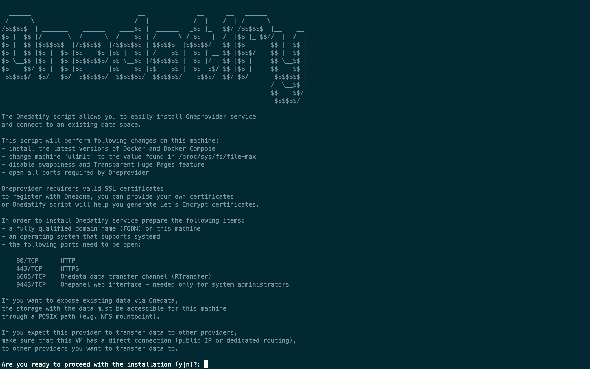

=======

This documentation covers how to install and configure a OneData OneProvider in order to join 
a new or existing DataHub space.
In particular 2 types of installations are available, depending if the provider wants to support the 
space with an an empty storage or if existing data are willing to be exposed via the OneProvider.

## Requirements for production installation

- Oneprovider
  - RAM: 32GB
  - CPU: 8 vCPU
  - Disk: 50GB SSD
  - To be adjusted for the dataset and usage scenario
- For high IOPS
  - High performance backend storage (CEPH)
  - Low latency network

## Installation and attach empty storage to the EGI DataHub

The installation of a new OneProvider is performed using the an installation script used `onedatify` which
will setup the components using Docker and Docker-compose

The simple installation script can be generated from the EGI DataHub web interface.

First you need to login to the EGI DataHub and from the Data menu you either select an existing space 
or create a new one.

You can then select on the space menu the Providers section and click on the Add Support button on the top
right corner 

You should then select on the page the tab: `Deploy your own provider` and there you will have just to copy 
the command having already the correct parameters for the OneZone to use (datahub.egi.eu) and the 
space to join.

### Run the command on the host

Paste the copied command in the terminal on the OneProvider machine (as superuser).

If necessary, the Onedatify script will ask for permission to install all necessary dependencies including Docker and Docker Compose.

After the dependency installation is complete, the script will ask several questions and suggest default setting for each one:

The progress can be monitored on a separate terminal using the following command:

`onedatify logs`

After the deployment is complete, the following message will be shown, with connection details for administration panel for the Oneprovider instance:

The WebUI Admin portal at port 9443 can be used to administer the OneProvider installation

##  Installation and expose existing data to the EGI DataHub

The installation of a new OneProvider to expose existing data sets to an EGI DataHub space is similar to the installation with an 
empty storage.

When adding support to an existing or new space you should select from the EGI DataHub GUI the tab : `Expose Existing dat set` and there you will have just to copy the command having already the correct parameters for the OneZone to use (datahub.egi.eu) and the space to join.

### Run the command on the host

Paste the copied command in the terminal on the OneProvider machine (as superuser) and follow the instructions as for the case of an empty storage.

