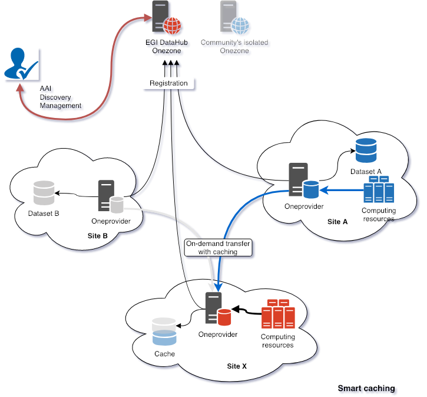
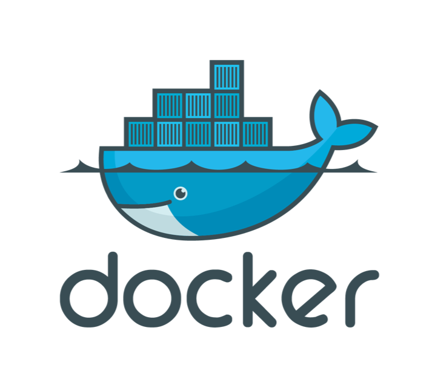

Usage and deployment may vary depending on the use case.

## Transparent data access

- Clients use one ore more providers to access data
- Data can be accessed over multiple protocols

## Federation of service providers

- Heterogeneous backend storage
- Common interfaces (Web, REST, POSIX, CDMI)
- Common AAI with Check-in
- Discovery of Datasets in the EGI DataHub

## Smart caching

- Site A hosts data and computing resources
- Site B hosts only data
- Site X uses data from A and B without pre-staging
- Pre-staging can also be done using APIs
- Data is accessed locally "à la" POSIX with FUSE

## Publication of datasets

- PID minting
- Publishing, discovery and access to datasets

## Integrating DataHub and EGI Notebooks

## Steps to use DataHub and Onedata

- Collecting and analysing dataset specificities
  - Number of files
  - Size of files
- Preparing a pilot
  - Designing and validating usage model
  - Integrating Onedata with existing resources
- Validating the pilot
- Deploying a production setup
  - Ensuring hardware requirements are sufficient
    - RAM, CPU, Disk, Network,...
    - Storage backend

## Deploying Onedata

Preferred model: using docker containers, with docker-compose.

Packages for Ubuntu 16.04 and CentOS 7 are also available.

## Requirements for production

- Oneprovider
  - RAM: 32GB
  - CPU: 8 vCPU
  - Disk: 50GB SSD
  - To be adjusted for the dataset and usage scenario
- For high IOPS
  - High performance backend storage (CEPH)
  - Low latency network
- POSIX mounting
  - Oneprovider close to the Oneclient
